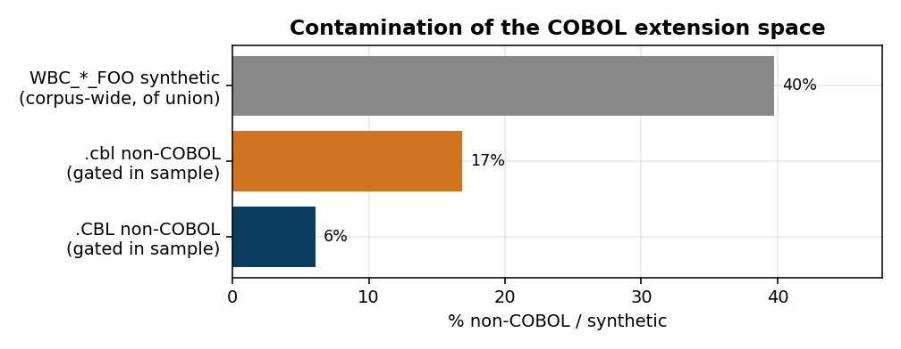
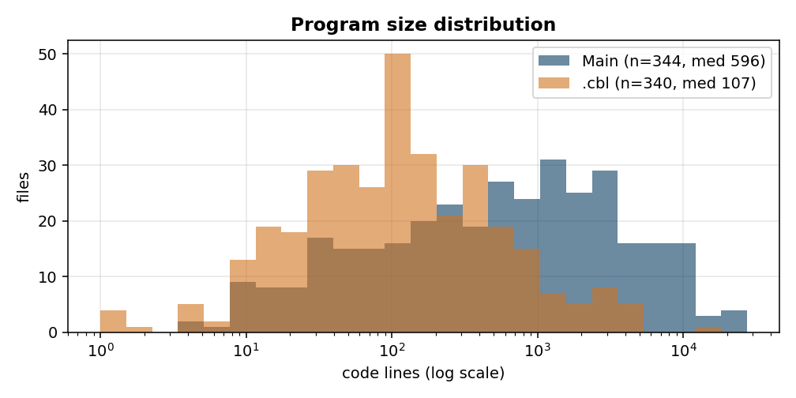
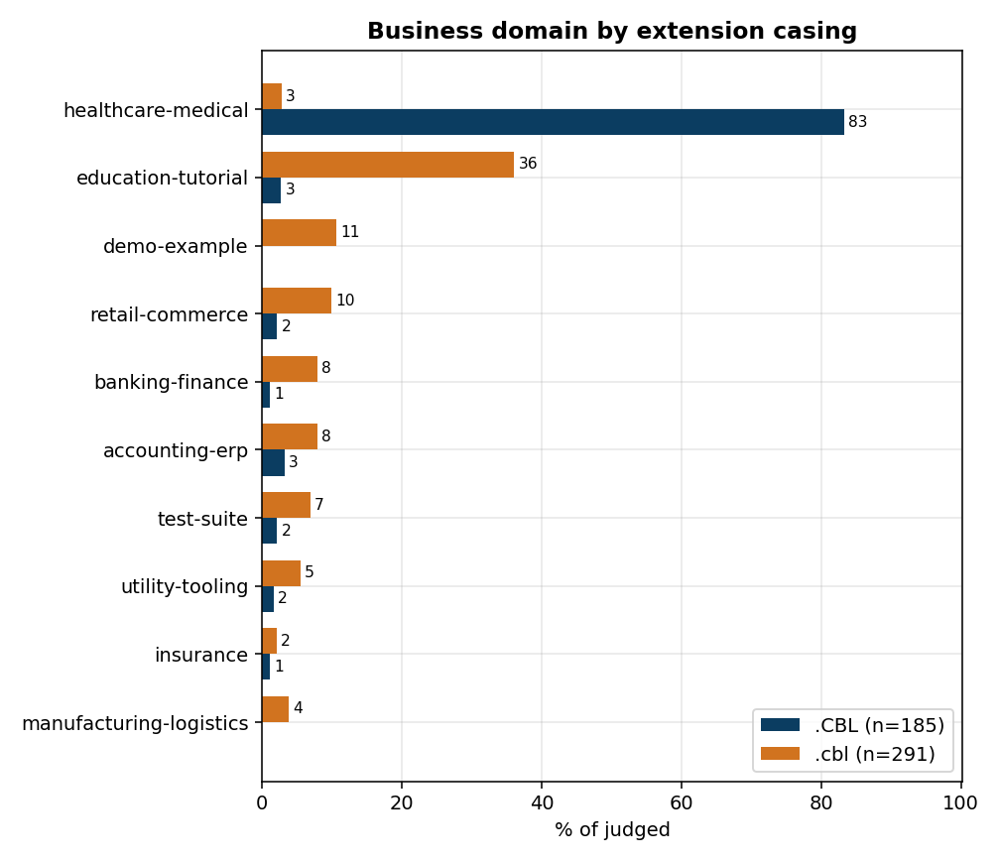
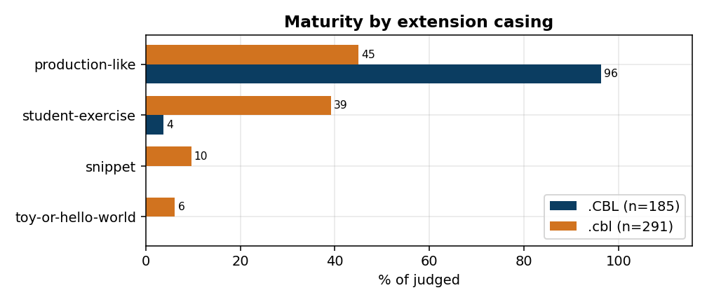
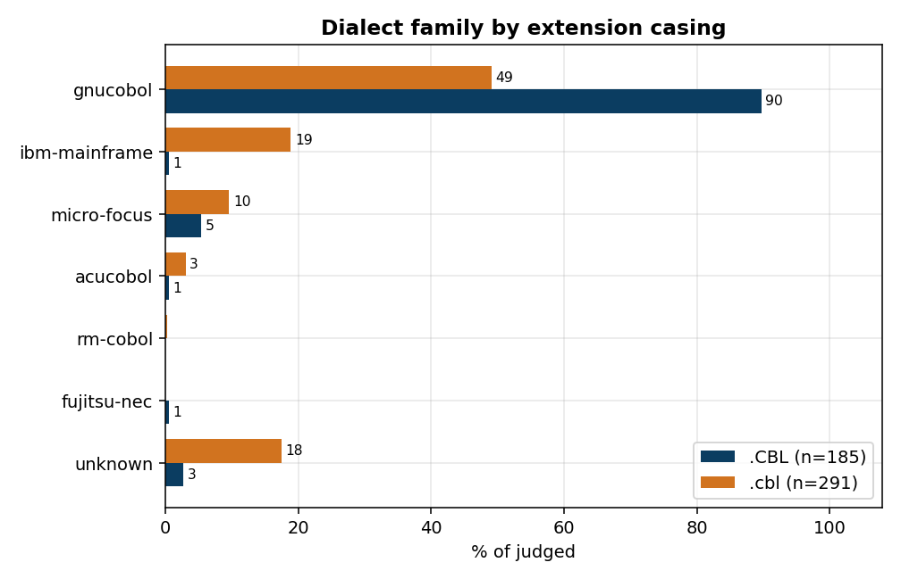
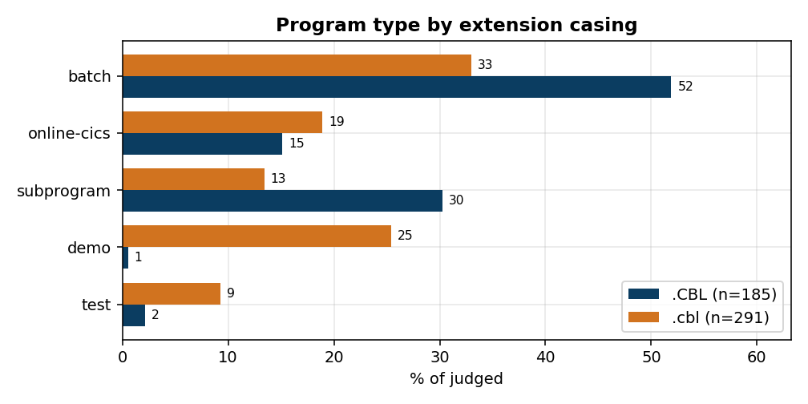
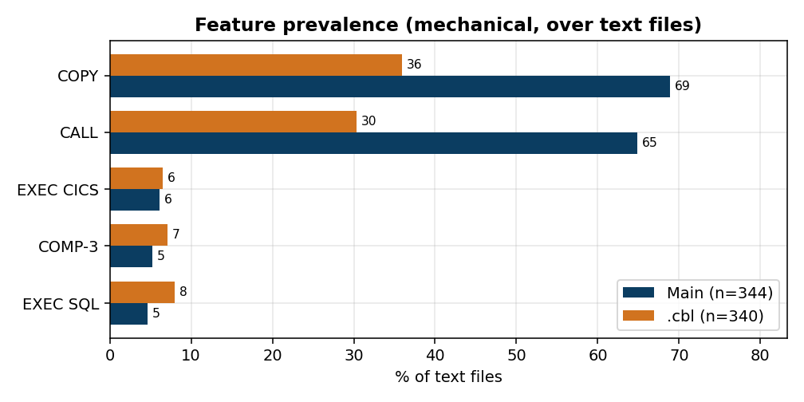
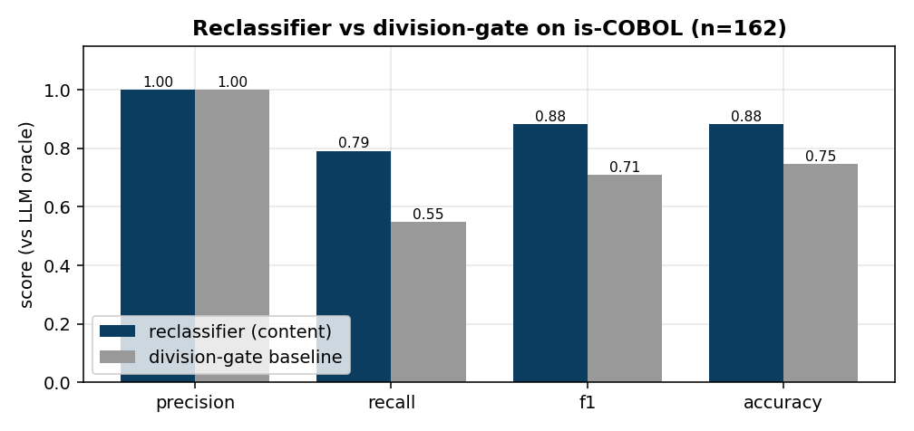
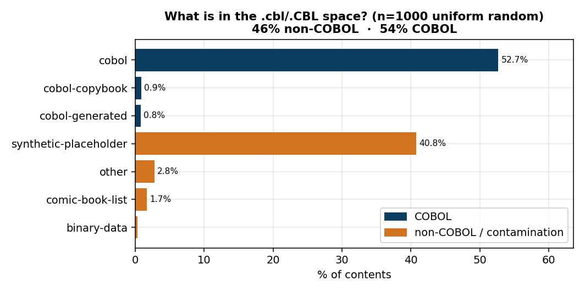
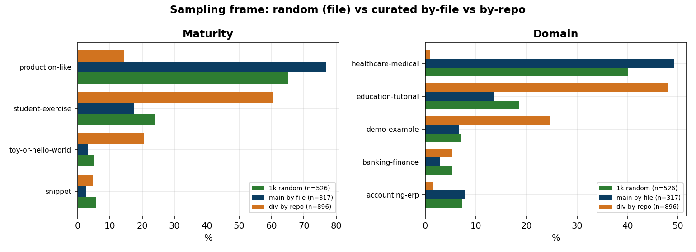

# What is "COBOL" in Software Heritage? An LLM-as-judge exploratory study

*Exploratory study, June 2026. Toolkit: `tools/cobol/`. Data: `data/derived/cobol_study/`.*

## Abstract

We characterise the contents that Software Heritage (SWH) indexes under the
COBOL file extensions `.CBL` / `.cbl`, starting from two extracted content
lists (`COBOL-SWH-extracted/`). For sampled contents we fetch the bytes from
SWH, compute deterministic structural indicators (lines of code, divisions,
embedded SQL/CICS, copybooks, …), and run an enum-constrained
**LLM-as-judge** (Claude Sonnet 4.6 via OpenRouter) that classifies each file
by dialect family, language standard, source format, program type, business
domain, and maturity. Across 653 judged files (plus a 1,000-content
reclassifier sweep) we find that the SWH COBOL extension space is
(a) **heavily contaminated** — a content-based estimate on 1,000 uniform-random
contents puts **~46 % as not COBOL** (95 % CI 42–49 %; independently confirmed
by LLM judging at 47 %, §8.6), ~41 % of it a single family of synthetic
placeholder files, with the lowercase `.cbl` space
additionally colliding with Calibre comic-book libraries and editor artefacts;
and (b) **strongly bimodal** — the uppercase
`.CBL` archive is dominated (83 % of a clean slice) by one open-source
enterprise system, the Japan Medical Association's **ORCA** medical-receipt
software (GnuCOBOL, COBOL-85, fixed-format, batch), whereas lowercase `.cbl`
is a diverse **education / hobbyist** population (36 % tutorials, 39 %
student-grade). We release the pipeline, the per-file reports, and a
human review tool for building ground truth.

## 1. Motivation & questions

"COBOL" is often treated as a monolith. Before doing anything quantitative
with an archive-scale COBOL sample, we wanted to know what is actually *in*
it. Concretely:

- **Q1 — Contamination.** What fraction of the COBOL-extension corpus is not
  COBOL at all (synthetic files, extension collisions, binaries)?
- **Q2 — Composition.** Of the genuine COBOL, what dialects, standards,
  source formats, program types, and business domains appear, and in what
  proportions?
- **Q3 — Sub-populations.** Do the uppercase `.CBL` and lowercase `.cbl`
  spaces differ, and how?
- **Q4 — Method.** Can a cheap deterministic layer + an LLM-judge produce a
  useful, reproducible characterisation, and how far can we trust it?

## 2. Data sources

| Input | Rows | Unique contents (`sha1_git`) |
|---|---:|---:|
| `COBOL-SWH-extracted/CBL_files.csv` (`.CBL`) | 196,416 | 196,228 |
| `COBOL-SWH-extracted/cbl_files_lowercase.csv` (`.cbl`) | 83,840 | 81,446 |
| Union | — | 276,831 (overlap: 843) |

Each row is `swh:1:cnt:<sha1_git>,/<filename>`: a **content** identifier plus
a bare filename. The `sha1_git` is the SWH content id (git blob hash); it is
self-verifying, so the raw bytes can be re-fetched anonymously without any
trust in the CSV beyond the hash. The lists carry **no origin or commit** —
recovering "which repository this came from" is out of scope (see §7).

## 3. Methodology

### 3.1 Pipeline

```
sample.py  →  common.fetch  →  indicators.py  →  judge.py  →  run_study aggregation
(dedup)       (SWH raw,        (deterministic    (LLM enum      (canonical distributions,
              1 req/sha,        metrics)          verdict)       CSV + Markdown)
              cached)
```

All steps are reproducible (`python3 -m tools.cobol.<module>`), resumable
(per-content reports keyed by `sha1_git`), and idempotent (fetched bytes are
cached under `.cache/cobol/`, so re-runs and re-judging cost zero SWH
requests).

### 3.2 Sampling

Contents are **deduplicated by `sha1_git`** (the same bytes appear under many
filenames) and sampled with a fixed RNG seed for reproducibility. We ran
three samples:

| Study | Seed | Source | Filter | N | Text | Judged | Gated |
|---|---|---|---|---:|---:|---:|---:|
| Pilot | 42 | both lists | none | 100 | 100 | 46 | — |
| **Main** | 7 | both lists | exclude `WBC_*_FOO` | 350 | 344 | 317 | 33 |
| **LC** | 11 | `.cbl` only | exclude `WBC_*_FOO` | 350 | 340 | 291 | 59 |

The Main sample is a union sample (197 `.CBL` + 153 `.cbl`); §4.7 also reports
a clean extension-split view.

### 3.3 Content retrieval

Bytes are fetched from `GET /api/1/content/sha1_git:<sha>/raw/` — **one
request per content**. SWH's anonymous quota is ~120 requests/hour; the
fetcher reads the `X-RateLimit-*` headers and self-paces (sleeping until the
window resets) so a multi-hundred-file sweep survives the hourly caps
unattended. Bytes are decoded UTF-8 → Latin-1 → replacement; a NUL byte or a
high non-printable ratio marks a content as non-text (excluded from the
judge).

### 3.4 Structural indicators (deterministic, no LLM)

Computed from the bytes alone, modelling COBOL's column rules (fixed format:
cols 1–6 sequence area, col 7 indicator `*`/`/` = comment, cols 8–11 Area A,
12–72 Area B; free format uses `*>` comments):

- **Size:** total / blank / comment / code lines; max & mean line length.
- **Format guess:** fixed / free / tab / unknown (heuristic).
- **Divisions present:** identification, environment, data, procedure.
- **Features:** `EXEC SQL`, `EXEC CICS`, `COPY`, `CALL`, `PERFORM`, `GO TO`,
  `PIC(TURE)`, `COMP-3`; extracted `PROGRAM-ID`s; compiler directives.

These feed the report *and* the judge prompt (the judge sees the same facts a
human reviewer would). One bug found and fixed during the study: fixed-format
`COPY` sits in Area B (~col 12) and was missed by a too-tight regex,
under-reporting copybook usage as 0 % → corrected to ~69 % (Main).

### 3.5 LLM-as-judge

- **Model:** `anthropic/claude-sonnet-4.6` via OpenRouter (OpenAI-compatible),
  `temperature=0`, `max_tokens=2048`, source truncated to 16,000 chars.
- **Structured outputs:** the verdict is produced under a strict
  `response_format=json_schema` so every categorical field is drawn from a
  fixed enum (`tools/cobol/taxonomy.py`); free-text `*_detail` fields carry
  nuance. This is schema `cobol-judge/2`. Fields: `cobol_confirmed`,
  `not_cobol_label`, `dialect.{family,standard,detail,evidence,confidence}`,
  `source_format`, `purpose.{domain,domain_detail,summary,program_type}`,
  `notable_features`, `maturity`, `overall_confidence`.
- **Gating:** to avoid spending on obvious non-COBOL, files below a division
  threshold (and lacking a PROGRAM-ID + COBOL verbs) are skipped mechanically
  (`--judge-min-divisions 2`) — no API call.
- **Normalization:** aggregation canonicalises every verdict through the
  taxonomy, so an earlier free-text schema (`cobol-judge/1`) collapses into
  the same enums with no re-judge. (The pilot was first judged free-text; its
  30+ ad-hoc dialect strings normalised to 5 families.)

### 3.6 Validity checks

- **Parse integrity:** 0 unparseable verdicts across 653 files (the single
  `max_tokens` truncation was found and fixed).
- **Judge vs deterministic agreement (source format):** the LLM's
  `source_format` matched the mechanical heuristic on **94.6 %** of Main and
  **85.9 %** of LC judged files — an independent cross-check that the two
  layers largely corroborate each other.

## 4. Results

### 4.1 Contamination (Q1)

- **Synthetic placeholders dominate `.CBL`.** `WBC_*_FOO.CBL` files — literal
  contents "This is cobol file number N" — account for **109,999 / 276,831
  (~40 %)** of the deduplicated union. In the unfiltered pilot, 51 % of a
  random 100 were this noise. A content-based sweep of 1,000 uniform-random
  contents confirms it at the population level: **45.6 % non-COBOL** (40.8 %
  synthetic), quantified in §8.3. Their **origin** (from the graph CSV, §8.4)
  is a single GitLab **test fixture** —
  `gitlab.com/fbetestpublic/repo-with-many-files-in-one-tree` (branch
  `changing-commits`) — i.e. 100 k `.CBL` files used as *filler to populate a
  many-files tree*, never COBOL in intent.
- **Extension collisions differ by casing.** After excluding `WBC_*_FOO`, the
  mechanical gate still rejected **17 %** of lowercase `.cbl` vs **~6 %** of
  `.CBL`. Lowercase `.cbl` collides with **Calibre comic-book libraries**
  (`[DC Comics] DC Master Reading Order…`, `Avengers 004.cbl`, `Wonder Woman
  1 - Golden Age.cbl`), `.NET` designer files (`*.aspx.designer.cbl`), and
  editor temp files (`tempCodeRunnerFile.cbl`).
- **Binaries:** 6/350 (Main) and 10/350 (LC) sampled contents are non-text.



### 4.2 Size

| | Main (n=344 text) | LC (n=340 text) |
|---|---|---|
| Code lines — median | 596 | 107 |
| Code lines — mean | 2,040 | 405 |
| Code lines — max | 27,378 | 15,350 |
| Total code lines | 701,654 | 137,525 |

Both are right-skewed (large enterprise programs + many small files);
lowercase files are ~5× smaller at the median.



### 4.3 Dialect family (Main, n=317)

GnuCOBOL **70 %** · IBM mainframe 11 % · unknown 10 % · Micro Focus 4 % ·
ACUCOBOL 3 % · Fujitsu/NEC & other <1 %.

### 4.4 Standard & source format (Main)

- **Standard:** COBOL-85 **98 %**, COBOL-2002/2014 the rest. The corpus is
  overwhelmingly the 1985 standard.
- **Source format:** fixed **92 %**, free 8 % (judge); the mechanical
  heuristic agrees 95 %.

### 4.5 Program type & maturity (Main)

- **Type:** batch **44 %** · subprogram 23 % · online-CICS 18 % · demo 11 % ·
  test 3 %.
- **Maturity:** production-like **77 %** · student-exercise 17 % · toy 3 % ·
  snippet 3 %.

### 4.6 Domain (Main, n=317)

healthcare-medical **49 %** · education-tutorial 14 % · accounting-erp 8 % ·
demo 7 % · retail 5 % · utility 4 % · insurance 3 % · banking 3 % · payroll /
manufacturing / government tail.

### 4.7 Uppercase vs lowercase (Q3) — clean extension-split

Restricting to a single extension (the `.CBL` rows of the Main sample vs the
`.cbl`-only LC sample) makes the two sub-populations starkly different:

| Dimension | `.CBL` upper (n=185 judged, 6 % gated) | `.cbl` lower (n=291 judged, 17 % gated) |
|---|---|---|
| **Domain** | healthcare-medical **83 %**; long tail <3 % each | education-tutorial **36 %**, demo 11 %, retail 10 %, banking 8 %, accounting 8 % |
| **Maturity** | production-like **96 %** | production-like 45 %, **student-exercise 39 %**, snippet 10 %, toy 6 % |
| **Dialect** | GnuCOBOL **90 %**, Micro Focus 5 % | GnuCOBOL 49 %, IBM 19 %, unknown 18 %, Micro Focus 10 % |

The uppercase `.CBL` archive is almost a monoculture: ~83 % of it is the
Japan Medical Association **ORCA** open-source medical-receipt system (`ORC*`
programs, GnuCOBOL, COBOL-85, fixed-format, batch/CICS) — a single project is
the largest source of archived COBOL under this extension. Lowercase `.cbl`
is where the teaching and hobby COBOL lives.









### 4.8 Feature prevalence

| Feature | Main | LC |
|---|---|---|
| COPY (copybooks) | 69 % | 36 % |
| CALL (subprograms) | 65 % | 30 % |
| EXEC SQL (embedded DB2) | 5 % | 8 % |
| EXEC CICS (online tx) | 6 % | 6 % |
| COMP-3 (packed decimal) | 5 % | 7 % |



## 5. Insights

1. **The extension is a weak signal for "COBOL".** ~40 % of `.CBL` is
   synthetic; lowercase `.cbl` collides with unrelated formats. Any
   archive-scale COBOL study must filter aggressively, and casing matters.
2. **Archived open-source COBOL is not representative of "enterprise COBOL".**
   It is dominated by (a) one large open-source system (ORCA) and (b)
   student/tutorial code. Mainframe idioms (CICS, DB2/`EXEC SQL`, COMP-3)
   appear in only single-digit percentages — the classic IBM z/OS COBOL that
   motivates "COBOL modernization" is largely *absent* from the public
   archive.
3. **Uppercase vs lowercase are different worlds** (§4.7): enterprise
   monoculture vs diverse learner corpus. Naïvely pooling them mixes two
   populations.
4. **A two-layer method works and is cheap.** Deterministic indicators catch
   noise for free and cross-validate the judge (95 % format agreement);
   enum-constrained structured outputs give clean, aggregatable categories at
   ~$0.03/file. Post-hoc normalization means schema changes don't require
   re-judging.
5. **Extension-level PLI is blind to all of this.** Pygments / Linguist would
   map every file here to COBOL from the extension alone; none of the
   contamination, sub-structure, or the `.CBL`≠`.cbl` population split is
   visible without reading content. The LLM-judge is therefore a *complement*
   to PLI — and a way to bootstrap a better, case-aware extension→PL mapping
   (see §7.1).

## 6. Limitations

- **Judge trust.** No human ground truth yet, so judge accuracy is
  *unmeasured*. The 95 %/86 % format cross-check and 0 parse failures are
  encouraging but not a substitute. A unified review app ships with this study
  (`tools/cobol/review_app.py`) — one pane over every label a content received
  (judge, reclassifier, oracle, division-gate, human), surfacing cross-source
  disagreements — precisely to build that ground truth. As a first cross-check,
  the deterministic reclassifier agrees with the judge on is-COBOL for all 653
  judged files.
- **`unknown` dialect (10–18 %).** The judge honestly abstains on family when
  evidence is thin; these are unresolved, not resolved-as-other.
- **Truncation.** Sources >16,000 chars are truncated for the judge; very
  large programs are classified from their head. Indicators use full bytes.
- **Encoding.** Many ORCA files carry EUC-JP/Shift-JIS Japanese comments
  rendered as replacement chars in UTF-8; the judge flags this but comment
  ratios and some text metrics are approximate on such files.
- **Sampling scale.** 350 + 350 (+100) contents out of 276k; distributions
  have sampling error (±~5 pts on mid-range proportions). The clean
  `.CBL`-only slice is only n=185.
- **De-dup granularity.** We dedup by content hash, so near-duplicate programs
  (copy-pasted student exercises, forks of ORCA) still count separately;
  "49 % healthcare" is a share of *distinct contents*, not of distinct
  projects.
- **Origin absent.** Without origin/commit we cannot attribute contents to
  repositories, measure project-level concentration, or de-duplicate forks.

## 7. Future work

### 7.1 PLI (Pygments / Linguist) and revising the extension→PL mapping

A natural first step before any LLM would be a programming-language
identification (PLI) tool — GitHub Linguist or Pygments. Yet PLI buys us
almost nothing *here*, and understanding why motivates two concrete changes.

**Why PLI can't do better on this corpus.** For a lone file, Linguist and
Pygments are essentially extension→language lookups. Linguist runs its
heuristics + Bayesian classifier only for *ambiguous* extensions (those that
several languages claim); `.cbl`/`.CBL` map unambiguously to COBOL in its
table, so no content disambiguation fires. Pygments'
`guess_lexer_for_filename` likewise resolves `.cbl`→COBOL from the name alone.
Neither tool will tell you that a given `.cbl` is actually a Calibre
comic-book list, a `.NET` designer file, or a synthetic `WBC_*_FOO`
placeholder; neither yields dialect, standard, domain, or maturity. In our own
mapping the picture is even flatter: `.cbl` (and, once case-folded, `.CBL`) →
`pl/cobol`, and that is the *entire* signal. This is precisely why the
**content-based LLM pass is complementary, not redundant** — it recovers the
contamination and the sub-structure that extension-level PLI cannot see.

**(1) Revise the mapping to be case-aware.** The study shows `.CBL` and
`.cbl` are *semantically distinct populations* (enterprise/ORCA vs
education/hobby; §4.7), yet our `ext_claim` table keys COBOL under lowercase
`.cbl` only, and the miner lower-cases extensions before matching — so the two
casings collapse and the distinction is lost. The raw SWH-MSR-ARV data
*preserves* case (`.CBL` 192 k, `.cbl` 57 k, plus a mixed-case tail
`.Cbl`/`.CBl`/…), and the project already hit this once: the documented
**`.R` vs `.r` fix** (`docs/SWH_EXTENSIONS_DECISIONS.md`) recovered 21.5 M
capital-`.R` occurrences that case-folding had dropped. COBOL is the second
instance, with a sharper twist: `.R`/`.r` was a *coverage* miss (same
language, dropped rows), whereas `.CBL`/`.cbl` is a *population* difference
(same language, different provenance and character). The mapping should record
casing and let downstream analysis split on it; folding should be an explicit,
reversible choice, not a silent default.

**(2) Bootstrap cheap heuristics from the judge.** The LLM is too costly to
run archive-wide, but it is an excellent *oracle* for deriving deterministic
detectors that scale. From the labels it produced we can distil near-free
rules that reclassify mis-extensioned contents *before* any COBOL analysis:
content starting `This is cobol file number` → `synthetic/placeholder`;
`*.aspx.designer.cbl` or a `<global::`-style first line → `.NET generated`; a
Calibre comic-book-list structure (`[DC Comics] …`, issue-numbered titles) →
`data:comic-book-list`; zero divisions + no `PROGRAM-ID` → `not-cobol`. Folded
back into the extension→PL pipeline, these convert the LLM's one-off judgements
into permanent, auditable mapping corrections: the judge labels the hard tail,
the heuristics carry it at scale, and the extension mapping stops over-claiming
COBOL for ~10–40 % of these files. **Both ideas are implemented and evaluated
as prototypes in §8.**

### 7.2 Other directions

- **Ground truth & judge eval.** Use the review tool to annotate a stratified
  ~100–200 file sample; report judge precision/recall per field, and inter-
  rater agreement. Add a second model (a different provider) for a judge-vs-
  judge comparison and majority/adversarial verification.
- **Origin recovery.** A bare `swh:1:cnt:` does not reverse to an origin via
  the public REST API (no origin field, no origins-containing-content
  endpoint). The repo already ships a *heuristic* recoverer,
  `tools/swh_extension_mining.py::qualify_via_github`: it searches GitHub by
  filename, keeps the candidate whose byte-length matches (so the content
  SWHID is identical), reads the latest commit as the anchor, and emits
  `swh:1:cnt:…;origin=…;anchor=swh:1:rev:…;path=…` — which the review UIs then
  render as forge/SWH deep links. Tested on COBOL samples it works but has
  modest recall (files not on GitHub, or forks whose bytes differ, are
  refused), and it finds *nothing* for the vanished WBC repo. For an
  authoritative, complete answer: the SWH public
  **ORC dataset** is readable anonymously over plain HTTPS (no AWS account) —
  `origin` is ~9.5 GB (~255 M origins). But the reverse traversal must scan
  `directory_entry` (**~13 TB**, UUID-sharded) then walk dir→rev→snapshot→
  origin recursively, so it is an **swh-graph** (backward BFS) or
  **swh-provenance** job, not a laptop one; Athena/Spark suit the *forward*
  direction (origin→files). Practically: re-run the `.cbl`/`.CBL` extraction
  *starting from* revisions/snapshots and keep origin as a column — then
  project-level concentration (how much is *literally* the ORCA repo and its
  forks, or the single WBC generator) and fork de-duplication become possible.
- **Scale & stratify.** With an `SWH_TOKEN` (higher quota), scale to a few
  thousand contents; stratify by size band and extension casing to reduce the
  ORCA-domination of naïve samples.
- **Sharper deterministic layer.** Distinguish copybooks from programs;
  detect free-vs-fixed more robustly (tab-expanded GnuCOBOL); count
  paragraphs/sections; flag EBCDIC/Japanese encodings explicitly.
- **Other extensions.** Mine and compare the rest of the COBOL family
  (`.cob`, `.cpy`, `.ccp`, `.cobol`) and quantify the comic-book / non-COBOL
  collision rate corpus-wide, not just in samples.

## 8. Prototypes & validation

Both future-work ideas from §7.1 are implemented as self-contained prototypes
that do **not** modify the production taxonomy pipeline.

### 8.1 Case-aware extension mapping (`tools/cobol/case_aware_mapping.py`)

The SWH extension-popularity data preserves casing; the COBOL `.cbl` key has
these variants (249,372 occurrences total): **`.CBL` 192,066 (77.0 %)**,
**`.cbl` 57,265 (23.0 %)**, and a 41-occurrence mixed-case tail (`.Cbl`,
`.CBl`, …). The current `ext_claim` folds all of them into a single lowercase
`.cbl → pl/cobol` claim. The prototype emits a case-aware claim table
(`data/derived/cobol_study/ext_claim_case_aware_prototype.csv`) with `.CBL`
and `.cbl` as **distinct rows**, each → `pl/cobol`, carrying occurrence counts
and a study-derived `population_hint` (enterprise/ORCA vs education/hobby). The
minimal production change is a `CASE_SIGNIFICANT` allow-list in `_norm_ext`:
`return tok if tok in CASE_SIGNIFICANT else tok.lower()`, plus matching SWH's
case-preserved extensions without lower-casing for those keys.

### 8.2 Content reclassifier for the non-COBOL tail (`tools/cobol/reclassify.py`)

A deterministic, zero-API classifier reads a slice of each file and assigns one
of `cobol`, `cobol-generated`, `cobol-copybook`, `synthetic-placeholder`,
`comic-book-list`, `binary-data`, `other` — bootstrapped from the judge's
labels (§7.1(2)).

**Experiment.** We score it against the **LLM judge as oracle** on the binary
task "is this COBOL?" over a 162-file evaluation set: 92 tail files (what the
division-gate skipped), 20 `WBC_*_FOO` synthetic placeholders, and 50
judge-confirmed COBOL controls. Oracle = the judge's `cobol_confirmed` (cached;
$2.07 one-off). Baseline = the **division-gate** (`n_divisions ≥ 2`) that
`run_study` used for cost-gating.

| System — is-COBOL, vs LLM oracle | Precision | Recall | F1 | Accuracy |
|---|---:|---:|---:|---:|
| **Content reclassifier** | **1.00** | **0.79** | **0.88** | **0.88** |
| Division-gate baseline | 1.00 | 0.55 | 0.71 | 0.75 |



Both are perfectly precise (nothing they call COBOL is non-COBOL), but the
reclassifier recovers **72 vs 50** genuine COBOL files — it rescues the COBOL
the crude gate wrongly excluded: Micro-Focus OO `.designer.cbl`, copybooks
(`SQLCA`/`SQLDA` includes, level+PIC records), GnuCOBOL `TESTSUITE` files, and
COBOL carrying a stray NUL or Shift-JIS/EUC-JP Japanese comments. It is
flawless on synthetic placeholders (20/20) and controls (50/50), and it adds a
**fine-grained contamination taxonomy** the gate and the extension mapping
cannot: of the non-COBOL it flags — 27 comic-book lists, 20 synthetic
placeholders, 3 binaries, 40 other/foreign text.

**Where it still loses to the LLM.** The 19 residual misses are all *weak
copybooks* — short data fragments with no strong marker — exactly the
ambiguous cases where the judge's semantic reading wins. That is the intended
division of labour: cheap heuristics carry the clear ~88 %, the LLM (or a real
COBOL parser) adjudicates the ambiguous copybook tail. Applied archive-wide,
the reclassifier strips the comic-book / synthetic / binary contamination from
`.cbl`/`.CBL` at zero API cost.

### 8.3 Archive-scale contamination estimate (1,000-content sample)

Applying the reclassifier (§8.2) to a fresh **uniform random sample of 1,000
contents from the full 276,831-content union** — this time *including* the
`WBC_*_FOO` noise — classified from content at zero API cost:

| Class | Share (95% CI) | |
|---|---|---|
| **COBOL** (cobol + copybook + generated) | **54.4 %** (51.3–57.5) | genuine |
| synthetic-placeholder (`WBC_*_FOO`) | 40.8 % (37.8–43.9) | contamination |
| other / foreign text | 2.8 % (1.9–4.0) | contamination |
| comic-book-list (Calibre/CBR) | 1.7 % (1.1–2.7) | contamination |
| binary-data | 0.3 % (0.1–0.9) | contamination |
| **Non-COBOL total** | **45.6 %** (42.5–48.7) | |



**So ~46 % of the SWH COBOL extension space is not COBOL** — nearly all of it
(40.8 %) a single family of synthetic placeholder stubs. Content-based
cross-check: this 40.8 % matches the *filename*-based `WBC_*_FOO` share (41 %)
and the corpus-wide count (109,999 / 276,831 = 39.7 %) — three independent
routes to the same number.

**Bias direction (from the §8.2 metrics).** The reclassifier has precision
1.00 on is-COBOL, so everything it calls COBOL really is — the 54.4 % COBOL
figure is a *lower bound* and 45.6 % non-COBOL an *upper bound*. Its recall
(0.79) means some genuine weak copybooks are dumped into `other`, so the true
`other` share is smaller and true COBOL a little higher. The firm floor on
contamination is the 40.8 % synthetic stratum (detected unambiguously); the
honest range is **~41–46 % non-COBOL, ≥54 % genuine COBOL**. Scaling this pass
to the whole archive (a token lifts the ~120 req/h cap) would tighten it and
let the estimate be split by extension casing.

### 8.4 Origin recovery via the GitHub matcher

Running the repo's existing `qualify_via_github` (§7 note) over the 653
judge-confirmed COBOL contents, and confirming each hit by requiring the
GitHub file's `sha1_git` to equal our target content (byte-identical, not
just same-name/same-length):

| Outcome | Count | |
|---|---:|---|
| **confirmed origin** (byte-identical, **all with anchor rev**) | **67 (10.3 %)** | across **41 distinct repos** |
| no GitHub candidate | 414 | not on GitHub (or search empty) |
| filename found, length differs | 154 | a fork/variant, correctly refused |
| length matched but content differs | 17 | rejected by the sha check |

The recovered origins skew to **education / tooling / sample** repos —
Advent-of-Code COBOL, IBM-learn / Open-Mainframe-Project, COBOL parsers
(`proleap-cobol-parser`, `TypeCobol`, `che4z-lsp-for-cobol`,
`gnucobol-contrib`), and course notes. Tellingly, the **enterprise / ORCA
uppercase `.CBL` bulk did *not* match** (it lives on non-GitHub git and is the
414 no-candidate / 154 fork tail) — so its origin needs swh-graph, and the
GitHub route recovers precisely the public-learning slice. This corroborates
the §4.7 population split from the provenance side. Results
(`data/derived/cobol_study/origins.jsonl`) surface in the review app as a
per-file *recovered origin* panel (forge + qualified-SWHID deep links) and a
`with origin` filter.

**Graph-derived origins (primary source).** The maintainer separately produced
`cbl_file+origin.csv` by traversing the SWH graph: one SWH *browse* URL per
lowercase content, carrying `origin_url` + `path` + visit `timestamp` +
`branch`. With the uppercase companion `CBL_files+origins.csv`, this now covers **both
corpora** — **276,600** graph origins across *all* forges (GitHub ~143k, GitLab
~120k, Bitbucket ~6k, **SourceForge SVN/CVS** ~4.7k, cobolworx GitLab, Google
Code), the authoritative broad source the review tools use as *primary*
(`tools/cobol/origins.py`; 1,794 / 1,797 of our indexed contents resolve).
Two headline resolutions: the **WBC** synthetic bulk → one GitLab many-files
test fixture (§4.1), and the **ORCA** enterprise programs →
`github.com/izumiya/jma-receipt` (the JMA receipt system, mirrored). It also cross-
checks the GitHub matcher: of the 67 byte-confirmed matches, 60 appear in the
CSV but only **21 name the same repo** — the other 39 point to a different
(often upstream) origin for the *identical bytes*, a concrete illustration of
SWH's global content dedup (one blob, many origins). The review app shows both
and flags where they differ.

### 8.5 Project-level vs file-level: an origin-diverse sample

With origins known (§8.4) we can sample by *repository* instead of by *file*.
`sample_diverse.py` draws **1,000 contents from 1,000 distinct origins** (≤1
file per repo, across `.cbl`+`.CBL`) out of the **6,278** COBOL-containing
origins in SWH, so no single project dominates (the WBC fixture contributes 1,
not 40%; ORCA 1, not the bulk). 896 judged, 104 gated, $15.61.

The picture of *what COBOL projects exist* on public forges flips completely:

| | by-file (`main`, n=317) | **by-repo (`div`, n=896)** |
|---|---:|---:|
| production-like | 77 % | **14 %** |
| student-exercise | 17 % | **60 %** |
| toy / hello-world | 3 % | **21 %** |
| healthcare-medical (domain) | 49 % | **~0 %** |
| education-tutorial | 14 % | **48 %** |
| demo-example | 7 % | **25 %** |
| median code lines | 596 | **48** |
| COPY (copybooks) | 69 % | **13 %** |
| GnuCOBOL dialect | 70 % | 41 % (unknown 37 %) |



**Interpretation.** The by-file view was dominated by a few large production
systems (ORCA above all), each contributing hundreds of files; by-repo sampling
neutralises that. What emerges is that **public-forge COBOL is overwhelmingly
small learner code** — 60 % student exercises + 21 % toy, median 48 code lines,
copybooks rare (13 %) — with production systems a ~14 % minority. COBOL-85 still
dominates (96 %); the higher `unknown` dialect (37 % vs 10 %) reflects tiny
snippets with too little evidence to pin a compiler. This is a direct
measurement of file-level vs project-level sampling bias: the *typical COBOL
file* in SWH belongs to a big production repo, but the *typical COBOL project*
is a student's first program.

### 8.6 The uniform-random sample, LLM-judged: the file-level truth + contamination validated

The §8.3 sweep classified a uniform-random 1,000 with the *reclassifier*; here
we LLM-judge that same sample (gate=2 → the real-COBOL half; the WBC/noise half
is skipped for free). **526 judged, 474 gated, $14.88.**

**Contamination — two independent methods agree.** The gate+judge finds
**53 % COBOL / 47 % not**, versus the reclassifier's **54.4 % / 45.6 %** (§8.3)
— within 1.4 points, from completely different mechanisms. And of the 526
judged, **525 are confirmed COBOL** by the LLM (1 false) — the gate's selection
holds up.

**Three sampling frames, one table.** This is the only *uniform-random* sample;
placing it beside the curated by-file (`main`) and by-repo (`div`) frames shows
exactly how the frame shapes the story:

| | **1k — random (file-level)** | main — by-file, WBC-excluded | div — by-repo |
|---|---:|---:|---:|
| healthcare-medical | 40 % | 49 % | ~0 % |
| education-tutorial | 19 % | 14 % | 48 % |
| production-like | 65 % | 77 % | 14 % |
| student-exercise | 24 % | 17 % | 60 % |
| median code lines | 382 | 596 | 48 |
| GnuCOBOL | 65 % | 70 % | 41 % |
| COBOL-85 | 98 % | 98 % | 96 % |


The random file-level sample is **production/ORCA-heavy** (healthcare 40 %,
production-like 65 %) — because at the *file* level, big production repos
genuinely dominate the population (ORCA alone contributes thousands of files).
It sits between `main` (which excluded WBC and over-sampled a few big systems)
and `div` (one file per repo). The reconciling statement: **the typical
archived COBOL *file* is a production program (65 % production-like), but the
typical COBOL *project* is a student exercise (60 % student, §8.5)** — both true,
of different populations, and only separable once you have origins. COBOL-85
(~98 %) is invariant across all three frames — the one property that doesn't
depend on how you sample.

## 9. Reproducibility & artefacts

**Commands**
```bash
python3 -m tools.cobol.sample --n 350 --seed 7 --exclude-name 'WBC_.*_FOO'
python3 -m tools.cobol.run_study --no-judge                    # indicators only (no key)
OPENROUTER_API_KEY=… python3 -m tools.cobol.run_study --judge --judge-min-divisions 2 --tag scaled
python3 -m tools.cobol.review_server                           # human annotation UI
python3 -m tools.cobol.case_aware_mapping                      # §8.1 prototype
OPENROUTER_API_KEY=… python3 -m tools.cobol.eval_reclassify --tail-all   # §8.2 experiment
python3 -m tools.cobol.corpus_estimate --worklist worklist_1k.csv        # §8.3 sweep (no key)
python3 -m tools.cobol.corpus_estimate --report               # §8.3 aggregate + CIs
python3 -m tools.cobol.recover_origins                         # §8.4 origin recovery (needs gh auth)
python3 -m tools.cobol.sample_diverse --n 1000 --seed 5        # §8.5 origin-diverse worklist
OPENROUTER_API_KEY=… python3 -m tools.cobol.run_study --judge --judge-min-divisions 2 --worklist data/derived/cobol_study/worklist_div.csv --tag div
python3 -m tools.cobol.make_figures                            # figures → docs/assets/cobol/
```

**Artefacts** (`data/derived/cobol_study/`): `worklist*.csv`,
`reports/<sha1_git>.json` (653 per-content: sample + content + indicators +
verdict), `indicators*.csv`, `summary*.{md,json}`,
`ext_claim_case_aware_prototype.csv` (§8.1), `reclassify_eval.json` +
`reclassify_oracle_cache.json` (§8.2), `corpus_estimate.jsonl` +
`worklist_1k.csv` (§8.3). Toolkit: `tools/cobol/` (`sample`, `common`,
`indicators`, `judge`, `taxonomy`, `run_study`, `review_server`, `review_app`,
`reclassify`, `eval_reclassify`, `case_aware_mapping`, `corpus_estimate`,
`make_figures`) + `README.md`. The 9 figures are generated by `make_figures` → `docs/assets/cobol/`.

**Cost & scale.** Current stored verdicts (653 files): 3.98 M prompt +
0.35 M completion tokens, ~$17.2 embedded. Cumulative OpenRouter spend
including the pilot, the v1→v2 re-judge of the Main set, and smoke tests:
**~$26.5**. SWH: ~800 anonymous requests (1/content, cached thereafter).

*Model: claude-sonnet-4.6 (judge) · study authored with Claude Code.*
