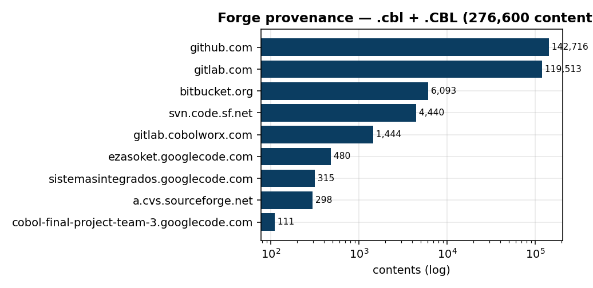
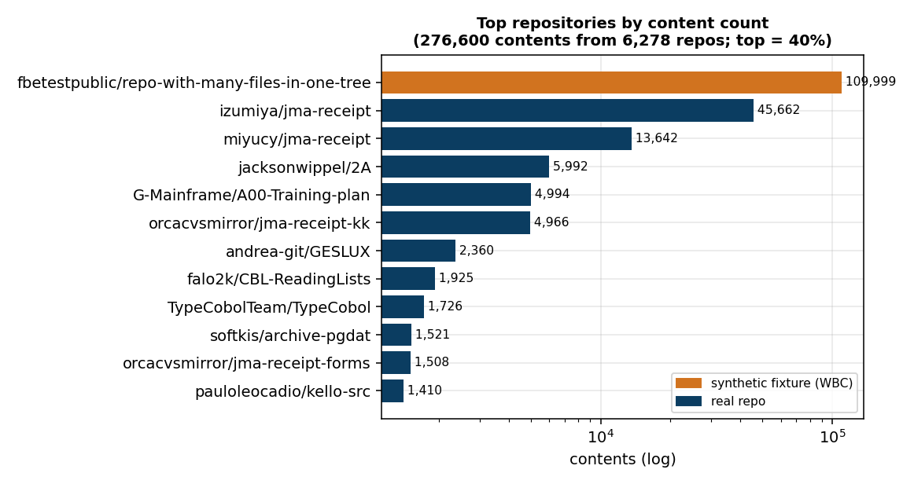

# What is *actually* in the COBOL extensions on Software Heritage?

*An empirical study of the `.cbl` / `.CBL` file extensions in the Software
Heritage (SWH) archive. Toolkit: `tools/cobol/`. Companion study on a
non-programming extension: `docs/fsf_swh_study.md`.*

> **Bottom line.** A file extension is a *claim*, not a fact — and *how you
> count* changes the claim. **~46 % of COBOL-extension files are not COBOL**
> (almost all of it one synthetic test fixture), yet **~93 % of COBOL-extension
> repositories really do contain COBOL**. Likewise the typical COBOL **file** is
> a production program, while the typical COBOL **project** is a student
> exercise. Getting any of this right requires reading content (not extensions)
> and recovering provenance (which repository each file came from).

## 1. Motivation & questions

An extension is the cheapest possible label: `.cbl` "means" COBOL. But is it
COBOL, how much of it, of what kind, and from where? We answer, for `.cbl` and
`.CBL`:

- **Q1 — Contamination.** What fraction is not COBOL, and what is it instead?
- **Q2 — Composition.** Of the genuine COBOL: dialect, standard, source format,
  domain, maturity — and how stable are those answers under different sampling?
- **Q3 — Provenance.** Where does it come from, and how concentrated?
- **Q4 — Method.** Can a cheap deterministic layer + an LLM judge produce a
  reproducible characterisation we can trust?

## 2. Data & method

### 2.1 The population we sample from

The study starts from an extraction of every SWH content whose filename ends in
`.cbl` or `.CBL`:

| | `.CBL` (upper) | `.cbl` (lower) | union |
|---|---:|---:|---:|
| rows in the extraction | 196 415 | 83 840 | 280 255 |
| **unique contents** (`sha1_git`) | 196 228 | 81 446 | **276 831** |
| unique filenames | 112 435 | 37 042 | — |
| of which synthetic `WBC_*_FOO` | 109 999 | 0 | 109 999 (**39.7 %**) |

(843 contents appear under *both* extensions.) After removing non-COBOL
(§4.1), the estimated genuine-COBOL population is **≈150 600 contents**.

**Provenance skew.** 276 600 of those contents map to **6 278 repositories**, and
the distribution is extraordinarily heavy-tailed:

| contents per repository | |
|---|---:|
| median | **3** |
| mean | 44.1 |
| max (the synthetic fixture) | 109 999 |
| top repository's share | 39.8 % |
| top-10 repositories | 69.7 % |
| **80 % of all contents come from** | **71 repos (1.1 % of repos)** |
| repositories with exactly 1 content | 1 971 |

> **Why this matters for sampling.** The population is *not* a bag of
> independent programs. Half the repositories hold ≤ 3 files, while **71
> repositories hold 80 % of all contents**. So a **by-file** sample is, in
> effect, a sample of those 71 repositories; a **by-repo** sample is a sample of
> the 6 278 projects. Neither is wrong — they estimate *different populations*.
> That is precisely what experiments E2–E4 (§3) are designed to separate.

**Sampling fractions.** How much of the population each experiment sees:

| Experiment | drawn from | N | fraction |
|---|---|---:|---:|
| E1 pilot | 276 831 contents | 100 | 0.04 % |
| E2 filtered by-file | 166 832 contents (noise-removed) | 350 | 0.21 % |
| E3 random by-file | 276 831 contents | 1 000 | 0.36 % |
| E4 by-repo | **6 278 repositories** | 1 000 | **15.9 %** |

E3 is a small fraction but *uniform-random*, so it is an unbiased estimate of the
file-level population (±~3 pts at 95 %). E4 covers **one sixth of every
COBOL-containing repository in the archive** — a genuinely representative view of
the *project* population.

### 2.2 Pipeline

The same pipeline runs end-to-end and is reused across studies:

| Stage | What it does |
|---|---|
| **Sample** | dedup by content `sha1_git`; draw N (various frames, §3) |
| **Fetch** | raw bytes from SWH by `sha1_git` (self-verifying), cached |
| **Indicators** | deterministic metrics: LOC, divisions, `EXEC SQL`/`CICS`, `COPY`, `COMP-3`, source format |
| **LLM-judge** | enum-constrained verdict via OpenRouter (Claude Sonnet 4.6, `json_schema`): is-COBOL, dialect family, standard, source format, domain, program type, maturity |
| **Reclassifier** | zero-API content rules for the non-COBOL tail, validated against the judge |
| **Origins** | recover the repository each content came from (graph CSV + GitHub match) |
| **Review** | a web app over every label (`tools/cobol/review_app.py`) for human ground truth |

The judge is asked for a single JSON object under a strict schema, so its
categorical answers are drawn from fixed vocabularies (`tools/cobol/taxonomy.py`)
and aggregate cleanly; a free-text `detail` carries nuance. Everything is cached
and resumable (re-runs and re-judging cost zero SWH quota).

## 3. Experiments (settings, stated up front)

The study is a set of deliberate experiments, each **isolating one variable**.
The crucial design choice is the **sampling frame** — how contents are drawn —
because it is what makes numbers comparable or misleading.

| # | Experiment | Sample (frame) | N judged | What it isolates → what it shows |
|---|---|---|---|---|
| **E1** | Pilot | 100, random, **both extensions, no filter** | 46 | end-to-end validation → first contamination signal (51 % noise) |
| **E2** | Curated composition | 350, random, **noise-filtered** (`WBC_*_FOO` excluded), union | 317 | the character of *filtered* COBOL as usually sampled by-file |
| **E3** | Population & contamination | **1 000, uniform-random, no filter** | 526 (+474 gated) | the true **file-level** population + a contamination estimate |
| **E4** | Project-level view | **1 000, origin-diverse** (≤ 1 file per repo) | 896 | the **project-level** population (no repo dominates) |
| **E5** | Cheap-classifier eval | 162 (tail + synthetic + controls) | — | how well a zero-API classifier matches the LLM |
| **E6** | Provenance | full origin CSVs + GitHub matcher | — | which repositories the corpus comes from |

> **Why three "large samples" and not one?** E2, E3, E4 differ *only* in the
> sampling frame — filtered-by-file, uniform-by-file, one-per-repo. Comparing
> them **is** the experiment: it measures how much of any conclusion is an
> artefact of *how you drew the sample* rather than a fact about COBOL.

Fixed throughout: model `anthropic/claude-sonnet-4.6`, temperature 0, structured
outputs; a cost **gate** (`n_divisions ≥ 2`) skips obvious non-COBOL before
spending on the judge. Total ≈ 2 900 judged contents, ~$45 across all
experiments.

## 4. Results

### 4.1 Contamination — how much is not COBOL, and *at which level*? (Q1)

**At the file level, most of the extension space is not COBOL.**

- **E1** (unfiltered pilot): 51 of 100 random files were `WBC_*_FOO.CBL` —
  literally `"This is cobol file number N"`, a *synthetic placeholder*. Corpus-
  wide these are **109 999 / 276 831 = ~40 %** of all deduplicated contents.
- **E3** (uniform-random 1 000, content-classified): **45.6 % non-COBOL**
  (95 % CI 42.5–48.7), independently **confirmed by the LLM at 47 %**. It breaks
  down as 40.8 % synthetic + 2.8 % other/foreign + 1.7 % Calibre *comic-book
  lists* (a `.cbl` extension collision) + 0.3 % binary.


**But at the repository level, it is almost all COBOL.** That 40 % synthetic mass
is **a single repository** (the "many-files-in-one-tree" test fixture, §4.3) —
one of 6 278. Drawing one file *per repository* (E4) instead of per file:

| | E3 — file level | E4 — repository level |
|---|---:|---:|
| genuinely COBOL | 54 % | **93 %** |
| **not** COBOL | **46 %** | **7 %** |

(E4: the sampled file is COBOL for 927 of 1 000 distinct repositories; the 73
others are 53 foreign/other text, 19 binaries, 1 comic-book list.)

> **Key finding — contamination is a *file-level* phenomenon.** ~46 % of
> COBOL-extension **files** are not COBOL, but ~93 % of COBOL-extension
> **repositories** really do contain COBOL. One synthetic fixture (0.02 % of
> repositories) contributes 40 % of the files. **The extension is a poor signal
> per file, and a fairly good one per project** — which statement you need
> depends on what you are sampling.

**Casing.** `.CBL` (192 k occurrences) and `.cbl` (57 k) *look* like different
worlds: a clean single-extension slice of the by-file data is **83 % healthcare**
for `.CBL` vs **36 % education** for `.cbl`. **This too is a file-level effect.**
Sampling one file per repository, the gap largely closes:

| by repository (E4) | `.CBL` (68 repos) | `.cbl` (932 repos) |
|---|---:|---:|
| education-tutorial | 39 % | 49 % |
| demo-example | 12 % | 26 % |
| healthcare-medical | *not in top-5* | *not in top-5* |
| student-exercise | 58 % | 61 % |
| production-like | **32 %** | 13 % |
| toy-or-hello-world | 7 % | 22 % |

At the *project* level both casings are education/student dominated; the residual
difference is that `.CBL` **repositories** skew somewhat more production-like
(32 % vs 13 %) and less toy. The dramatic "83 % healthcare" is entirely the ORCA
system's thousands of files. (Only 68 `.CBL` repositories fall in the by-repo
sample — most distinct repositories use lowercase — so this comparison is
indicative, with a wide interval.) Independently of that, casing still matters
for *coverage*: SWH preserves case while the extension→language mapping folds it
(cf. the documented `.R`/`.r` fix), and the contamination *modes* differ
(synthetic stubs under `.CBL`; comic-book lists under `.cbl`).

> **Lesson — even the headline facts are frame-dependent.** Contamination (46 %
> vs 7 %) and the casing split (two worlds vs nearly one) both invert when you
> move from files to repositories. This report's own central claims obey its
> central lesson: **state the sampling frame with every number.**

### 4.2 The genuine COBOL — and why the sampling frame decides the story (Q2)

Restricting to real COBOL, one property is invariant and the rest are not.

**Invariants** (true in *every* frame — not artefacts of sampling):
**COBOL-85 ~98 %**, and the **rarity of mainframe idioms** (`EXEC CICS`,
`EXEC SQL`, `COMP-3`: 3–7 %, see below).

**Everything else depends on the frame.** E3 (uniform-random, file-level), E2
(filtered, file-level) and E4 (one-per-repo, project-level) give sharply
different pictures:

| | **E3 — random (file)** | **E2 — filtered (file)** | **E4 — by repo (project)** |
|---|---:|---:|---:|
| healthcare-medical | 40 % | 49 % | ~0 % |
| education-tutorial | 19 % | 14 % | 48 % |
| production-like | 65 % | 77 % | 14 % |
| student-exercise | 24 % | 17 % | 60 % |
| median code lines | 382 | 596 | 48 |
| GnuCOBOL | 65 % | 70 % | 41 % |
| COBOL-85 | 98 % | 98 % | 96 % |


**What each experiment shows.** E2/E3 (by file) are dominated by a few large
production systems — one open-source medical-billing suite (ORCA,
`jma-receipt`) contributes *thousands* of files, so file-level sampling inherits
its character (production-like, healthcare, fixed-format, large). E4 (one file
per repo) neutralises that: 1 000 files from 1 000 distinct repos out of 6 278
COBOL-containing origins.

> **Key finding — Sampling frame determines the story.** The *typical COBOL
> file* is a production program (65 % production-like, median 382 LOC); the
> *typical COBOL project* is a student's first program (60 % student-exercise,
> median 48 LOC). Both are true — of different populations. Only origins (§4.3)
> let you tell them apart.

Beyond that, the by-file view (E2, the "clean COBOL" people usually mean) is:
GnuCOBOL ~70 %, IBM-mainframe ~11 %; fixed-format 92 %; batch 44 % / subprogram
23 % / online-CICS 18 %.


**Language features by frame.** Measured over *judged real COBOL* in each frame
(apples-to-apples — the earlier "single-digit CICS" figure was **not** an E2-only
artefact):

| feature | E3 random (file) | E2 filtered (file) | E4 by repo (project) |
|---|---:|---:|---:|
| `COPY` (copybooks) | 63 % | 74 % | **14 %** |
| `CALL` (subprograms) | 63 % | 69 % | **14 %** |
| `EXEC CICS` | 3 % | 7 % | 5 % |
| `EXEC SQL` (DB2) | 3 % | 5 % | 4 % |
| `COMP-3` (packed decimal) | 7 % | 5 % | 6 % |
| *n (judged real COBOL)* | *525* | *317* | *896* |

This splits the features cleanly in two:

- **Frame-invariant:** the mainframe idioms — `EXEC CICS`, `EXEC SQL`, `COMP-3` —
  are single-digit in *every* frame (3–7 %).
- **Frame-dependent:** `COPY` and `CALL` collapse from ~70 % (by file) to
  **14 %** (by repo), because copybooks and subprogram calls are properties of
  *large multi-file projects*, not of the single-file programs that most
  repositories actually contain.

> **Key finding — Public COBOL ≠ enterprise COBOL.** The archive is dominated by
> GnuCOBOL, COBOL-85, fixed-format code. The mainframe idioms that motivate
> "COBOL modernization" (CICS, DB2/`EXEC SQL`, COMP-3) are rare in **every**
> sampling frame (3–7 %) — a robust fact, not a sampling artefact. Conversely,
> copybooks and `CALL` look ubiquitous by-file (~70 %) but are rare by-repo
> (14 %): they are a property of the few big projects, not of COBOL projects in
> general.

### 4.3 Provenance — where it comes from, and how concentrated (Q3)

Origins were recovered two ways: a graph-derived CSV (authoritative, 99.7 % of
lowercase, all forges) and a GitHub filename+byte-length matcher (narrow: 67 of
653, but with commit anchors). Global content dedup means the same bytes can
live in many repos; the graph route usually finds the upstream.



**276 600 contents from 6 278 repositories** across GitHub (~143 k), GitLab
(~120 k), Bitbucket, SourceForge SVN/CVS, Google Code. But the corpus is
*extremely concentrated*:



> **Key finding — Provenance is the mechanism behind the sampling bias.** A
> single **synthetic fixture** (`fbetestpublic/repo-with-many-files-in-one-tree`,
> a "many files in one tree" test repo) is **40 % of everything**; the **ORCA
> `jma-receipt` ecosystem** (~65 k contents) is the largest *real* system. A
> handful of repos dominate the file population — which is exactly why by-file
> sampling (§4.2) is skewed and by-repo sampling recovers the truth.

### 4.4 Method validation (Q4)

- **Reclassifier vs LLM (E5).** A zero-API content classifier scores
  **precision 1.00 / recall 0.79 / F1 0.88** against the judge on "is this
  COBOL" over 162 files, beating the cheap division-gate baseline (F1 0.71). It
  recovers copybooks / OO / Japanese-comment / NUL-bearing COBOL the gate
  misses; the residual errors are ambiguous weak copybooks (where the LLM's
  semantic reading wins).


- **Judge vs deterministic indicators.** The LLM's `source_format` matches the
  mechanical heuristic on 95 % of judged files — an independent cross-check.
- **Judge vs reclassifier (in the review app).** They agree on is-COBOL for all
  653 judged files; the 58 flagged disagreements are all the crude gate vs the
  content methods on the copybook/fragment boundary.

> **Lesson — Bootstrap a cheap classifier from the LLM, then validate it.** The
> LLM is an expensive *oracle*; distil deterministic rules from its labels that
> run archive-wide for free, and *measure* their error (P/R/F1) rather than
> assume it. Keep the ambiguous tail with the LLM.

## 5. Key findings & lessons (summary)

> **Findings.**
> 1. **~46 % of COBOL-extension *files* are not COBOL** (one synthetic fixture),
>    but **~93 % of COBOL-extension *repositories* do contain COBOL**. The
>    `.CBL`/`.cbl` "two populations" split is likewise a *file-level* effect: by
>    repository both are education/student dominated.
> 2. Of genuine COBOL, only two answers are **frame-invariant**: COBOL-85
>    (~98 %) and the rarity of mainframe idioms (CICS/`EXEC SQL`/COMP-3, 3–7 %).
>    Domain, maturity, size, dialect — and even `COPY`/`CALL` — all depend on the
>    sampling frame.
> 3. **File vs project:** typical file = production program; typical project =
>    student exercise.
> 4. **Public COBOL is not enterprise COBOL** (GnuCOBOL/COBOL-85/fixed; CICS/DB2
>    rare).
> 5. Provenance is highly concentrated: one fixture = 40 %, ORCA = the largest
>    real system.

> **Lessons for extension studies.**
> 1. The extension is a weak signal **per file** and a fairly good one **per
>    project** — classify content, measure contamination, and always say *which
>    level* a number refers to.
> 2. The **sampling frame** is a first-class experimental variable; report
>    file-level *and* project-level. Even contamination and casing claims flip
>    between the two.
> 3. Constrain the judge to **enums + structured outputs**; cross-check against
>    deterministic indicators.
> 4. **Origins are the enabler** — they name the noise, dedup forks, and make
>    by-repo sampling possible; recover them via the SWH **graph**, not the REST
>    API.

## 6. Limitations

- **Judge accuracy is unmeasured against human ground truth** (only against a
  deterministic reclassifier and cross-checks). The review app
  (`tools/cobol/review_app.py`, with group-assertion rules) exists to build it.
- Sources > 16 000 chars are truncated for the judge (indicators use full
  bytes); `unknown` dialect (10–37 %, higher in the by-repo frame) reflects
  honest abstention on tiny snippets.
- Content-level dedup does not collapse near-duplicate forks (e.g. ORCA
  mirrors), so per-repo counts still over-represent mirrored systems.
- Many ORCA files carry EUC-JP/Shift-JIS Japanese comments; comment metrics are
  approximate on those.

## 7. Reproducibility & artefacts

```bash
python3 -m tools.cobol.sample --n 350 --seed 7 --exclude-name 'WBC_.*_FOO'   # E2
python3 -m tools.cobol.corpus_estimate --worklist worklist_1k.csv            # E3 (reclassifier sweep)
python3 -m tools.cobol.sample_diverse --n 1000 --seed 5                       # E4
OPENROUTER_API_KEY=… python3 -m tools.cobol.run_study --judge --judge-min-divisions 2 --tag <name>
python3 -m tools.cobol.eval_reclassify --tail-all                             # E5
python3 -m tools.cobol.recover_origins                                        # E6
python3 -m tools.cobol.make_figures ; python3 -m tools.cobol.review_app
```

Artefacts in `data/derived/cobol_study/`: `worklist*.csv`, per-content
`reports/<sha>.json`, `indicators*.csv`, `summary*.{md,json}`, `origins.jsonl`,
`corpus_estimate.jsonl`; figures in `docs/assets/cobol/`. Toolkit:
`tools/cobol/`. Total ≈ 2 900 judged contents, ~$45, 0 parse failures.

*Model: claude-sonnet-4.6 (judge) · study authored with Claude Code.*
