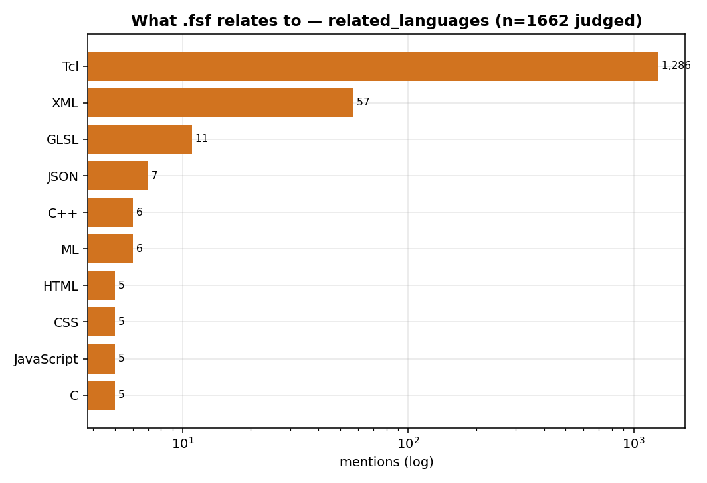
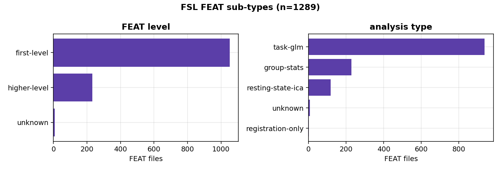
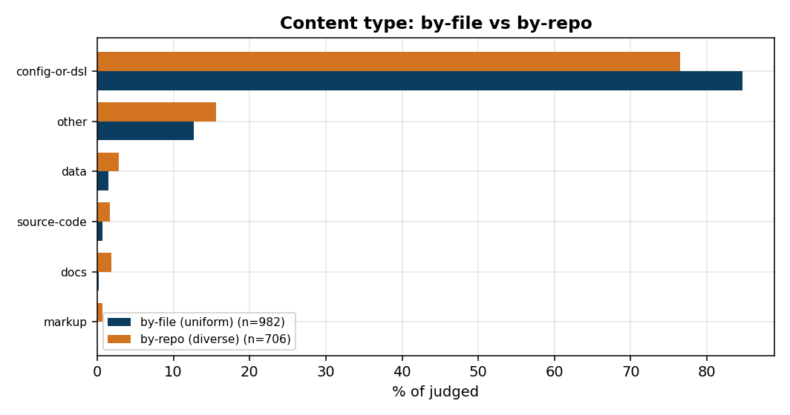
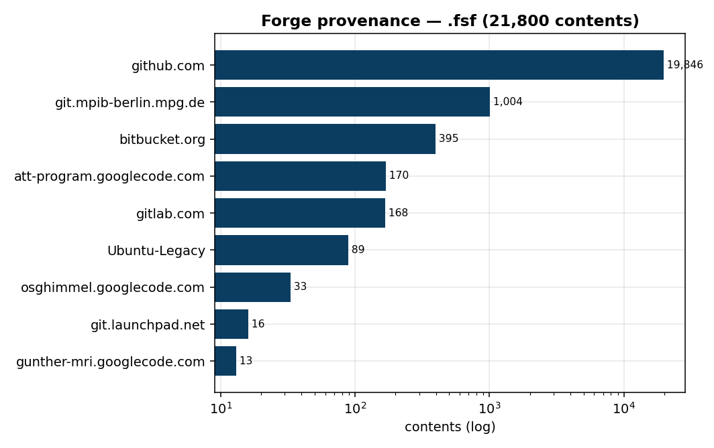
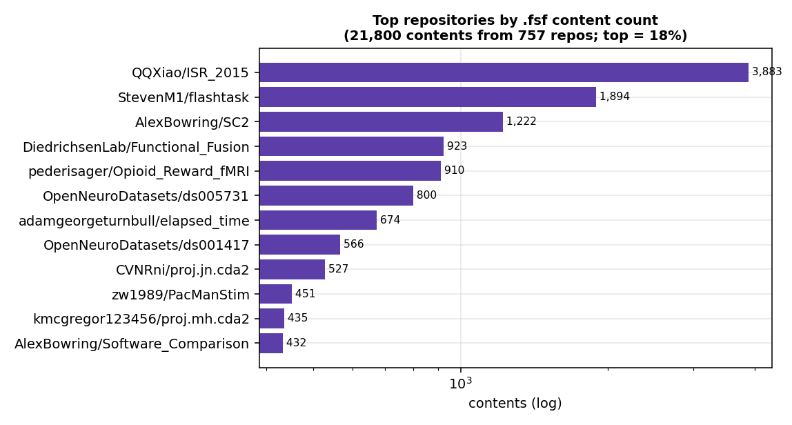

# What is *actually* in the `.fsf` extension on Software Heritage?

*An empirical study of the `.fsf` file extension in the Software Heritage (SWH)
archive — the world's largest source-code archive. Toolkit: `tools/fsf/`.*

> **Bottom line.** `.fsf` on SWH is, almost entirely, the **FSL FEAT design
> file** — a configuration for fMRI (functional MRI) neuroimaging analysis,
> written in **Tcl** `set` syntax. It is not a general-purpose programming
> language[^pl]; it is best read as a domain-specific / embedded configuration
> language hosted in Tcl. Reading content also reveals *polysemy*: the same
> extension is occasionally a **GLSL fragment shader** or a data-management
> pointer — different files, different languages.

[^pl]: "Not a programming language" is a statement about the *file's role*, not
its syntax. An FSL FEAT design is a **declarative configuration** that
parametrises an analysis pipeline — it does not, by itself, compute. It is,
however, *expressed in* **Tcl** (a real programming language) as a sequence of
`set fmri(...) value` statements, so it can equally be described as an
**internal / embedded DSL over Tcl**. Throughout, we distinguish *content role*
(configuration / DSL vs. general-purpose program) from *host syntax* (Tcl).

## 1. Motivation & questions

A file extension is the cheapest possible label. Software Heritage has archived
tens of thousands of files ending in `.fsf`, but the extension alone says
nothing about what they contain, who wrote them, or why. We ask:

- **Q1 — What is it?** What kind of content is `.fsf`, in what format, and
  which language(s)/notation(s) does it relate to?
- **Q2 — Is it a programming language, and how pure is the extension?** Is all
  `.fsf` one thing, or is the extension polysemous / contaminated?
- **Q3 — What is the sub-structure?** If it is a specific format, what are its
  variants and how were the files produced?
- **Q4 — Provenance.** Which communities and repositories does it come from?

## 2. Data & method

### 2.1 The population we sample from

We start from an extraction of every SWH content whose filename ends in `.fsf`:

| `.fsf` extraction | |
|---|---:|
| rows | 22 900 |
| **unique contents** (`sha1_git`) | **21 802** |
| unique filenames | 13 457 |
| contents with a recovered origin | 21 800 |
| **repositories** | **757** |

**Provenance skew.** As with most extensions, the distribution over repositories
is heavy-tailed — though far less extreme than some:

| contents per repository | |
|---|---:|
| median | **3** |
| mean | 28.8 |
| max | 3 883 |
| top repository's share | 17.8 % |
| top-10 repositories | 54.4 % |
| **80 % of contents come from** | **44 repos (5.8 % of repos)** |
| repositories with exactly 1 content | 247 |

> **Why this matters for sampling.** Half the repositories hold ≤ 3 `.fsf`
> files, while 44 repositories hold 80 % of all files (FEAT auto-generates one
> design per subject × run, so a single study emits thousands). A **by-file**
> sample therefore mostly measures those 44 studies; a **by-repo** sample
> measures the 757 projects. The two estimate *different populations*.

**Sampling fractions.**

| Experiment | drawn from | N | fraction |
|---|---|---:|---:|
| E1 by-file | 21 802 contents | 1 000 | 4.6 % |
| E2 by-repo | 757 repositories | 757 | **100 % — a census** |

E1 is a uniform-random 4.6 % sample of contents (unbiased for the *file*
population, ±~3 pts). E2 is not a sample at all: it draws one file from **every
`.fsf`-containing repository in the archive**, so the project-level results are a
complete enumeration, not an estimate.

### 2.2 Pipeline

We use a general content-characterisation pipeline (the same one we apply to
other extensions):

| Stage | What it does |
|---|---|
| **Sample** | dedup by content `sha1_git`; draw N contents (two sampling frames, §3) |
| **Fetch** | pull raw bytes from SWH by `sha1_git` (self-verifying), cached locally |
| **Indicators** | deterministic metrics from the bytes: line/comment counts, `set fmri(...)` directives, FEAT level, EV count, format |
| **LLM-judge** | an enum-constrained verdict via OpenRouter (Claude Sonnet 4.6, strict `json_schema`) |
| **Reclassifier** | a zero-API content rule, validated against the LLM |
| **Origins** | recover the repository each content came from |
| **Review** | a web app over every label (`tools/fsf/review_app.py`) for human ground truth |

The key design choice is *what we ask the judge*: not "is this language X?" but
**"what is this content, and which languages/notations does it relate to?"** —
so it leads with `content_type`, a free-text `format`, `expressed_in`, a
**`related_languages[]`** list, and `ecosystem_tool`, with an `is_programming_
language` flag and format-specific detail as secondary fields. This is what
lets a *polysemous* extension reveal itself.

## 3. Experiments

Two sampling frames plus a classifier evaluation:

| # | Experiment | Sample (frame) | N judged | What it shows |
|---|---|---|---|---|
| **E1** | File-level population | 1 000, **uniform-random** | 982 | what a typical `.fsf` *file* is |
| **E2** | Project-level population | 757, **origin-diverse** (1 file per repo — *all 757 repos: a census*) | 706 | what a typical `.fsf` *project* is (no repo dominates) |
| **E3** | Cheap-classifier eval | reclassifier vs the LLM judge | 1 662 | whether a zero-API marker can replace the judge |

Fixed throughout: model `anthropic/claude-sonnet-4.6`, temperature 0, structured
outputs. Total **1 662 judged contents** (from a pool of 21 800 across 757
repositories), **~$31**.

## 4. Results

### 4.1 What `.fsf` is — an FSL FEAT configuration in Tcl (Q1, Q2)

A fetched file looks like this:

```tcl
# FEAT version number
set fmri(version) 3.14
set fmri(inmelodic) 1
set fmri(level) 1
set fmri(analysis) 7
set fmri(outputdir) "..."
```

This is an **FSL FEAT design file** — the configuration format of *FEAT* (fMRI
Expert Analysis Tool) in the FMRIB Software Library, the dominant open-source
fMRI analysis suite. It is a heavily-commented **Tcl `set fmri(...)` config**,
usually generated by the FEAT GUI.


- **Content type:** `config-or-dsl` in **76–85 %** of files; `other` 13–16 %;
  small data / docs / source-code tails.
- **Is it a programming language?** `is_programming_language = False` for
  **1 641 / 1 662 = 99 %** (in the sense of the footnote above). The method
  correctly identifies a configuration format and does not mistake its Tcl host
  syntax for "a program".
- **Ecosystem:** FSL / FEAT (FMRIB), overwhelmingly.

> **Key finding — what `.fsf` is.** `.fsf` on SWH is the FSL FEAT fMRI-analysis
> design file: a neuroimaging **configuration** (99 % not a general-purpose
> program) **expressed in Tcl** — an embedded DSL over Tcl.

### 4.2 What it relates to — polysemy (Q1, Q2)

The most informative output is *which languages the content relates to*.



**Tcl 77 %** (the FEAT host syntax), then a real tail: **XML** (57), **GLSL**
(11), **C++** (6), ML (6), HTML/CSS/JavaScript (5 each), C (5), OCaml/Haskell
(4). So `.fsf` *relates to* Tcl by construction, but the extension is genuinely
**polysemous** across the archive.

> **Key finding — polysemy.** `.fsf` is not one thing. Its dominant meaning is
> FSL FEAT (Tcl), but the same extension is *also* used for **GLSL fragment
> shaders** — indeed the ~21 files the judge marks as a real programming
> language are exactly the shaders (`2DShader.fsf`, `ppFragment.fsf`) and
> C++/GLSL headers. A binary "is it language X?" question would have hidden this
> entirely; asking "what does it relate to?" surfaces it.

### 4.3 FSL FEAT sub-types (Q3)



Among the FEAT files: **first-level** analyses dominate (55–69 %) over
higher-level (12–16 %); **task-GLM** designs (48–62 %) over resting-state /
MELODIC-ICA (7 %) and group-stats (12–16 %); and they are mostly
**GUI-generated** (54–76 %) rather than hand-edited.

### 4.4 The contamination / polysemy tail (Q2)

The `other` slice (13–16 %) and the non-Tcl languages are where `.fsf` is *not*
FSL FEAT:

- **GLSL fragment shaders** — `.fsf` is also a *fragment-shader* extension
  (`.fs`/`.fsf`); some are C++ headers embedding GLSL.
- **git-annex / DataLad pointers** — a *large* artefact: ~120 files per frame
  are git-annex symlink/pointer stubs, not design content. In DataLad-managed
  neuroimaging datasets the real `.fsf` is *annexed*, so what SWH archived at
  that path is a pointer. This is ecosystem-specific contamination.
- Odd tails: a fractal-rendering config, stray XML/HTML/JSON.

> **Lesson — contamination is ecosystem-specific.** Every extension carries its
> own kind of non-target content. Here it is git-annex pointers (a
> data-management artefact of the neuroimaging community) and GLSL shaders — you
> only find them by reading content.

### 4.5 File-level vs project-level (Q3)



| | E1 — by-file (n=982) | E2 — by-repo (n=706) |
|---|---:|---:|
| has FEAT marker | 80 % | 67 % |
| config-or-dsl | 85 % | 76 % |
| `other` (non-FEAT) | 13 % | 16 % |
| GUI-generated | 76 % | 54 % |
| **hand-edited** | 6 % | **22 %** |
| distinct origins | 173 | 757 |

> **Key finding — sampling frame.** Sampling **one file per repository** surfaces
> more diversity: more non-FEAT content and far more **hand-edited** designs
> (22 % vs 6 %). Sampling **by file** over-weights the auto-generated designs
> that a few large studies emit in bulk (982 files came from only 173 repos).

### 4.6 Provenance — a neuroimaging corpus (Q4)





**21 800 contents from 757 repositories**, led by GitHub with a strong
neuroscience signal (`git.mpib-berlin.mpg.de` = Max Planck Institute). The top
repositories are pure neuroimaging: **OpenNeuroDatasets** (the canonical
fMRI/BIDS dataset hub), `DiedrichsenLab`, `Opioid_Reward_fMRI`, fMRI-task repos
(`flashtask`, `PacManStim`).

> **Key finding — provenance.** `.fsf` on SWH is a **real research corpus** from
> the neuroimaging community. Unlike some extensions, **no synthetic fixture
> dominates**: the top repository is 18 % of contents (a real study), and the
> concentration is driven by studies auto-generating one design per subject ×
> run.

### 4.7 Method validation (Q4)

The zero-API reclassifier (label = "does the file contain `set fmri(`") agrees
with the LLM judge on "is this FEAT" for **1 654 / 1 662 = 100 %**. A single-
token signature is enough to split FEAT from non-FEAT archive-wide at zero cost.

> **Lesson — bootstrap a cheap classifier from the LLM.** Use the (expensive)
> judge as an oracle to distil a deterministic rule, then *measure* its
> agreement. For `.fsf` the `set fmri(` marker is essentially perfect.

## 5. Key findings & lessons (summary)

> **Findings.**
> 1. `.fsf` ≈ **FSL FEAT** fMRI design files — a neuroimaging **configuration**
>    (99 % not a general-purpose program) **expressed in Tcl**.
> 2. The extension is **polysemous**: also GLSL fragment shaders, plus a large
>    git-annex/DataLad **pointer** artefact.
> 3. FEAT files are mostly **first-level, task-GLM, GUI-generated**.
> 4. **By-repo** sampling reveals more hand-edited, more diverse content than
>    by-file.
> 5. Provenance is a **real neuroimaging corpus** (OpenNeuro, labs, FMRIB), no
>    synthetic fixture.

> **Lessons.**
> 1. Ask *"what is this content and what does it relate to?"* — not "is it
>    language X" — because extensions are polysemous.
> 2. A `content_type` axis + a **`related_languages`** list is what exposes both
>    the dominant meaning and the tail.
> 3. Contamination is **ecosystem-specific**; only content inspection finds it.
> 4. Report **file-level and project-level** frames separately.

## 6. Toward a general methodology

This study of `.fsf` is one instance of a general question — *what is actually
in file-extension X on Software Heritage?* — and a reusable pipeline for
answering it (sample → fetch → deterministic indicators → enum LLM-judge →
cheap reclassifier → provenance → human review). We deliberately applied the
*same* method to a very different extension, **`.cbl`/`.CBL` (COBOL,
`docs/cobol_swh_study.md`)**, to check that it works symmetrically:

| | `.fsf` (this study) | `.cbl`/`.CBL` (COBOL) |
|---|---|---|
| verdict | a non-PL **configuration** (FSL FEAT / Tcl) | a real **programming language** |
| purity | mostly clean; polysemy = GLSL shaders + git-annex pointers | ~46 % contamination (synthetic fixture + comic-book lists) |
| cheap classifier vs judge | 100 % (is-FEAT) | F1 0.88 (is-COBOL) |
| provenance | real neuroimaging corpus, no fixture | one synthetic fixture = 40 % of contents |
| deliverables | report + figures + review app + rules | idem |

> **Lesson — the method generalises.** The same pipeline characterises both a
> programming language *and* a domain configuration format, distinguishes
> genuine content from contamination in each, and surfaces provenance — evidence
> that "characterise extension X on SWH" can be a general, reproducible
> methodology rather than a one-off.

## 7. Limitations

- **git-annex pointers** inflate the FEAT-looking share at the *file* level and
  under-represent real design content (the actual files are annexed off-SWH).
- The ~21 non-FEAT programs are a small window on the shader/other tail; a
  targeted sweep of `.fsf` files *without* `set fmri(` would size it precisely.
- Judge accuracy is validated against the deterministic marker (100 % on
  is-FEAT) but not yet against human ground truth — the fsf review app
  (`tools/fsf/review_app.py`, with group-assertion rules) exists for that.
- 757 origins is the whole by-repo ceiling for this extension.

## 8. Reproducibility & artefacts

```bash
python3 -m tools.fsf.study --sample --n 1000 --seed 5
SWH_TOKEN=… OPENROUTER_API_KEY=… python3 -m tools.fsf.study --run --judge
python3 -m tools.fsf.study --report
python3 -m tools.fsf.make_figures
python3 -m tools.fsf.review_app            # http://127.0.0.1:8767
```

Artefacts: `data/derived/fsf_study/` (`worklist_all.csv`, `reports/<sha>.json`,
`summary_fsf.json`), `fsf_files+origin.csv` (graph provenance), figures under
`docs/assets/fsf/`. Toolkit: `tools/fsf/`.

*Model: claude-sonnet-4.6 · 1 662 judged · ~$31 · study authored with Claude Code.*
