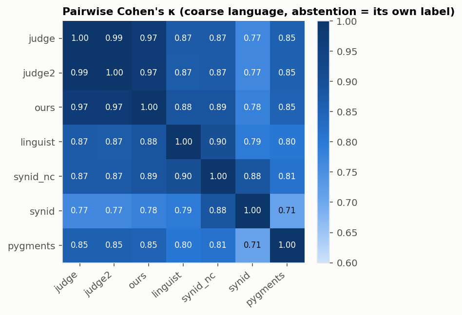

# What is *actually* in the `.m` extension on Software Heritage?

*The fourth extension study (after `.cbl`/`.CBL`, `.fsf`, `.rpgle`), and the
first on a massively polysemous extension — preceded by a methodological
revisit of the first three. Toolkit: `tools/m/`. Pre-registration:
`data/derived/m_study/PREREGISTRATION.md` (commit `eb988475`).*

> **Bottom line.** `.m` is two languages sharing one extension, plus a thin
> tail of seven more. **Which of the two is "the" `.m` language depends on what you
> count:** by file, Objective-C 54% and MATLAB 43%; by repository, 71% and 27%;
> by `(repository, path)` with version history collapsed, a near tie (50% / 47%). **Much of it was not written by the
> project that holds it:** 22% of Objective-C files — and 58% of Objective-C files
> drawn one per repository — are Xcode templates, CocoaPods stubs, vendored libraries or
> decompiled firmware — and content deduplication cannot merge them, because Xcode
> personalises the header of every copy. **The identifiers the ecosystem relies on each
> fail on one specific, fixable pattern:** Pygments reads MATLAB matrix literals as
> Objective-C (12% of MATLAB files); Linguist's rules abstain on MATLAB without a
> `%` comment (14%); Software Heritage's own Synid answers "Text" for one
> Objective-C file in ten — its comment heuristic counts the `%` in `@"%@"` — and,
> run on local files, never content-identified a file that is not UTF-8. Our own mapping gives `.m` to
> three unrelated languages through an extension-based join that affects 19% of
> its Pygments links.
>
> **Methodologically**, no labeller was treated as the oracle: seven labellers
> (three of them the ecosystem's own tools), a judge kept blind to our features, a
> second judge from another vendor, predictions committed before judging, and a
> weighted blind human audit ready to run. The two judges agree on the language
> of 99.2% of files (κ 0.98), but not on whether MATLAB code is portable to Octave
> — where they give opposite majority answers.

**How to read this report.** Part I is about *method*: what the three earlier
studies got right, what they got wrong, and what we changed. Part II is the
`.m` study itself, run with the revised method. §6 scores the seven predictions
we committed before judging; §7 folds the lessons back into the playbook.

## Part I — Revisiting the method

Three extensions have been through the playbook (`docs/swh_extension_study_playbook.md`):
`.cbl`/`.CBL` (COBOL), `.fsf` (FSL FEAT) and `.rpgle` (ILE RPG). Before running a
fourth, we re-read the three toolkits and reports as a reviewer would, asking one
question of each design choice: *would the numbers survive if we had got this
wrong?*

### 1. What held up

- **Content over extension.** Classifying from bytes, never from the name, found
  46% non-COBOL under `.cbl`, 99% non-PL under `.fsf`, and 0.5% under `.rpgle`.
  The same method found rot where there was rot and none where there was none.
- **Two frames, always.** By-file and by-repo answered different questions in
  all three studies, and disagreed materially each time.
- **Enum-constrained structured output.** Thousands of judged files with
  essentially no parse failures (one COBOL verdict truncated mid-JSON, fixed by
  raising `max_tokens`); aggregates never fragment.
- **Graph-derived provenance.** The maintainer's `<ext>_files+origin.csv` turned
  "40% of `.CBL` is noise" into "40% of `.CBL` is *one* GitLab test fixture".
- **Cache everything, resume anything.** Re-analysis costs neither quota nor money.

### 2. What was weak

| # | Weakness | Where it showed | Why it matters | Change in the `.m` study |
|---|---|---|---|---|
| W1 | **No ground truth.** The LLM judge was the reference in every evaluation. | All three. Across the three studies' review directories there is **one** human review. rpgle then showed the judge wrong on 9.1% of a lexical field. | Every accuracy we reported was agreement with one model. | Seven labellers, three of them tools we did not write (Linguist, Pygments, SWH Synid); two judges from different vendors; Dawid–Skene accuracy with no oracle; and a **blind, stratified, weighted human audit** wired into the review tool (§5.8). |
| W2 | **The judge saw the indicators, then was scored against a classifier built from them.** | All three judges received the mechanical indicators in the prompt. COBOL reported "the judge matches the heuristic on 95% — an *independent* cross-check". | Agreement inflated by construction; the two layers were not independent. | The primary judge is **blind** (bytes, filename, path, repo only). An ablation (E5) re-judges 300 files *with* indicators to measure anchoring. |
| W3 | **One model, one run.** | All three (Sonnet 4.6, temperature 0). | No estimate of how much a label depends on the model. | A second judge from another vendor (Gemini 3.8 Flash) on the same 2,000 files; κ per field (E4). E5 doubles as a test–retest of the primary judge. |
| W4 | **Rules tuned and scored on the same labels.** | COBOL's reclassifier (P 1.00 / R 0.79) was distilled from, and scored on, the same 162 judged files. rpgle froze its rules after 326 judgements and scored them on the next 1,146 — a genuine hold-out, but not declared in advance, and its v3 was tuned on everything. | In-sample scores overstate what the rules will do on new files. | A **pre-registration** (hypotheses H1–H7, samples, models, frozen v1 rules, tuning split) was **committed before the first study judgement** (commit `eb988475`). v1 is scored prospectively; v2 is tuned on U ranks 1–300 only and scored on the rest. |
| W5 | **Expensive labels cap the sample.** | ≤ 1,000 judged files per frame; rare classes invisible. | Wide intervals, and nothing to say about the tail. | Cheap labels on every fetched file, combined with the judged subset by **prediction-powered inference** (PPI) for valid, narrower intervals. Post-stratified frames use population weights computed *exactly* from the full 51 M-row table. |
| W6 | **The population file was taken as-is.** | No study accounted for its rows (read vs parsed vs dropped). | Silent loss or duplication skews every frame. | An ingest audit: rows parsed = rows starting `swh:1:cnt:` (51,414,668); three defect classes counted and kept (§2.1). |
| W7 | **The mapping was stress-tested against one claim.** | Each study asked "is it language X?" for the one X the mapping named. | A polysemous extension was never tested. | `.m` is claimed by eight languages in our own `ext_claim.csv`, three more through a join bug (§5.7), and three widely used identifiers disagree about it. |

> **Lesson — "The LLM is not the oracle" generalises: no single labeller is.**
> rpgle showed the judge can be confidently wrong on a lexical fact. The
> remedy is not to swap in a different oracle but to measure *every* labeller —
> ours, the community's, SWH's, two LLMs — against each other and, finally,
> against a small weighted human audit, with the judge's prompt kept blind to
> the features it will be compared on.

## Part II — The `.m` study

### 1. Who claims `.m`? (a two-minute primer)

Every earlier study had one expected answer. `.m` has many, and our own
extension→language mapping (`data/derived/pl_taxonomy/ext_claim.csv`) already
lists eight:

| Claimant | What a `.m` file is in that world | Claimed by |
|---|---|---|
| **MATLAB** | a function file, a script, or a `classdef` class | Linguist, Pygments, Wikidata |
| **GNU Octave** | the same, plus Octave-only syntax (`#` comments, `endfunction`, `printf`, `++`, `!=`) | Pygments, Wikidata |
| **Objective-C** | a class implementation (`@implementation`), `main.m`, a test case | Linguist, Pygments, Wikidata |
| **Wolfram Language** | a Mathematica *package* (`BeginPackage[…]`, `(* ::Package:: *)`) | Linguist, Wikidata |
| **Mercury** | a module (`:- module …`) | Linguist, Wikidata |
| **M (MUMPS)** | a routine (GT.M / YottaDB store one routine per `.m`) | Linguist |
| **Limbo** | an Inferno module *interface* (`Sys: module { … }`) | Linguist |
| **MUF** | a TinyMUCK Forth program | Linguist |
| *M4, Monkey C, Win32 Message File* | none — they inherit `.m` from Pygments' **Mason** lexer through a join bug (§5.7) | Pygments (spurious) |

Reading contents added four notations no source claims: **Magma** (computer
algebra), the **FreeBSD kobj interface definition** language (`*_if.m`), the
**New Jersey Machine-Code Toolkit** specification language, and **PML** — the
XML morphological layer of the Prague Dependency Treebank. There is also plain
C, Markdown and CSV that happen to sit in `.m` files.

So the question is not "is it X?" but **"which of a dozen things is it, how
often, and can anything short of a language model tell them apart?"**

### 2. Data

#### 2.1 The population, and an audit of the population file

The maintainer's export (`SWH-m-files.zip`) is six headerless CSV shards, 14 GB,
produced by the Rust **`swh-provenance`** tool on the CINES supercomputer: one row
per content, `swh:1:cnt:<sha1_git>,<SWH browse URL>`, where the URL carries
`origin_url`, `branch`, `path` and a `timestamp`. It is too large for the
`csv`-module approach of the earlier studies, so `tools/m/ingest.py` loads it with
DuckDB into a 2.8 GB Parquet table in about 20 seconds.

Before sampling we audited the file itself (weakness W6):

| Property | Value |
|---|---|
| Physical lines / records starting `swh:1:cnt:` / records parsed | 51,414,839 / **51,414,668** / 51,414,668 (none lost) |
| Distinct contents | **51,414,668** — each listed exactly once, with a single provenance context |
| `no_origin` rows (`… has no predecessors in this graph`) | 58,549 (0.11%) — kept, excluded from by-repo frames |
| Records split by a newline inside the file name | 100 — first line kept (sha, origin, branch, path prefix intact) |
| Non-data trailer | a CINES job report at the end of each shard — dropped |
| Contents with an origin / **distinct origins** | 51,356,119 / **2,076,824** |
| Distinct `(origin, path)` files | 27,678,487 → **46.1% of contents are later versions of the same file** |
| Contents per repo — median / mean / max | 4 / 24.7 / 429,552 |
| Largest repo / top 10 / top 100 | 0.84% / 3.1% / 6.2% of contents |
| Top 1% / top 10% of repos | 41% / 76% of contents — 265,470 repos (12.8%) cover 80% |
| Provenance context whose name does **not** end in `.m` | 169,231 (0.33%): `.svn-base` 99,782, MATLAB autosave `.asv` 28,939, `.m~`, `.txt`, `.md`, `.c`, `.h`, even `.py` |

Three properties of this file matter for everything that follows.

- **The context path is *a* path, not *the* `.m` path.** A content was selected
  because *some* directory entry names it `*.m`; the provenance tool then reports
  *one* place it occurs — which, for 0.33% of contents, is a Subversion pristine
  copy, an editor backup, or a file of another type holding the same bytes. One of
  our sampled contents is reported as `test.lua`: 21 bytes that are equally valid
  Lua and MATLAB.
- **The timestamp is a visit date.** Years run 2015–2025 — SWH's own lifetime — so
  they date the archive's crawl, not the code.
- **Only lowercase `.m` was extracted.** Uppercase `.M` (26 k occurrences in the
  SWH-MSR-ARV counts) is absent; the 1,263 `.M` paths above are contexts of bytes
  that also exist as `.m`. The COBOL lesson — *case matters* — applies here as a
  coverage gap to close in a later extraction.


`.m` is not dominated by any single repository — unlike `.CBL` (one fixture held
40%) or `.rpgle` (three parser repos held 21%) — yet it is top-heavy in
aggregate: 1% of repositories hold 41% of the contents. The largest are named in
§4.4, and they are not what a reader expects.

#### 2.2 Duplication signals, measured on the whole population

Because the population is a table, some questions can be answered exactly, for
free, before any file is read (`tools/m/name_pop.py`):

| Family (by file name) | contents | % of contents | repos | % of repos |
|---|---:|---:|---:|---:|
| Xcode template names (`AppDelegate.m`, `main.m`, `ViewController.m`, `SceneDelegate.m`) | 3,243,345 | 6.3% | 880,802 | **42.4%** |
| CocoaPods stubs (`*-dummy.m`) | 493,666 | 1.0% | 241,904 | 11.6% |
| Coursera *Machine Learning* exercises (repos with ≥ 5 exercise names) | 449,136 | 0.9% | 20,942 | 1.0% |
| Flutter plugin registrant (`GeneratedPluginRegistrant.m`) | 19,710 | 0.04% | 13,334 | 0.6% |


`AppDelegate.m` exists in 689,794 repositories — a third of every repository that
contains a `.m` file — as **1,341,866 distinct contents**; `main.m` as 1.0 M and
`ViewController.m` as 0.86 M. Software Heritage deduplicates byte-identical files,
but Xcode stamps each new project's template with a header comment carrying the
project name, author and date. Stripping `//` comment lines from the `main.m`
files in our sample collapses 139 distinct contents to 68, and **55 (40%) of them
become one and the same file** — the untouched Xcode template. (`AppDelegate.m` is
edited more often: its largest cluster is 38 of 261.) **Content-level
deduplication does not remove boilerplate that is personalised at creation**; any
count of "`.m` files" carries millions of near-identical templates.

#### 2.3 Sampling frames

| Frame | Definition | fetched | judged |
|---|---|---:|---:|
| **U · by file** | uniform over all 51,414,668 contents; md5 rank | 2,000 of 10,000 drawn | 1,000 (ranks 1–1,000) |
| **R · by repo** | uniform over the 2,076,824 origins, then one content uniformly within it | 2,000 of 3,000 drawn | 1,000 (ranks 1–1,000) |
| U″ · by path | U re-weighted by 1 / (versions of its `(origin, path)`) | — | derived, $0 |
| U′ · by repo | U re-weighted by 1 / (contents in its origin) — a cross-check on R | — | derived, $0 |
| **T · heavy tail** | 4 random contents from each of the 25 largest repositories | 100 | 100 |

Every rank prefix of U and R is itself a simple random sample (weakness W5), so
the rate-limited fetch — the token quota turned out to be 1,200 requests an hour —
could stop anywhere without biasing a frame. The weights for U″ and U′ are
**computed exactly from the population table**, not estimated.

### 3. Labellers and experiments

#### 3.1 Seven labellers, one question: *which language is this `.m` file?*

| Labeller | Kind | Sees | Cost |
|---|---|---|---|
| **LLM judge** — `anthropic/claude-sonnet-4.6`, T=0, schema `m-judge/1` | semantic | bytes (≤ 16 k chars), file name, path, repository — **no indicators** | $25.41 for 2,093 calls |
| **LLM judge 2** — `google/gemini-3.8-flash`, same prompt and schema | semantic | same | $8.08 for 2,105 calls |
| **our reclassifier** — `m-reclass/1` (frozen before judging) and `/2` (tuned on U ranks 1–300) | rules | bytes | $0 |
| **Linguist** — the `.m` block of `heuristics.yml`, first match wins, else abstain | rules | bytes | $0 |
| **Pygments** 2.19 — `guess_lexer_for_filename`, choosing among its four `*.m` lexers | scores | bytes + name | $0 |
| **SWH Synid** `9bc1c32` — `synid file`, default content strategies | tool | bytes + name | $0 |
| **SWH Synid**, without its `comment` strategy | tool | bytes + name | $0 |

Linguist, Pygments and Synid are the identifiers the ecosystem actually runs;
Synid is Software Heritage's own. None of them was written for this study, so
their agreement with the judges is evidence rather than an echo. The judge schema
asks for the language *and* the semantic context the rules cannot give:
`content_type`, `provenance_kind` (hand-written / IDE-or-framework template /
tool-generated / vendored third-party / decompiled), `unit_kind`,
`matlab_dialect`, `related_languages[]`, `domain`, `maturity`, and free-text
details.

#### 3.2 Experiments

| # | Question | Design |
|---|---|---|
| **E1** | What is `.m`, by file? | judge + all labellers on U ranks 1–1,000 |
| **E2** | …and by repository? | the same on R ranks 1–1,000; U″ and U′ re-weightings for free |
| **E3** | Lexical vs semantic: who decides "Octave"? | judge's `octave` vs Octave-only tokens computed in code (H5) |
| **E4** | Do two LLMs from different vendors agree? | κ per schema field, 2,000 files (H7) |
| **E5** | Does showing the indicators anchor the judge? | U ranks 1–300 re-judged *with* indicators; agreement with our rules, blind vs shown (H6) |
| **E6** | How good are the ecosystem's identifiers? | Linguist, Pygments, Synid vs the two-judge consensus; failure modes traced to code |
| **E7** | Can cheap labels carry the estimate? | our frozen v1 on U/R ranks 1,001–2,000 + judge on ranks 1–1,000 → PPI |
| **E8** | Is the mapping right? | `ext_claim.csv` claims vs observed languages; the Pygments join |
| **E9** | Who is right when they disagree? | blind, stratified, weighted human audit — **tool and queue ready; reviews pending** |

**Spend.** Primary judge $25.41 (2,093 calls, incl. frame T), anchoring ablation $3.99 (299 calls), second judge $8.08 (2,105 calls, 12 empty responses retried once) — **$37.48 in total**, 4,481 parsed verdicts. Everything else ran locally for free.

### 4. Results — what `.m` is

#### 4.1 Two languages, and the frame decides which one is bigger


| language | by file (U, judged) | by file, PPI | by path (U reweighted) | by repo (U reweighted) | by repo (R, judged) | by repo, PPI |
|---|---:|---:|---:|---:|---:|---:|
| Objective-C | 53.7% [50.6–56.8] | 55.1% [52.9–57.3] | 49.5% [45.6–53.4] | 69.9% [60.2–77.5] | 71.2% [68.3–73.9] | 70.0% [68.0–72.1] |
| MATLAB / Octave | 42.8% [39.8–45.9] | 41.7% [39.5–43.9] | 47.4% [43.6–51.4] | 29.7% [21.6–38.8] | 27.0% [24.3–29.8] | 28.1% [26.1–30.1] |
| Wolfram | 1.0% [0.5–1.8] | 0.4% [0.0–0.7] | 1.2% [0.5–2.3] | 0.3% [0.0–3.5] | 0.4% [0.2–1.0] | 0.4% [0.1–0.7] |
| other code | 1.7% [1.1–2.7] | 1.9% [1.2–2.6] | 1.3% [0.6–2.5] | 0.1% [0.0–3.5] | 0.5% [0.2–1.2] | 0.5% [0.1–0.9] |
| not code | 0.8% [0.4–1.6] | 0.8% [0.4–1.3] | 0.6% [0.2–1.6] | 0.0% [0.0–3.5] | 0.7% [0.3–1.4] | 0.6% [0.2–1.1] |
| *n* | 1000 | 1000+1000 | n_eff≈632 | n_eff≈105 | 1000 | 1000+1000 |

*(Coarse classes; brackets are 95% intervals — Wilson for simple random samples,
Kish effective n for re-weighted frames, power-tuned PPI for the PPI columns.
Binary contents are never sent to a judge and count as "not code".)*

Read across the Objective-C row. **By file**, `.m` is 54% Objective-C and 43%
MATLAB. **By repository**, it is 71% Objective-C and 27% MATLAB — and the
re-weighted by-file sample (U′) lands on the same answer (70% / 30%) through a
completely different route, which is the best evidence that neither is an
artefact. **By `(repository, path)`**, i.e. with version history collapsed, the
two languages are level (50% / 47%).

> **Finding 1 — `.m` has no frame-free majority language.**
> Most `.m` *repositories* are iOS/macOS projects; most `.m` *files* are split
> almost evenly; with version history collapsed to one content per
> `(repository, path)`, the two are level.
> The mechanism is visible in the population: an Objective-C app carries many
> small template and class files, a MATLAB research repository carries many
> function files **and** more archived revisions of each (the by-path
> re-weighting shifts 4 points toward MATLAB).

Octave-only files are rare (1.1% of files; 16 of the 23 files the Sonnet judge
called Octave use Octave-only syntax — §5.2), and 99.2% of files are in a
programming language at all.

#### 4.2 The tail: seven more notations under one extension

By file, **3.5%** of `.m` is neither Objective-C nor MATLAB-family. Small — but
it spans seven distinct languages or formats, four of them claimed by no source
our mapping uses:

| language (judge) | by file (of 1,000) | by repo (of 1,000) | examples (repository owner) |
|---|---:|---:|---|
| mathematica-wolfram | 10 | 4 | `1.2.3.5 P(x) (d x)^m (a+b x^` (JuliaSymbolics); `AdaIN.m` (GalAster); `DSe_algorithm.m` (laluzamakhsyari) |
| mumps-m | 6 | 1 | `ECX8151.m` (jshtz4); `ENEQNX2.m` (~ov+server); `IBDEI0C8.m` (shabiel) |
| magma | 4 | 0 | `128S124-8,8,8-g41-path194.m` (michaelmusty); `64S12-8,8,2-g9.m` (michaelmusty); `64S14-4,8,8-g17-path7-notcom` (michaelmusty) |
| mercury | 3 | 0 | `parsing_utils.m` (Mercury-Language); `post_term_analysis.m` (sebgod); `simplify_goal_switch.m` (Mercury-Language) |
| c-or-cpp | 1 | 1 | `list.c` (blackreaven); `main.m` (pasoev) |
| other-programming-language | 3 | 3 | `000.m` (DamnDanielV); `FEB 25:2006.m` (csrgxtu); `decoder.m` (mibrahim) |
| not-code | 8 | 7 | `._vonMiseFourier.m` (joaodornas); `0000-01-02-Kasia239.md` (Kasia239); `Code.m` (icestraw) |
| unknown | 0 | 2 | `pong.m` (martin-azpillaga); `test.lua` (Player1os) |

- **Wolfram** (1.0%): Mathematica packages, symbolic-integration rule sets
  (Rubi), and computer-algebra *output* — e.g. a 250 kB asymptotic expansion
  written by Mathematica itself.
- **MUMPS** (0.6%): VistA and RPMS routines — the US Veterans Affairs hospital
  system, released under FOIA and mirrored across many repositories.
- **Magma** (0.4%, unclaimed): files of the *SolvableDessins* database, generated
  by Magma scripts — one repository with 256,931 `.m` contents, the
  second-largest in the archive.
- **Mercury** (0.3%): the Mercury compiler and standard library.
- **Other languages** (unclaimed): the **FreeBSD kobj interface definition
  language** (`mmcbus_if.m`), a **New Jersey Machine-Code Toolkit** specification
  from the Boomerang decompiler, *Monty* bytecode from a coding-school stack
  interpreter exercise, C code in a `main.m` — and a CSV matrix that the judge
  files here although its own detail field calls it data.
- **Not code** (0.8%): **PML**, the XML morphological layer of the Prague
  Dependency Treebank; Markdown READMEs; a file holding only a UUID; macOS
  AppleDouble metadata (`._vonMiseFourier.m`) and other binaries.

**Limbo** and **MUF**, both claimed by Linguist, never occurred in 2,000 judged
files (by-file upper 95% bound: 0.38%).

#### 4.3 Who wrote it? Much of `.m` was not written by its project


| provenance kind | by file | by repo | Objective-C by file | Objective-C by repo | MATLAB by file | MATLAB by repo |
|---|---:|---:|---:|---:|---:|---:|
| hand-written | 84.0% | 56.8% | 77.8% | 41.6% | 93.7% | 94.8% |
| ide-or-framework-template | 9.1% | 39.1% | 16.4% | 54.4% | 0.5% | 1.1% |
| vendored-third-party | 2.1% | 2.9% | 2.4% | 3.7% | 1.9% | 1.1% |
| tool-generated | 3.2% | 1.2% | 0.7% | 0.4% | 3.7% | 3.0% |
| decompiled-or-dumped | 1.4% | — | 2.6% | — | — | — |
| unknown | 0.1% | — | — | — | 0.2% | — |

The judge's `provenance_kind` separates hand-written code from files a tool or a
template put there. **By file, 22% of Objective-C is not hand-written; by
repository, 58% is** — mostly IDE/framework templates: Xcode's `AppDelegate.m`
and `main.m`, CocoaPods' `Pods-*-dummy.m` stubs, React Native's `AppDelegate`,
Flutter's `GeneratedPluginRegistrant.m`. MATLAB is the opposite: 94–95% is
hand-written in both frames, with a small generated tail (symbolic code exported
from Maple, simulation logs written as `.m` scripts).

This label is not self-certified. The judge never saw how many repositories
share a file's name; the population table knows (`name_popularity.json`):

| judge's `provenance_kind` (by file) | n | median repos sharing the file name |
|---|---:|---:|
| hand-written | 837 | 2 |
| vendored third-party | 21 | 48 |
| IDE / framework template | 91 | 13,334 (quartiles 1 / 567,590) |

Files the judge calls templates have names that recur across **thousands** of
repositories; files it calls hand-written have names that recur in two. (The low
quartile of templates is CocoaPods stubs, whose names embed the project name —
`Pods-MyApp-dummy.m` — and so never repeat.)

> **Finding 2 — A `.m` count is largely a count of boilerplate, and
> deduplication does not remove it.** 42% of all `.m` repositories contain an
> Xcode-template file name; 12% contain a CocoaPods stub. SWH stores each copy
> as a distinct content because the template is personalised at creation (§2.2:
> in our sample, 139 distinct `main.m` contents collapse to 68 once `//` comment lines are removed). By repository, more than half of what a
> random Objective-C `.m` file tells you is what Xcode, CocoaPods or React
> Native generated when the project was created.

The judge also surfaces **vendored MathWorks toolboxes** (Model-Based
Calibration, Simulink Coverage, Real-Time Workshop) copied wholesale into
personal repositories, and — at population scale — **commit-bot histories**:
`icestraw/EveryDayOC` keeps 4,016 versions of a single `Code.m` (the version we
sampled holds nothing but a UUID); `duaneking/metrics` holds 19,879 versions of
one `helloWorld.m`.

#### 4.4 The heavy tail, named (frame T)

| repository | `.m` contents | % | what the 4 sampled files are (judge) |
|---|---:|---:|---|
| github.com/CrackerCat/iPhone15-3_17.6.1_21G101_Restore | 429,552 | 0.84 | objective-c/decompiled-or-dumped — Decompiled binary from iPhone 15 iOS 17.6.1 restore,… |
| github.com/michaelmusty/SolvableDessins | 256,931 | 0.5 | magma/tool-generated — SolvableDessins database entry generated by Magma scripts for solvable… |
| github.com/CrackerCat/iPhone17-1_18.2_22C152_Restore | 249,201 | 0.49 | objective-c/decompiled-or-dumped — Decompiled from iPhone 17-1 iOS 18.2 (22C152) restore image,… |
| github.com/ufal/PDT-C | 186,869 | 0.36 | not-code/tool-generated; other-programming-language/tool-generated — Prague Dependency Treebank (PDT) morphological annotation layer,… |
| github.com/rueckelt/TransmissionPlanningFramework | 155,345 | 0.3 | matlab/tool-generated — Auto-generated log file from TransmissionPlanningFramework greedy… |
| github.com/SchapplM/robsynth-serroblib | 124,473 | 0.24 | matlab/tool-generated — HybrDyn-Toolbox output from Maple symbolic code generation for serial… |
| github.com/Mx1014/workSource | 57,641 | 0.11 | objective-c/hand-written; objective-c/tool-generated — Code-generated API command object, generated at 2016-04-07 17:33:47,… |
| github.com/Mercury-Language/mercury | 56,656 | 0.11 | mercury/hand-written — Mercury-Language/mercury repository sample: Eliza chatbot implemented… |
| gitlab.ifremer.fr/fleet/acoustic/sonarscope.git | 51,236 | 0.1 | matlab/hand-written — SonarScope application (Ifremer acoustic toolbox), private method of… |
| github.com/Gong-Meng1/Matlab-funciones | 43,732 | 0.09 | matlab/hand-written; matlab/vendored-third-party — MathWorks MBC Toolbox (Model-Based Calibration) contable2 class… |
| github.com/rueckelt/TransmissionPlanning | 41,079 | 0.08 | matlab/tool-generated — Auto-generated simulation log from TransmissionPlanning research code,… |
| github.com/xiaolaihuohuo/matlab | 39,216 | 0.08 | matlab/hand-written; matlab/vendored-third-party — MathWorks Simulink Coverage toolbox private utility (slcoverage/private) |
| github.com/BytedanceCBR/MyTest | 35,437 | 0.07 | objective-c/hand-written — Hand-written iOS view controller for a house sale input feature in a… |
| github.com/ga-explorer/GA-FuL-MATLAB-Toolbox | 34,057 | 0.07 | matlab/tool-generated — GA-FuL generated geometric algebra sparse product function (scalar… |
| github.com/spm/spm | 33,852 | 0.07 | matlab/hand-written; matlab/vendored-third-party — FieldTrip toolbox (fieldtrip/fileio/private), vendored into SPM… |
| github.com/aludiba/automobileBeautyService | 33,744 | 0.07 | objective-c/hand-written; objective-c/tool-generated — Obfuscated/generated Objective-C class with mangled names, likely from… |
| github.com/chebfun/chebfun | 29,828 | 0.06 | matlab/hand-written — Chebfun library, deltafun class method for numerical intersection of… |
| github.com/PioRob/Viral-Dark-Matter | 29,809 | 0.06 | matlab/hand-written; matlab/vendored-third-party; not-code/unknown — MathWorks RTW targets CAN block open-function callback, Copyright 2004… |
| github.com/pace-neutrons/Horace | 29,169 | 0.06 | matlab/hand-written — Horace neutron scattering software test configuration base class |
| github.com/michaelkm03/Fastlane | 28,210 | 0.05 | objective-c/hand-written — Hand-written Objective-C view controller for a marquee/carousel UI… |
| github.com/SuperChaoM/Apple_TVOS_18.2.1_22K160 | 27,383 | 0.05 | c-or-cpp/decompiled-or-dumped; objective-c/decompiled-or-dumped — IDA Pro or similar decompiler output of Apple iMessage.imservice binary… |
| github.com/ChristopherEdwards/FOIA-RPMS | 26,512 | 0.05 | mumps-m/hand-written — VistA/RPMS MUMPS routine for Integrated Billing package, FOIA release |
| github.com/michaelmusty/2GroupDessinsNonGalois | 26,396 | 0.05 | magma/tool-generated — Generated data file for 2-group dessin d'enfant database… |
| github.com/jshtz4/VistA-FOIA | 25,879 | 0.05 | mumps-m/hand-written; mumps-m/tool-generated — VistA FOIA source - Integrated Billing package routine IBARXEU1,… |
| github.com/yoflippo/MatlabExamGeneratorChecker | 25,779 | 0.05 | matlab/hand-written; matlab/tool-generated; not-code/hand-written — MatlabExamGeneratorChecker generated exam question file |

**Twelve of the 25 largest `.m` repositories are mostly not hand-written**, and
the six largest — 2.7% of every `.m` content in the archive — contain no ordinary
program at all: two **decompiled iOS firmware images** (429,552 and 249,201
files of IDA-style Objective-C pseudo-code), a **Magma-generated** mathematical
database, the **Prague treebank** in XML, and two research projects whose `.m`
files are **machine output** (simulation logs; Maple-generated robot dynamics).
Unlike `.CBL`, no single repository dominates; like `.CBL`, the largest
repositories are the least representative.

### 5. Results — how well can `.m` be labelled?

#### 5.1 Seven labellers against the two-judge consensus (E6)

The two LLM judges, from different vendors and blind to our indicators, give the
same coarse language for **1,991 of 1,997** files judged by both (99.7%). We use
that agreement set as the reference — a consensus, not ground truth (§5.8).


| labeller | agrees | disagrees | abstains | accuracy when it answers | Dawid–Skene accuracy |
|---|---:|---:|---:|---:|---:|
| LLM judge — Sonnet 4.6 (blind) | *defines the consensus* | | | | 99.7% |
| LLM judge — Gemini 3.8 Flash (blind) | *defines the consensus* | | | | 99.8% |
| our reclassifier v2 | 98.9% | 0.3% | 0.8% | 99.7% | 99.4% |
| our reclassifier v1 (frozen) | 98.6% | 0.2% | 1.2% | 99.8% | — |
| Linguist `.m` heuristics | 93.6% | 0.1% | 6.3% | 99.9% | 100.0% |
| SWH Synid (without `comment`) | 93.7% | 0.3% | 6.0% | 99.7% | 98.5% |
| SWH Synid (default content strategies) | 87.6% | 0.1% | 12.3% | 99.8% | 98.7% |
| Pygments `guess_lexer` | 93.6% | 6.4% | 0.0% | 93.6% | 93.2% |

Recall per class (abstaining counts as a miss) shows *where* each tool fails —
beyond the two big languages, almost everywhere:

| labeller | Objective-C R | MATLAB / Octave R | Wolfram R | other-code R | not-code R |
|---|---:|---:|---:|---:|---:|
| our reclassifier v2 | 1.00 (1248) | 1.00 (695) | 0.86 (14) | 0.63 (19) | 0.60 (15) |
| our reclassifier v1 (frozen) | 1.00 (1248) | 0.99 (695) | 0.79 (14) | 0.63 (19) | 0.60 (15) |
| Linguist `.m` heuristics | 1.00 (1248) | 0.86 (695) | 0.57 (14) | 0.47 (19) | 0.40 (15) |
| SWH Synid (without `comment`) | 1.00 (1248) | 0.88 (695) | 0.00 (14) | 0.47 (19) | 0.00 (15) |
| SWH Synid (default content strategies) | 0.90 (1248) | 0.88 (695) | 0.00 (14) | 0.47 (19) | 0.00 (15) |
| Pygments `guess_lexer` | 1.00 (1248) | 0.88 (695) | 0.00 (14) | 0.00 (19) | 0.40 (15) |

When they answer, Linguist and Synid are almost always right (99.7–99.9%);
Pygments never abstains, so its errors surface as wrong answers (6.4%). All
three fail **systematically**, and each failure traces to a specific line of
code:

| Tool | Failure | Share | Mechanism |
|---|---|---:|---|
| **Pygments** | calls MATLAB "Objective-C" | 86 / 695 MATLAB files (12.4%) | `ObjectiveCLexer.analyse_text` scores 0.8 for `\[\s*[a-zA-Z_]\w*\s+…[\]:]` — a message send *or a MATLAB matrix literal* `[a b]`; `MatlabLexer` scores only 0.2 for a `%` comment. Only four lexers claim `*.m`, so Wolfram, Mercury, MUMPS and Magma are unreachable. |
| **Linguist** heuristics | abstain on MATLAB | 97 / 695 (14.0%) | the MATLAB rule is `^\s*%` — any MATLAB file without a comment line falls through to the Bayesian classifier. |
| **SWH Synid** | answers `Text` for Objective-C | 124 / 1,248 Objective-C files (9.9%) | the `comment` strategy runs *before* the Linguist heuristics, scores each candidate by lines that *contain* its comment symbol — `%` inside `@"%@"` counts for MATLAB/Mercury — and drops Objective-C. **Without that one strategy: 3 / 1,248 (0.2%).** Appendix C gives a reproduction and three possible fixes. |
| **SWH Synid** | returns all eight candidates | 42 / 1,991 (2.1%) | **every** such text file is non-UTF-8 (36 of 36 — MATLAB with Latin-1 comments, one Objective-C), and every resolved file is UTF-8 (1,958 of 1,958): in `file` mode (and with the SquashFS content host) a strict UTF-8 read fails and content strategies are skipped. The S3 and Web API hosts decode lossily. The other 6 are binaries. |

> **Finding 3 — The archive's own identifier mislabels one Objective-C `.m`
> file in ten, for a reason that fits in one line.** Synid returns `Text` for
> 9.9% of Objective-C files because its comment heuristic counts `%` inside
> format strings; disabling that step fixes 121 of 124. The general lesson: a
> content heuristic that runs *before* a disambiguation rule can remove the
> right answer from the candidate set, and nothing downstream can bring it back.

A Dawid–Skene model — which estimates every labeller's confusion matrix with no
reference at all — ranks them the same way (judges 99.7–99.8%, ours 99.4%,
Synid 98.5–98.7% when answering, Pygments 93.2%) and agrees with the Sonnet
judge on 99.7% of files. Its independence assumption is violated (Synid embeds
the Linguist rules and the Pygments scorers), so we use it as a consistency
check, not an estimate.



#### 5.2 Lexical vs semantic: who decides "Octave"? (E3, H5)

The prompt defined `octave` lexically: *only* when the file uses Octave-only syntax
that MATLAB rejects. The rpgle study found the judge over-applying a lexical label
one-sidedly. Here:

| language label × Octave-only syntax present? | Sonnet 4.6 | Gemini 3.8 Flash | ours v2 |
|---|---:|---:|---:|
| `octave`, syntax present | 16 | 16 | 15 |
| `octave`, **no** Octave-only syntax | 7 | 0 | 0 |
| `matlab`, **with** Octave-only syntax | 2 | 0 | 3 |

*(Syntax detected by comment- and string-aware markers — see below.)*

As registered, with **regex** markers, the Sonnet judge's disagreements were 7 vs
4 — not one-sided, and H5 fails. Reading the four "`matlab` with Octave syntax"
cases showed three were **our** errors: `!=` inside a string, `printf(` inside a
`%` comment, and the `1;` script idiom (valid MATLAB). With markers computed on
code only (comments and strings blanked by a small scanner), the picture is
sharp — and it splits the two models:

- **Sonnet** calls 7 files Octave that use no Octave-only syntax. Three sit in an
  Octave-Forge package tree (`inst/`, `inst/private/`) and one is named
  `fhr_open_octave.m` — it answers "which ecosystem is this from?" instead of the
  question asked. The other three it justifies by double-quoted strings, which
  have been legal MATLAB since R2017a: an outdated rule, applied confidently. One
  justification cites an `endfunction` that is not in the file. Its two
  "`matlab` with Octave syntax" cases are one genuine miss (`printf` in
  `default.m`) and one **git-annex pointer** — a symlink path stored as file
  content, the DataLad artefact of the `.fsf` study — that both it and our marker
  misread (Gemini correctly called it not code).
- **Gemini** follows the definition to the letter: every file it calls Octave
  has Octave-only syntax, and none it calls MATLAB does.

> **Finding 4 — "Lexical facts in code" needs a lexer, and "semantic facts to
> the LLM" depends on the LLM.** Our first lexical rule had a 3-in-4 false
> positive rate on the disagreements because it could not see strings and
> comments. Once fixed, one judge honoured a lexical definition exactly and the
> other overrode it with context — the rpgle failure, reproduced by one vendor
> and absent in the other.

The same split, larger, appears on a purely semantic field. Asked whether MATLAB
code is portable to Octave (`matlab_dialect`), Sonnet says **84% MATLAB-specific**;
Gemini says **63% portable**. Only 7% of those files use a lexical MATLAB-only
construct (`classdef`, `arguments`, `matlab.*` packages, GUIDE). Two models giving
opposite majority answers means the field, as defined, measures the model.

#### 5.3 Two judges, one schema (E4, H7)

| field | agreement | Cohen's κ |
|---|---:|---:|
| `language_coarse` | 99.7% | 0.99 |
| `language` | 99.2% | 0.98 |
| `is_programming_language` | 99.7% | 0.81 |
| `content_type` | 98.1% | 0.86 |
| `unit_kind` | 97.4% | 0.96 |
| `provenance_kind` | 92.4% | 0.84 |
| `matlab_dialect` | 82.5% | 0.67 |
| `domain` | 78.3% | 0.73 |
| `maturity` | 64.1% | 0.54 |
| `confidence` | 99.7% | 0.00 |

Identity is settled: κ 0.98 on the fine language label, 0.99 coarse. Everything
that asks for *judgement* degrades in a clear order — `provenance_kind` 0.84,
`domain` 0.73, `matlab_dialect` 0.67, `maturity` 0.54. The same order appears
when the *same* model judges the same 299 files twice (E5): language 99.3%
identical, provenance 98.0%, domain 93.0%, maturity 87.3%. `confidence` shows the
κ paradox: 99.7% agreement, κ = 0 — both models say "high" almost always, so the
field carries no information.

The provenance disagreements are mostly *boundary* cases, not contradictions:
"hand-written vs vendored" (58) and "template vs tool-generated" (39) — whether a
modified copy of AFNetworking is "vendored", whether a CocoaPods stub is a
"template" or "generated". Maturity disagreements are pervasive (36%).

> **Finding 5 — Report κ per field, and drop fields below ~0.7.** A second
> model is cheap (Gemini cost a third of Sonnet here) and turns "the judge said"
> into a measured reliability. In our schema `maturity` and `matlab_dialect`
> fail that bar and should not be aggregated without a human audit.

#### 5.4 Does showing the indicators anchor the judge? (E5, H6)

Re-judging U ranks 1–300 *with* the mechanical indicators in the prompt changed
the language label of 2 files out of 299 — one toward our reclassifier, one away
from it. Agreement with our rules was 99.0% blind and 99.0% shown. **H6 is not
supported**: on a task this lexical, the indicators add nothing the judge does not
already read in the bytes. The blind protocol costs nothing and removes the
question; we keep it. (The one flip toward our rules was `read_hist_simulator.m`,
from `octave` to `matlab` once the prompt listed its indicators — none of them
Octave-specific. The effect exists; it is just rare on this task.)

#### 5.5 Our reclassifier, scored prospectively (G)

| rules | scored on | n | fine accuracy | coarse accuracy |
|---|---|---:|---:|---:|
| v1 | tuning split vs judge | 300 | 98.0% | 99.0% |
| v2 | tuning split vs judge (in-sample) | 300 | 99.0% | 100.0% |
| v1 | held-out vs judge (prospective) | 1700 | 98.0% | 98.2% |
| v2 | held-out vs judge | 1700 | 98.2% | 98.4% |
| v1 | held-out vs consensus | 1691 | 98.3% | 98.5% |
| v2 | held-out vs consensus | 1691 | 98.5% | 98.7% |

The frozen v1 — written before any judge label existed — agrees with the judge on
98.2% of 1,700 held-out files at the coarse level. v2, revised after reading the
seven disagreements in the 300-file tuning split, gains 0.2 points on held-out
data (100% in-sample: the usual optimism of tuning). Held-out errors are mostly
**abstentions** (`→ unknown`) on the tail; the most frequent *wrong* answer is
`octave` for files that are not MATLAB at all (two C files, a MUMPS routine, a
data file), because `printf(` and `!=` are Octave-only *relative to MATLAB* but
ordinary in C. That fix belongs in v3 and has to be scored on fresh data.

#### 5.6 Cheap labels, valid intervals (E7)

The frozen v1 reclassifier labelled every fetched content for free. PPI combines
it with the judge: the 1,000 judged files per frame estimate the reclassifier's
bias, the unjudged files add precision. Because our unlabelled pool (1,000 by file, 1,000 by repo) is not
much larger than the labelled set, we use the power-tuned variant (PPI++), which
weights the cheap labels by how much they help and can never do worse than
the judged sample alone.

| frame | judged + cheap-only | Objective-C (PPI++) | judged-only 95% CI | width ratio | λ | MATLAB (PPI++) | width ratio |
|---|---:|---:|---:|---:|---:|---:|---:|
| by file (U) | 1000 + 1000 | 55.1% [52.9–57.3] | 50.6–56.8 | 0.71 | 0.50 | 41.7% | 0.71 |
| by repo (R) | 1000 + 1000 | 70.0% [68.0–72.1] | 68.3–73.9 | 0.72 | 0.48 | 28.1% | 0.73 |

> **Finding 6 — A validated rule-based classifier doubles the judged sample for
> free.** With the unlabelled pool equal to the judged set, the tuned weight is
> λ ≈ 0.5 — a free label is worth about half a judged one — and intervals
> narrow by about 29%, the precision of roughly 2.0× as many judged files at
> no API cost. The gain grows with the pool; the bottleneck is now the SWH rate
> limit (1,200 requests an hour), not the budget.

#### 5.7 The mapping, stress-tested (E8)

| language | claimed in `ext_claim.csv` by | by file | by repo |
|---|---|---:|---:|
| objective-c | linguist, pygments, wikidata | 537 (53.7%) | 712 (71.2%) |
| matlab | linguist, pygments, wikidata | 417 (41.7%) | 258 (25.8%) |
| octave | pygments, wikidata | 11 (1.1%) | 12 (1.2%) |
| mathematica-wolfram | linguist, wikidata | 10 (1.0%) | 4 (0.4%) |
| mercury | linguist, wikidata | 3 (0.3%) | 0 (0.0%) |
| mumps-m | linguist | 6 (0.6%) | 1 (0.1%) |
| magma | **— (unclaimed)** | 4 (0.4%) | 0 (0.0%) |
| limbo | linguist | 0 (0.0%) | 0 (0.0%) |
| muf | linguist | 0 (0.0%) | 0 (0.0%) |
| c-or-cpp | **— (unclaimed)** | 1 (0.1%) | 1 (0.1%) |
| other-programming-language | **— (unclaimed)** | 3 (0.3%) | 3 (0.3%) |
| not-code | **— (unclaimed)** | 8 (0.8%) | 7 (0.7%) |
| unknown | **— (unclaimed)** | 0 (0.0%) | 2 (0.2%) |

Our mapping gets the two big languages right and lists four more that are really
there (Octave, Wolfram, Mercury, MUMPS). It misses **Magma** (as frequent as
MUMPS), and lists **Limbo** and **MUF**, which never occurred. It also lists three
languages that have nothing to do with `.m`: **M4**, **Monkey C** and **Win32
Message File** claim it through Pygments' *Mason* lexer. The cause is in
`tools/master_inventory.py::match_pygments_name`: when a language's name matches
no Pygments lexer, it falls back to **any lexer sharing an extension** — all three
list `.mc`, Mason lists `*.mc` and `*.m`, so all three become "Mason" and inherit
`.m`.

The fallback is not a `.m` accident. Across the master inventory, **114 of 588
Pygments identities (19%) were decided by extension overlap**, not by name. Some
are harmless (`standard-ml`→SML, `visual-basic-.net`→VB.NET), many are not:
**Mercury → MOOCode** (via `.moo`), NASL / bitbake / SourcePawn → POV-Ray,
OpenCL / qmake / Proguard / Cool → Visual Prolog, JetBrains MPS → Maple,
Motoko → Modelica. The full list is in
`data/derived/m_study/mapping_pygments_ext_fallback.json`.

> **Finding 7 — Using an extension as an identity key corrupts the mapping that
> is supposed to *test* extensions.** The same shortcut this whole line of work
> warns against — trusting what a file extension claims — was built into our own
> inventory join. Match by name or alias; treat a shared extension as evidence
> for review, never as identity.

#### 5.8 Who is right when they disagree? (E9 — ready, not yet run)

Every accuracy above is agreement with a two-LLM consensus. The last step is a
human, and it is set up so that a few hours of reviewing yield population-level
numbers:

- `tools/m/audit.py --build` drew **100** files from the judged by-file frame,
  stratified: 60 of the 77 files where at least one labeller dissents (weight
  1.28 each) and 40 of the 919 where all agree (weight 22.98 each). The weights
  make the audit estimate *population* accuracy, not accuracy on hard cases.
- The review app serves the queue in **blind mode**: machine labels stay hidden
  until the reviewer has saved an answer (the human version of E5).
- `audit --score` turns the reviews into a weighted accuracy with a 95% interval
  for each of the eight labellers.

This is the step none of the three earlier studies completed (one human review
exists across them); it is the single most valuable next hour of work.

### 6. The pre-registration, scored

Seven predictions were committed before the first study judgement (`eb988475`).
Verdicts are computed by `analysis.py` (section K), not written by hand.

| | Prediction | Observed | Verdict |
|---|---|---|---|
| H1 | By file, Objective-C + MATLAB ≥ 95%; the rest ≤ 5% but spanning ≥ 6 languages/formats | 96.5% ; remainder 3.5% ; 7 distinct: c-or-cpp, magma, mathematica-wolfram, mercury, mumps-m, not-code, other-programming-language | **held** |
| H2 | Objective-C share differs by ≥ 10 points between frames (weak guess: higher by file) | by file 53.7% vs by repo 71.2% (diff +17.5) | **held** — direction guessed wrong |
| H3 | By file, ≥ 15% of Objective-C is not hand-written | 22.2% not hand-written | **held** |
| H4 | Linguist abstains ≥ 5%; Pygments MATLAB→Objective-C ≥ 5%; Synid `Text`/unresolved ≥ 10% | Linguist abstains 6.3%; Pygments 12.4%; Synid 12.3% | consistent — *not a blind test* (these tools were run during calibration) |
| H5 | The judge's `octave` disagrees with the lexical definition, one-sidedly | as registered (regex markers): octave-without-syntax 7 vs matlab-with-syntax 4; post-hoc, comment/string-aware markers: 7 vs 2 (judge 2: 0 vs 0) | **failed as registered**; holds post hoc for Sonnet only, after fixing *our* lexical markers |
| H6 | Shown the indicators, the judge agrees more with our rules | blind 99.0% vs shown 99.0% (n=299; 1 flips toward ours, 1 away) | **failed** |
| H7 | κ ≥ 0.9 on `language`; < 0.7 on `provenance_kind` and `maturity` | language 0.98; provenance_kind 0.84; maturity 0.54 | **half held** — provenance is more reliable than predicted |

Three held (H1–H3, H2 with the direction guessed wrong), H4 was not a blind
test, H7 held by half, and two failed as registered (H5, H6) — H5 holding post hoc
for one of the two models once we fixed our own markers. Writing them down first is what
makes the failures informative: without H6 on record, "the blind judge is as good
as the anchored one" would read as an unremarkable detail rather than as a
refuted expectation; without H5, the lexer bug in our own markers would have been
invisible — it was found *because* the registered test failed and we read why.

### 7. Lessons for the playbook

Four extensions, one method:

| | `.cbl` / `.CBL` | `.fsf` | `.rpgle` | `.m` |
|---|---|---|---|---|
| Is it what the extension claims? | No — 46% not COBOL | No — 99% not a PL | Yes — 99.5% RPG | *Which* claim? 2 majors + 7 minors |
| Dominant population artefact | one synthetic fixture = 40.8% | git-annex pointers | 3 parser repos = 21% | Xcode/CocoaPods templates, firmware dumps, codegen |
| Frame sensitivity | contamination 46% → 7% | (census) | fixed-format 41% → 22% | Objective-C 54% → 71% |
| Where the judge was wrong | — | — | a lexical field, one-sided (9.1%) | Octave by context (1 of 2 vendors); portability (models disagree) |
| Where existing tools fail | — | — | — | Pygments 12% of MATLAB; Linguist abstains 14% of MATLAB; Synid 10% of Objective-C, and non-UTF-8 files in file mode |
| Judge independent of rules? | no | no | no | **yes (blind) — and it made no difference here** |
| Human ground truth | 1 review | 0 | 0 | audit queue of 100, weighted, blind — pending |

Revision 2 of the playbook (`docs/swh_extension_study_playbook.md`) records the
rules; the short version:

> **Lesson A — Measure every labeller; privilege none.** The question "how
> accurate is the judge?" has no answer without a reference; "how do seven
> independent labellers agree, and where exactly does each one break?" does —
> and it produced three upstream bug reports (Synid ×2, our own inventory join).

> **Lesson B — Lexical facts need a lexer.** "Compute lexical facts in code"
> (rpgle) is necessary but not sufficient: a regex that cannot see strings and
> comments manufactured three of the four disagreements we first blamed on the
> judge.

> **Lesson C — The second model is the cheapest reliability measurement there
> is.** One third of the primary judge's cost bought a per-field κ, located the
> fields not worth aggregating (`maturity`, `matlab_dialect`), and showed that
> "the LLM over-applies context" is a property of *a* model, not of LLMs.

> **Lesson D — Write the predictions down.** Two of seven failed; both failures
> taught us more than the successes.

> **Lesson E — Duplication is a first-class population property.** `.m` has
> 46% version inflation, millions of personalised template copies that
> content-deduplication cannot merge, and bot-driven histories. Measure these on
> the full population table before sampling; they decide what "a file" means.

### 8. Limitations

- **The consensus is not ground truth.** Two LLMs agreeing on 99.7% of files is
  strong but correlated evidence (both saw the same path and bytes). The audit
  queue exists to replace it with human labels; until it is reviewed, every
  accuracy is agreement.
- **The tail is thin.** 3.5% of 1,000 files is 35 files over seven notations;
  proportions below 1% have wide intervals, and Limbo/MUF are only bounded
  (< 0.38%). A stratified sample targeting non-Objective-C, non-MATLAB contents
  (cheap to draw with the reclassifier) would size it.
- **Only lowercase `.m`.** The extraction is case-sensitive; `.M` (~26 k
  occurrences) is not covered.
- **One provenance context per content.** A content that exists in many
  repositories is attributed to one; by-repo frames therefore under-count
  widely shared files (templates, vendored libraries) — the direction of this
  bias makes our template shares conservative.
- **Visit timestamps.** The CSV's timestamp is when SWH visited, not when code was
  written; no temporal claim is made.
- **Post-hoc elements are labelled as such**: reclassifier v2 (tuned on the
  tuning split), the comment/string-aware Octave markers, the not-code
  normalisation, frame T.

### 9. Recommendations and future work

**For Software Heritage (Synid).** Two defects, both with a one-line mechanism
and a measured impact (Appendix C): the comment strategy removes Objective-C on
~10% of Objective-C `.m` files; with the local-file and SquashFS content hosts,
non-UTF-8 content silently skips every content strategy. Both are worth
reporting upstream with the sample SWHIDs.

**For our inventory.** Replace the extension fallback in
`master_inventory.match_pygments_name` by name/alias matching only, and route
extension-overlap candidates to the review queue; re-derive `ext_claim.csv`. Add
**Magma** as a `.m` claimant; flag Limbo/MUF claims as unobserved in SWH.

**Next studies.**
- Run the 100-item blind audit (≈ 2 hours) and score all labellers.
- Complete the 10,000-file by-file frame (≈ 8 h of SWH quota) for PPI at N ≫ n.
- A tail-targeted sample (reclassifier says "neither Objective-C nor MATLAB")
  to size Magma, MUMPS, Mercury and the non-code formats properly.
- Extract `.M` and `.mm` (Objective-C++), the two neighbours this study could
  not see.

---

## Appendix A — The review tool

`tools/m/review_app.py` is a dependency-free `http.server` app (port 8769) over
every label layer of the study. It follows the cobol/fsf/rpgle apps — append-only
JSON reviews under `reviews_m/<sha1_git>/`, group rules in
`reviews_m/_rules.jsonl`, git as the sync layer — and adds what the revised
method needs.

```bash
python3 -m tools.m.review_app --reviewer <your-id>     # http://127.0.0.1:8769
```

**Dashboard.** Language by frame (by-file, by-repo, and the 25 largest
repositories), each labeller's agreement and abstention against the primary judge
— labelled explicitly as *not* ground truth — provenance kinds, and one-click
work queues for every disagreement type: judges disagree, judge ≠ our rules,
Pygments ≠ judge, Synid `Text`/unresolved, Linguist abstains, the Octave
lexical/semantic split, the non-Objective-C/MATLAB tail, non-hand-written files.


**Browse.** Filter by frame, judge language, flag, or name/origin; each row shows
all seven labellers as coloured tags (agrees with the judge / disagrees /
abstains), so a column of red is a tool's failure mode at a glance.


**Detail.** Source with line numbers; a provenance panel with the forge link *at
the archived branch*, the SWH browse context and the qualified SWHID, plus three
population signals the judge never saw — contents in the repository, archived
versions of this path, and how many repositories carry this file name; all seven
labellers with their raw answers; both judges' full verdicts side by side with
differences shaded; the non-zero mechanical indicators; a review form; and a
group-rule form (scope: origin, filename regex, or path regex).


**Blind audit.** `/audit` lists the stratified queue (§5.8) with a progress bar and
the live weighted accuracy of every labeller. Items open in blind mode: the
machine panels are hidden until the reviewer saves, then revealed for comparison.
`Save & next` (or the `n` key) walks the queue. Reviews record whether they were
made blind.


## Appendix B — Reproducing

```bash
# 0. population: 14 GB zip → Parquet (DuckDB lives in .venv)
unzip SWH-m-files.zip -d .cache/m/csv
.venv/bin/python -m tools.m.ingest            # → .cache/m/m_rows.parquet (2.8 GB)
.venv/bin/python -m tools.m.ingest --stats    # → population.json
.venv/bin/python -m tools.m.name_pop          # → name_popularity.json, population_signals.json

# 1. samples (seed 17; md5 ranks, every prefix is an SRS)
.venv/bin/python -m tools.m.sample --n-uniform 10000 --n-repo 3000 --seed 17
.venv/bin/python -m tools.m.sample --top-repos 25 --per-repo 4      # frame T

# 2. fetch (rate-limited; picks up a refreshed .swh_token on the fly)
python3 -m tools.m.fetch

# 3. free labellers: indicators, ours v1+v2, Linguist, Pygments; then SWH Synid
python3 -m tools.m.study --label
(cd swh-syntax-identification && cargo build --release)
python3 -m tools.m.run_synid

# 4. paid labellers (source .openrouter_key)
python3 -m tools.m.study --judge --n 1000                                   # Sonnet 4.6, blind
python3 -m tools.m.study --judge --n 1000 --model google/gemini-3.8-flash   # second vendor
python3 -m tools.m.study --judge --n 300 --frames U --with-indicators        # E5 anchoring
python3 -m tools.m.study --judge --n 4 --frames T                           # frame T
python3 -m tools.m.study --judge --n 4 --frames T --model google/gemini-3.8-flash

# 5. analysis, tables, figures, audit
python3 -m tools.m.analysis                   # → analysis.json (every number in this report)
python3 -m tools.m.report_tables              # the report's tables, from analysis.json
.venv/bin/python -m tools.m.make_figures      # → docs/assets/m/*.png
python3 -m tools.m.audit --build              # → audit_queue.csv (stratified, weighted)
python3 -m tools.m.review_app                 # http://127.0.0.1:8769
python3 -m tools.m.audit --score              # once the audit has reviews
```

Artifacts in `data/derived/m_study/`: `PREREGISTRATION.md`, `population.json`,
`population_signals.json`, `name_popularity.json`, `worklist_all.csv`,
`worklist_top.csv`, `labels/<sha>.json` (free labels, regenerable),
`synid.jsonl`, `judge/<model>/<sha>.json` (paid, append-only; usage and cost
inside), `analysis.json`, `audit_queue.csv`, `mapping_pygments_ext_fallback.json`.

## Appendix C — A Synid failure mode, ready to report upstream

**Tool.** `swh-syntax-identification` (Synid), commit `9bc1c32` (2026-06-15),
`synid file`, default strategy set minus the network-bound `linguistapi`.

**Symptom.** On `.m` files the judge (and Linguist's own rules) call
Objective-C, Synid answers `Text` for about one in ten.

**Minimal reproduction.** Any `.m` file with Objective-C `@interface` /
`@implementation`, no `//` or `/* */` comments, and a format string such as
`@"%@"`, e.g. the React-Native template `…AppTests.m`
(`swh:1:cnt:bbbcb890d40628ee37cff8c5f3d1a9791212ea63`).

**Mechanism.** The strategies run in sequence: *extension* yields the eight `.m`
candidates; the **comment** strategy (`src/strategies/comment_strategy/mod.rs`)
then scores every candidate by the number of lines that *contain* its comment
symbol — `line.contains(c)`, anywhere in the line, string literals included —
and keeps only the maximum. `%` inside `@"%@"` scores for MATLAB and Mercury;
Objective-C's `//` scores zero; Objective-C is removed from the candidate set.
The Linguist heuristic (`^\s*(@(interface|…|implementation)\b|#import …)`),
which would have decided Objective-C, runs next — on a set that no longer
contains the answer. The remaining strategies cannot recover, and the pipeline
returns `Text`.

**Evidence.** Removing only the `comment` strategy recovers Objective-C on the
large majority of these files (§5.1); the failure is specific to that step.

**Suggested fixes** (any one would do): count a comment symbol only at the
start of a line (after whitespace) or outside string literals; run
`hyplyheuristics` *before* `comment` for extensions that have a Linguist
disambiguation block; or let `comment` down-weight rather than eliminate
candidates.

**A second, independent failure — in `file` mode and the SquashFS host.**
In our judged sample, every text file for which Synid returned the full
eight-way candidate set (36 of 36) is not valid UTF-8 — typically MATLAB with
Latin-1 accented comments — and every file it resolved (1,958 of 1,958) is.
The cause is in `src/content.rs`: the local `FileFetcher` and the SquashFS
content host read with `std::fs::read_to_string`, which fails on invalid UTF-8;
the content strategies then return early and the extension's full candidate
list passes through unchanged. The AWS S3 host (`String::from_utf8_lossy`) and
the Web API host (`reqwest` `text()`) decode lossily and are **not** affected,
so the impact on archive-wide runs depends on the content host used. Reading
bytes and decoding with the same lossy fallback everywhere would fix it:
Linguist's `^\s*%` rule alone would then resolve 33 of the 35 MATLAB files.
