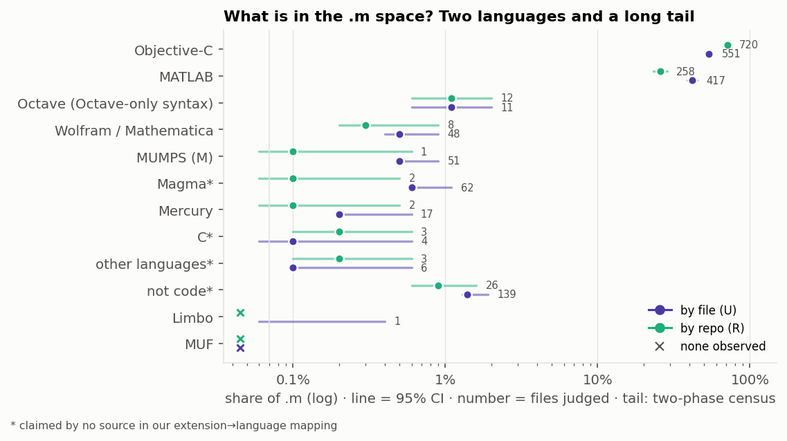
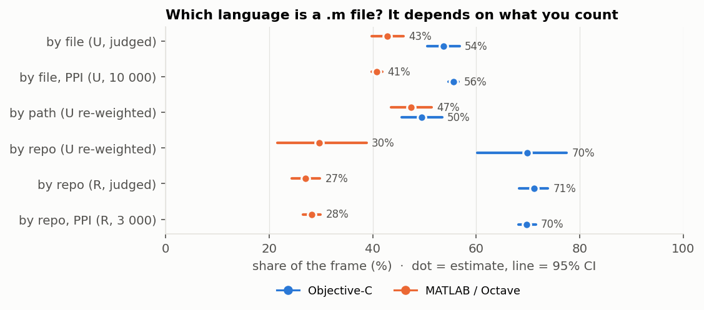
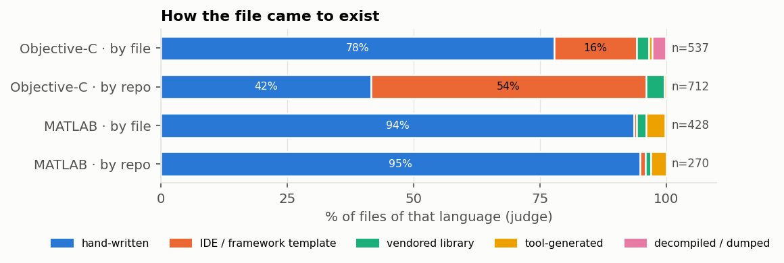
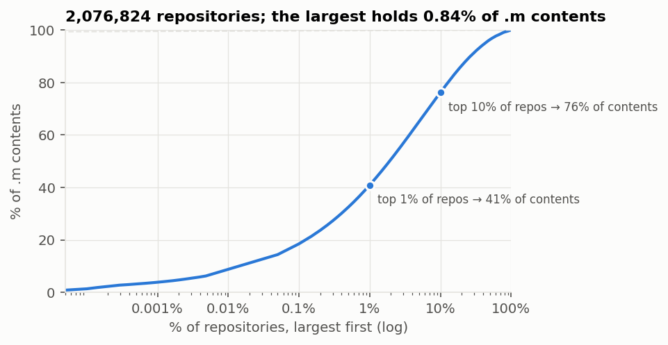
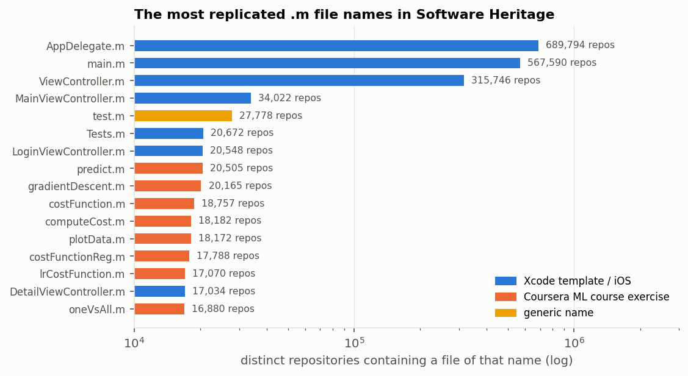
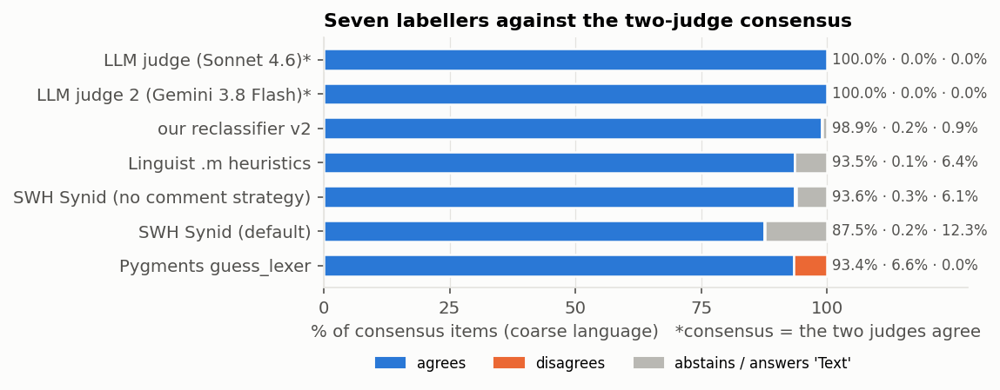
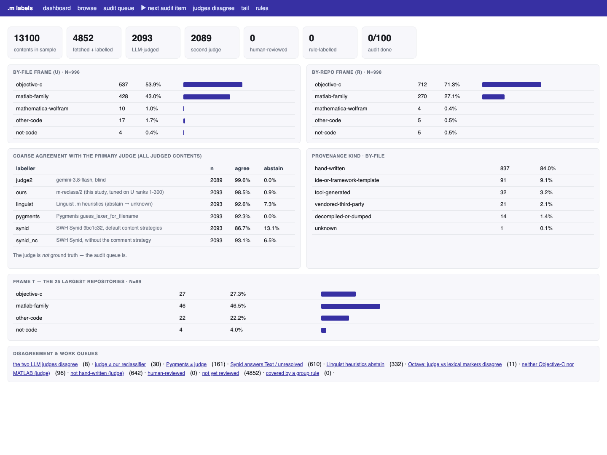
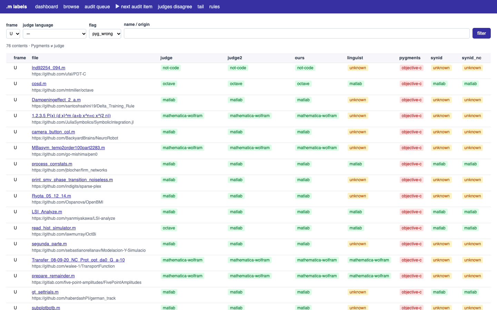
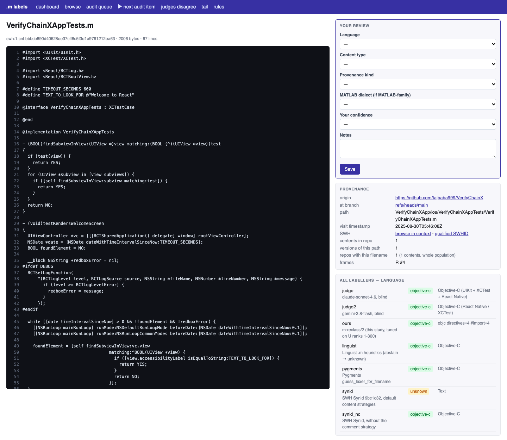
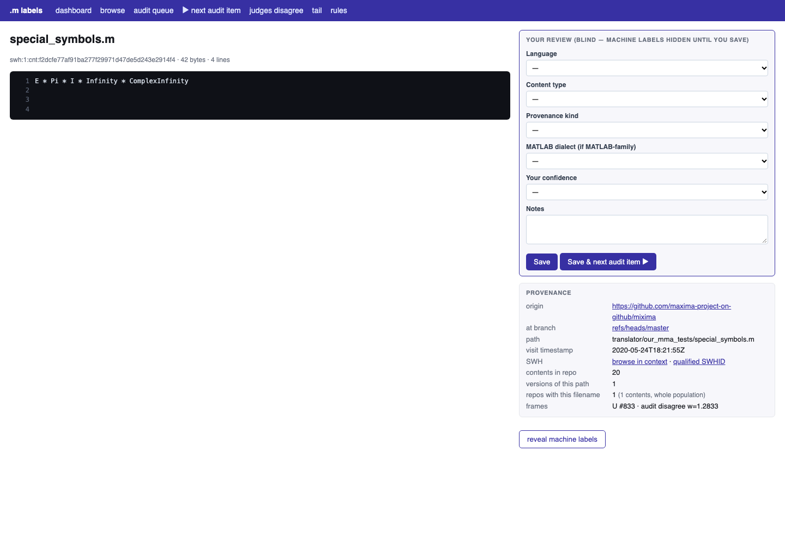

# What is *actually* in the `.m` extension on Software Heritage?

*An empirical study of the `.m` file extension in the Software Heritage (SWH)
archive — the most polysemous extension studied so far. Toolkit: `tools/m/`.
Companion studies: `docs/cobol_swh_study.md`, `docs/fsf_swh_study.md`,
`docs/rpgle_swh_study.md`. Pre-registration:
`data/derived/m_study/PREREGISTRATION.md` (commit `eb988475`).*

> **Bottom line.** A `.m` file is not "a MATLAB file" or "an Objective-C file":
> which one it *probably* is depends on how you count. **By file, `.m` is
> 54 % Objective-C and
> 43 % MATLAB; by repository,
> 71 % and
> 27 %.** The remaining
> 3.5 % spans seven more notations — Wolfram, MUMPS, Magma, Mercury, a
> FreeBSD interface language, treebank XML. **Much of `.m` was not written by the
> project that holds it:** 22 % of Objective-C files
> (58 % drawn one per repository) are Xcode/CocoaPods templates,
> vendored libraries or decompiled firmware, and SWH's deduplication cannot merge
> them. The language identifiers the ecosystem runs — including **SWH's own
> Synid, which answers "Text" for one Objective-C file in ten** — each fail on one
> specific, fixable pattern.

## 1. Motivation & questions

The earlier studies asked whether an extension is what it claims: is `.cbl`
COBOL, is `.rpgle` RPG? `.m` makes that question meaningless, because it claims
too much. Our own extension→language mapping (`ext_claim.csv`) already lets
eight languages claim it:

| Claimant | What a `.m` file is there | Claimed by |
|---|---|---|
| **MATLAB** / **GNU Octave** | function file, script, `classdef` class; Octave adds `#` comments, `endfunction`, `printf`, `++`, `!=` | Linguist, Pygments, Wikidata |
| **Objective-C** | class implementation (`@implementation`), `main.m`, test case | Linguist, Pygments, Wikidata |
| **Wolfram Language** | a Mathematica package (`BeginPackage[…]`) | Linguist, Wikidata |
| **Mercury** | a module (`:- module …`) | Linguist, Wikidata |
| **M (MUMPS)** | a routine (GT.M / YottaDB store one routine per `.m`) | Linguist |
| **Limbo**, **MUF** | an Inferno module interface; a TinyMUCK Forth program | Linguist |
| *M4, Monkey C, Win32 Message File* | nothing — they inherit `.m` from Pygments' *Mason* lexer through a join bug (§4.1) | Pygments (spurious) |

So we ask, for `.m`:

- **Q1 — Polysemy.** Which languages and formats actually sit under `.m`, in what
  proportion — per file and per repository — and how does that compare with what
  our mapping claims?
- **Q2 — Composition.** How was the code produced (hand-written, template,
  vendored, generated, decompiled), what kind of code is it, and which answers
  survive a change of sampling frame?
- **Q3 — Provenance.** Where does `.m` come from, how concentrated is it, and how
  much of it is replication?
- **Q4 — Method.** Can the identifiers the ecosystem runs (Linguist, Pygments,
  SWH Synid) tell `.m` apart — and how far can LLM judges be trusted when none of
  the labellers is treated as the oracle?

## 2. Data & method

### 2.1 The population we sample from

The study starts from an extraction of every SWH content that some directory
entry names `*.m`, produced by the maintainer with the Rust `swh-provenance`
tool on the CINES supercomputer (`SWH-m-files.zip`: six headerless CSV shards,
14 GB). Each row is a content SWHID plus **one** provenance context — origin,
branch, path, visit timestamp. At this size the population is loaded with
DuckDB into a Parquet table (`tools/m/ingest.py`, ~20 s), and every row is
accounted for:

| | |
|---|---:|
| rows = **unique contents** (each listed once) | **51,414,668** |
| contents with an origin (the rest: "no predecessors in this graph") | 51,356,119 |
| **distinct repositories** | **2,076,824** |
| distinct `(repository, path)` files | 27,678,487 |
| → contents that are later versions of the same file | **46.1 %** |
| provenance path not ending in `.m` (SVN pristine copies, `.asv` autosaves, `.m~`…) | 169,231 (0.33 %) |

Three caveats follow from the extraction itself. The reported path is *a* place
the bytes occur, not necessarily the `.m` one (one sampled content is reported as
`test.lua` — 21 bytes that are equally valid Lua and MATLAB). The timestamp is
SWH's visit date (2015–2025), not a commit date. And only lowercase `.m` was
extracted: uppercase `.M` (~26 k occurrences) is not covered.

**Provenance skew.** The distribution of contents per repository:

| contents per repository | |
|---|---:|
| median | **4** |
| mean | 24.7 |
| max (a decompiled iPhone firmware image) | 429,552 |
| top repository's share | 0.84 % |
| top-10 repositories | 3.1 % |
| **80 % of all contents come from** | **265,470 repos (12.8 %)** |
| repositories with exactly 1 content | 455,575 |

> **Why this matters for sampling.** Unlike `.CBL` (one fixture = 40 % of files)
> or `.rpgle` (three parser repositories = 21 %), no single repository dominates
> `.m`. What shapes it instead is **replication**: 46 % of
> contents are later versions of a file already counted; a third of all
> repositories contain an `AppDelegate.m`; and Xcode personalises every copy, so
> content deduplication cannot merge them (§4.3). A by-file, a by-path and a
> by-repo sample therefore estimate *different populations*. Experiments E1–E2
> (§3) are designed to separate them.

**Sampling fractions.**

| Frame | drawn from | drawn | fetched | judged |
|---|---|---:|---:|---:|
| **U** by file — uniform | 51,414,668 contents | 10 000 | 10,000 | 1,000 random + 368 tail census |
| **R** by repo — uniform repo, then one file | 2,076,824 repositories | 3 000 | 3,000 | 1,000 random + 55 tail census |
| **T** heavy tail — 4 files × 25 largest repos | 25 repositories | 100 | 100 | 100 |

The fractions are tiny, but U and R are uniform-random, so each is an unbiased
estimate of its population (±3 points at 95 %). Samples are drawn by ranking on
`md5(seed ‖ key)`, so **every prefix of a frame is itself a simple random
sample**: the rate-limited fetch (1 200 SWH requests an hour) could stop anywhere
without biasing a frame. Two more frames cost nothing: **by path** (U re-weighted
by 1 / versions of its `(repository, path)`) and **by repo, re-weighted** (U
re-weighted by 1 / contents in its repository — a cross-check on R). Their
weights are computed exactly from the full population table. Finally, every
fetched file that our rules place outside Objective-C and MATLAB is judged too —
a **tail census** (E10) that sizes the rare notations.

### 2.2 Pipeline

| Stage | What it does |
|---|---|
| **Ingest** | 14 GB CSV → Parquet (DuckDB); every row accounted for, defective rows kept with a status |
| **Sample** | md5-ranked frames (U, R, T) carrying exact population weights |
| **Fetch** | raw bytes from SWH by `sha1_git` (self-verifying), cached |
| **Indicators** | lexical markers for every claimant: Objective-C `@` directives, MATLAB function headers and `%` comments, Octave-only syntax (comment- and string-aware), Mercury `:-` declarations, MUMPS routine structure, Wolfram package cells, Magma/Maple block terminators… |
| **Labellers** | our reclassifier (v1 frozen before judging, v2 tuned on 300 files), **Linguist**'s `.m` heuristics, **Pygments** `guess_lexer`, **SWH Synid** (two configurations) |
| **LLM judges** | Claude Sonnet 4.6 **and** Gemini 3.8 Flash via OpenRouter, strict `json_schema` (`m-judge/1`): language, content type, provenance kind, unit kind, MATLAB dialect, related languages, domain, maturity — **blind** to the indicators |
| **Estimation** | Wilson intervals; Kish effective n for re-weighted frames; power-tuned prediction-powered inference (PPI++) |
| **Review** | a web app over every label, with a blind, weighted human-audit queue (`tools/m/review_app.py`) |

### 2.3 What changed since the COBOL study

Before running a fourth study we re-read the first three as a reviewer would.
Seven weaknesses, each with a concrete change here (details and the playbook
revision: `docs/swh_extension_study_playbook.md`, *Revision 2*):

| Weakness in the `.cbl` / `.fsf` / `.rpgle` studies | Change in the `.m` study |
|---|---|
| The LLM judge was the only reference; across the three studies there is **one** human review. | Seven labellers, three of them tools we did not write; two judges from different vendors; Dawid–Skene accuracy with no gold standard; a blind, weighted human audit (Appendix A). |
| The judge was **shown the indicators**, then compared with a classifier built on them — so COBOL's "95 % judge vs heuristic, an independent cross-check" was not independent. | The primary judge is **blind**; an ablation (E5) re-judges 300 files with indicators to measure anchoring. |
| One model, one run. | A second vendor on the same 2 000 files; κ per field (E4); E5 doubles as a test–retest. |
| Rules tuned and scored on the same labels (COBOL's P 1.00 / R 0.79 over the 162 files they came from). | Seven predictions, the samples and frozen v1 rules **committed before judging**; v2 tuned on 300 files only, scored on the other 1 700. |
| ≤ 1 000 judged files per frame; the tail invisible. | Free labels on every fetched file, joined to the judged subset by PPI++; a judged census of the tail stratum (E10). |
| The population file was never row-audited. | Rows read = rows parsed = 51 414 668; three defect classes counted. |
| The mapping was tested against the one language it named. | Every claimant tested, plus the mapping's own construction (§4.1). |

> **Lesson — "the LLM is not the oracle" generalises: no single labeller is.**
> The rpgle study showed the judge can be confidently wrong on a lexical fact.
> The remedy is not to swap in another oracle but to measure *every* labeller —
> ours, the community's, SWH's, two LLMs — against each other and, finally,
> against a small weighted human audit, with the judge kept blind to the features
> it will be compared on.

## 3. Experiments (settings, stated up front)

The crucial design variable is again the **sampling frame**; the new one is the
**labeller**.

| # | Experiment | Sample (frame) | N judged | What it isolates → what it shows |
|---|---|---|---:|---|
| **E1** | File-level population | U, uniform by file | 1 000 | which language a random `.m` *file* is |
| **E2** | Project-level population | R, one file per repo (+ free re-weightings of U) | 1 000 | which language a random `.m` *repository* holds |
| **E3** | Lexical vs semantic | MATLAB-family files of E1–E2 | 698 | who decides "Octave": the syntax or the judge? |
| **E4** | Inter-model agreement | E1 + E2, second vendor | 1,991 | how much each field depends on the model |
| **E5** | Anchoring | U ranks 1–300, judged *with* indicators | 299 | does showing features pull the judge toward our rules? |
| **E6** | Existing identifiers | E1 + E2, 7 labellers | — | how Linguist, Pygments and Synid fail, and why |
| **E7** | Cheap labels | U ranks 1 001–10 000, R 1 001–3 000 (free labels only) | — | how much a free classifier adds to 1 000 judged files |
| **E8** | Heavy tail | T, 4 files × 25 largest repos | 100 | what the biggest repositories actually contain |
| **E9** | Human audit | 100 from E1, stratified, weighted | pending | who is right when labellers disagree |
| **E10** | Tail census | every fetched U/R file our rules place outside Objective-C/MATLAB | 423 | how big each rare notation really is (two-phase stratified) |

> **Why seven labellers and two judges?** Every earlier accuracy figure was
> agreement with *one* model that had seen *our* features. Here the question
> "how accurate is the judge?" is replaced by one that has an answer without
> ground truth: *how do independent labellers agree, and where exactly does each
> one break?*

Fixed throughout: temperature 0, structured outputs, sources truncated to 16 000
characters for the judges, binary contents never sent to a judge (they count as
"not code"). Spend: Sonnet $32.07 (2,395 calls), Gemini $10.35 (2,412, 21 empty responses retried), anchoring ablation $3.99 (299) — **$46.41** for 5,083 verdicts. Seven hypotheses (H1–H7) were committed before the
first judgement; they are scored in §4.4. E10 was added afterwards (disclosed in
the pre-registration's post-hoc notes).

## 4. Results

### 4.1 Polysemy — which language, and *at which level*? (Q1)



**Two languages share the extension, and the frame decides which one is bigger.**

| language | by file (U, judged) | by file, PPI | by path (U reweighted) | by repo (U reweighted) | by repo (R, judged) | by repo, PPI |
|---|---:|---:|---:|---:|---:|---:|
| Objective-C | 53.7% [50.6–56.8] | 55.6% [54.6–56.6] | 49.5% [45.6–53.4] | 69.9% [60.2–77.5] | 71.2% [68.3–73.9] | 69.8% [68.2–71.5] |
| MATLAB / Octave | 42.8% [39.8–45.9] | 40.8% [39.8–41.9] | 47.4% [43.6–51.4] | 29.7% [21.6–38.8] | 27.0% [24.3–29.8] | 28.2% [26.5–29.9] |
| Wolfram | 1.0% [0.5–1.8] | 0.4% [0.1–0.7] | 1.2% [0.5–2.3] | 0.3% [0.0–3.5] | 0.4% [0.2–1.0] | 0.3% [0.1–0.6] |
| other code | 1.5% [0.9–2.5] | 1.6% [1.2–2.0] | 1.3% [0.6–2.5] | 0.1% [0.0–3.5] | 0.5% [0.2–1.2] | 0.5% [0.1–0.9] |
| not code | 1.0% [0.5–1.8] | 1.2% [0.9–1.6] | 0.7% [0.3–1.8] | 0.0% [0.0–3.5] | 0.7% [0.3–1.4] | 0.8% [0.3–1.3] |
| *n* | 1000 | 1000+9000 | n_eff≈632 | n_eff≈105 | 1000 | 1000+2000 |

*(Brackets: 95 % intervals — Wilson for simple random samples, Kish effective n
for re-weighted frames, PPI++ for the PPI columns.)*



By file, `.m` is 54 % Objective-C and
43 % MATLAB. By repository it is
71 % and
27 % — and the re-weighted by-file
sample reaches the same answer (70 % /
30 %) by a completely
different route. With version history collapsed (by path) the two are level
(50 % / 47 %).

> **Key finding — `.m` has no frame-free majority language.** Most `.m`
> *repositories* are iOS/macOS projects; `.m` *files* split almost evenly; with
> version history collapsed, the two languages tie. An iOS app carries many small
> template and class files; a MATLAB research repository carries many function
> files **and** more archived revisions of each.

**The tail: seven more notations.** In the judged sample, 3.5 % of files
are neither Objective-C nor MATLAB — about 35 files, too few to size anything.
The **tail census** (E10) fixes that. Of the 10,000 by-file and
3,000 by-repo contents fetched, our rules place 368 and
55 outside the two big languages; every one of them was judged, and a
two-phase estimator combines that census with the random judged sample of the
rest (`tools/m/tail.py`):

| notation | by file (U) | by repo (R) | files judged (U + R) | e.g. repositories of |
|---|---:|---:|---:|---|
| Wolfram / Mathematica | 0.5 % [0.4–0.9] | 0.3 % [0.2–0.9] | 56 | awantae, b3m2a1, fgerick |
| MUMPS (M) | 0.5 % [0.5–0.9] | 0.1 % [0.0–0.6] | 52 | OSEHRA, zxexz, ChristopherEdwards |
| Magma * | 0.6 % [0.6–1.1] | 0.1 % [0.0–0.5] | 64 | ulthiel, YijunYuan, assaferan |
| Mercury | 0.2 % [0.2–0.6] | 0.1 % [0.0–0.5] | 19 | Mercury-Language, AlaskanEmily, DeadZen |
| C * | 0.1 % [0.0–0.6] | 0.2 % [0.1–0.6] | 7 | arktouros, avh4, svn.code.sf.net |
| other languages * | 0.1 % [0.1–0.6] | 0.2 % [0.1–0.6] | 9 | DigammaX, guoran23, bartg |
| not code * | 1.4 % [1.3–1.9] | 0.9 % [0.6–1.6] | 165 | ekanou, ramonmc, whitegr |
| Limbo | <0.1 % [0.0–0.4] | 0.0 % [0.0–0.4] | 1 | yihugh |
| MUF | 0.0 % [0.0–0.4] | 0.0 % [0.0–0.4] | 0 | — |

*(Two-phase stratified estimates, 95 % intervals. The upper end allows for tail
files our rules missed, bounded by the 1,948 judged files of the
main stratum — only 8 of which turned out to be tail; conversely
56 files the rules sent to the tail were Objective-C or MATLAB.
\* = claimed by no source in our mapping.)*

- **Wolfram** — Mathematica packages (IGraph/M, FeynCalc, MathSBML's SBML
  generator), symbolic-integration rule sets (Rubi), and computer-algebra
  *output* (a 250 kB asymptotic expansion written by Mathematica).
- **MUMPS** — VistA and RPMS routines of the US Veterans Affairs hospital system,
  released under FOIA and mirrored across many repositories.
- **Magma** (*claimed by nothing*) — as frequent as MUMPS by file: the
  *SolvableDessins* databases generated by Magma scripts (the second-largest `.m`
  repository in the archive) and research packages such as CHAMP.
- **Mercury** — the Mercury compiler and standard library.
- **Other languages** (*unclaimed*) — the **FreeBSD kobj interface definition
  language** (`mmcbus_if.m`), a **New Jersey Machine-Code Toolkit** specification
  from the Boomerang decompiler, a Fortran 90 module, sources of the HBC Haskell
  compiler, *Monty* bytecode from a coding-school exercise, hobby languages, C in a
  `main.m`, C emitted by the XMLVM cross-compiler, and a **feature-model DSL** (an
  SPL alternative-group file).
- **Not code** (*unclaimed*) — **PML**, the XML morphological layer of the Prague
  Dependency Treebank; numeric matrices; MCNP simulation tallies shipped in PyPI
  packages; READMEs; a commit bot's UUID-only `helloWorld.m`; macOS AppleDouble
  metadata; Emacs lock files; one git-annex pointer.

**Against the mapping.** The mapping gets the two big languages right and four
more that are really there (Octave, Wolfram, Mercury, MUMPS). It misses **Magma**,
lists **MUF**, which never occurred, and **Limbo**, which the tail census found
exactly once in 10 000 files (an Inferno module interface in a git-filesystem
project; by-file upper bound 0.4 %) — and lists three languages that have nothing to do with `.m`:
**M4, Monkey C and Win32 Message File**. The cause is in
`tools/master_inventory.py::match_pygments_name`: when a language's name matches
no Pygments lexer, it falls back to *any lexer sharing an extension*. All three
list `.mc`; Pygments' *Mason* lexer claims `*.mc` and `*.m`; so all three became
"Mason" and inherited `.m`. Across the inventory, **114 of 588 Pygments identities
(19 %) were decided by extension overlap** — some harmless (`standard-ml`→SML),
many not (Mercury→MOOCode, NASL/bitbake/SourcePawn→POV-Ray,
OpenCL/qmake/Proguard→Visual Prolog, Motoko→Modelica).

> **Key finding — an extension used as an identity key corrupts the mapping
> meant to test extensions.** The shortcut this line of work warns against —
> trusting what an extension claims — was built into our own inventory join.
> Match by name or alias; treat a shared extension as evidence to review, never
> as identity.

### 4.2 Composition — who wrote it, and what is it? (Q2)

Restricting to what the files are, one property is invariant and most are not.

**Invariants** (true in both frames): MATLAB is hand-written
(94 % by file,
95 % by repo);
Octave-only code is ~1 %; 99 % of files are in a
programming language at all.

**Everything else depends on the frame:**

| | **by file (U)** | **by repo (R)** |
|---|---:|---:|
| hand-written | 84% | 57% |
| IDE / framework template | 9% | 39% |
| tool-generated | 3% | 1% |
| vendored third-party library | 2% | 3% |
| decompiled / dumped | 1% | — |
| class implementation (ObjC / `classdef`) | 50% | 56% |
| MATLAB function file | 28% | 14% |
| script | 13% | 13% |
| test | 3% | 11% |
| domain: iOS/macOS app or library | 49% | 66% |
| domain: numerical / signal / ML / control / engineering | 30% | 20% |
| maturity: research code† | 37% | 25% |
| maturity: student exercise† | 13% | 16% |
| maturity: toy or snippet† | 3% | 9% |
| median lines | 88 | 61 |

*† `maturity` is the least reliable field (two-judge κ 0.54, §4.4); read it as indicative.*



| | Objective-C · file | Objective-C · repo | MATLAB/Octave · file | MATLAB/Octave · repo |
|---|---:|---:|---:|---:|
| hand-written | 78% | 42% | 94% | 95% |
| IDE / framework template | 16% | 54% | <1% | 1% |
| vendored + generated + dumped | 6% | 4% | 6% | 4% |
| research code† | 18% | 12% | 60% | 59% |
| student exercise† | 9% | 9% | 18% | 35% |
| production-like† | 48% | 39% | 1% | <1% |
| median lines | 123 | 63 | 59 | 58 |
| *n* | 537 | 712 | 428 | 270 |

**What each frame shows.** By file, 22 % of Objective-C is not
hand-written; by repository, **58 %** is — mostly IDE and framework
templates: Xcode's `AppDelegate.m` and `main.m`, CocoaPods' `Pods-*-dummy.m`
stubs, React Native's `AppDelegate`, Flutter's `GeneratedPluginRegistrant.m`.
The judge's label is not self-certified: the population table records how many
repositories share each file's name, a signal the judge never saw.

| judge's `provenance_kind` (by file) | n | median repositories sharing the file name |
|---|---:|---:|
| hand-written | 837 | 2 |
| vendored third-party | 21 | 48 |
| IDE / framework template | 91 | 13,334 |

> **Key finding — much of `.m` was not written by the project that holds it.**
> MATLAB `.m` is overwhelmingly hand-written research and course code in every
> frame. Objective-C `.m` is not: drawn one per repository, more than half of it
> is what Xcode, CocoaPods or React Native generated when the project was created.

### 4.3 Provenance — where it comes from, and how replicated (Q3)

**Forges.** By content: GitHub 46,601,063, Bitbucket
2,101,478, GitLab 780,805,
SourceForge SVN/CVS/Git ~470 k, then package registries and archives — npm
(80,795), Launchpad, `doi.org` (Zenodo/Figshare
deposits, 64,517), Ifremer's GitLab
(52,162, the SonarScope acoustics toolbox),
`pkg.go.dev`. By repository, npm (16,521 packages) and
Dart's `pub.dev` (7,115) appear — Objective-C shims vendored in
React Native and Flutter plugins.



**The largest repositories are not ordinary code** (frame T):

| repository | `.m` contents | 4 sampled files (judge) |
|---|---:|---|
| CrackerCat/iPhone15-3_17.6.1_21G101_Restore | 429,552 | objective-c, decompiled-or-dumped |
| michaelmusty/SolvableDessins | 256,931 | magma, tool-generated |
| CrackerCat/iPhone17-1_18.2_22C152_Restore | 249,201 | objective-c, decompiled-or-dumped |
| ufal/PDT-C | 186,869 | not-code, tool-generated |
| rueckelt/TransmissionPlanningFramework | 155,345 | matlab, tool-generated |
| SchapplM/robsynth-serroblib | 124,473 | matlab, tool-generated |
| Mx1014/workSource | 57,641 | objective-c, hand-written; objective-c, tool-generated |
| Mercury-Language/mercury | 56,656 | mercury, hand-written |
| gitlab.ifremer.fr/fleet/acoustic/sonarscope.git | 51,236 | matlab, hand-written |
| Gong-Meng1/Matlab-funciones | 43,732 | matlab, hand-written; matlab, vendored-third-party |

**12 of the 25 largest repositories are mostly not hand-written.** The six
largest — 2.7 % of every `.m` content — hold two **decompiled iOS firmware
images** (IDA-style Objective-C pseudo-code), a **Magma-generated** database, the
**Prague treebank** XML, and two research projects whose `.m` files are machine
output (simulation logs; Maple-generated robot dynamics). Further down,
MathWorks' own toolboxes (Model-Based Calibration, Simulink Coverage) appear
copied into personal repositories.

**Replication, measured on the whole population:**

| family (by file name) | contents | repositories | % of `.m` repositories |
|---|---:|---:|---:|
| Xcode template names (`AppDelegate`, `main`, `ViewController`, `SceneDelegate`) | 3,243,345 | 880,802 | **42.41 %** |
| CocoaPods stubs (`*-dummy.m`) | 493,666 | 241,904 | 11.65 % |
| Coursera *Machine Learning* exercises (≥ 5 exercise names) | 449,136 | 20,942 | 1.01 % |
| Flutter plugin registrant | 19,710 | 13,334 | 0.64 % |



SWH deduplicates byte-identical files, yet there are 1.34 M distinct
`AppDelegate.m` and 1.02 M distinct `main.m` contents: Xcode stamps each new
project's template with a header comment carrying its name, author and date.
Stripping `//` comment lines from the sampled `main.m` files collapses
348 distinct contents to
164, and
127 of them become one and the same file
— the untouched template. History inflates too: 46 % of
contents are later versions of a file, including commit bots (`icestraw/EveryDayOC`
keeps 4 016 versions of one `Code.m`; the version we sampled holds only a UUID).

> **Key finding — replication, not concentration, is the population
> artefact of `.m`.** No repository dominates, but personalised templates,
> course clones (Coursera's ML exercises in ~21 000 repositories), vendored
> libraries and bot histories multiply near-identical files that content-level
> deduplication cannot merge. A count of "`.m` files" is to a large extent a
> count of copies.

### 4.4 Method validation (Q4)

**Existing identifiers (E6).** The two judges, from different vendors and blind
to our features, agree on the coarse language of
1,993 of 1,997 files. Against that
consensus — a consensus, not ground truth:



| labeller | agrees | disagrees | abstains | accuracy when it answers | Dawid–Skene accuracy |
|---|---:|---:|---:|---:|---:|
| Sonnet 4.6 (judge) | *defines the consensus* | | | | 99.8% |
| Gemini 3.8 Flash (judge) | *defines the consensus* | | | | 99.8% |
| our rules v2 | 98.9% | 0.2% | 0.9% | 99.7% | 99.4% |
| our rules v1 (frozen) | 98.5% | 0.3% | 1.2% | 99.8% | — |
| Linguist heuristics | 93.5% | 0.1% | 6.4% | 99.9% | 100.0% |
| SWH Synid (no `comment`) | 93.6% | 0.3% | 6.1% | 99.7% | 98.5% |
| SWH Synid (default) | 87.5% | 0.2% | 12.3% | 99.8% | 98.7% |
| Pygments | 93.4% | 6.6% | 0.0% | 93.4% | 93.2% |

When they answer, Linguist and Synid are almost always right; Pygments never
abstains, so its errors surface as wrong answers. Each failure traces to a line
of code:

- **Pygments calls MATLAB "Objective-C"** — 87 / 695 (12.5 %) of MATLAB files.
  `ObjectiveCLexer.analyse_text` scores 0.8 for `\[\s*[a-zA-Z_]\w*\s+…` — an
  Objective-C message send *or a MATLAB matrix literal* `[a b]` — while MATLAB
  scores only 0.2 for a `%` comment. Only four lexers claim `*.m`, so Wolfram,
  Mercury, MUMPS and Magma are unreachable.
- **Linguist abstains on MATLAB** — 97 / 695 (14.0 %) of MATLAB files. Its MATLAB rule is `^\s*%`: no
  comment line, no decision (Linguist then falls back to a Bayesian classifier).
- **SWH Synid answers `Text` for Objective-C** — 124 / 1,248 (9.9 %); **without its
  `comment` strategy, 3 / 1,248 (0.2 %).** That strategy runs *before* the Linguist
  rules and scores each candidate by the lines that *contain* its comment symbol:
  the `%` in `@"%@"` counts for MATLAB, Objective-C's `//` scores zero, and
  Objective-C is dropped from the candidate set.
- **SWH Synid returns all eight candidates** for 36
  text files — **every one** of them invalid UTF-8, while all
  1,958 resolved files are valid UTF-8. In `file`
  mode and with the SquashFS host, a strict UTF-8 read fails and every content
  strategy is skipped.

> **Key finding — the archive's own identifier mislabels one Objective-C `.m`
> file in ten, for a reason that fits in one line.** A content heuristic that
> runs *before* a disambiguation rule can remove the right answer from the
> candidate set, and nothing downstream brings it back. Both Synid defects are
> written up for upstream in Appendix B.

**Two judges (E4).** Identity is settled; judgement is not.

| field | agreement | Cohen's κ |
|---|---:|---:|
| `language_coarse` | 99.8% | 1.00 |
| `language` | 99.2% | 0.98 |
| `is_programming_language` | 99.7% | 0.81 |
| `content_type` | 98.1% | 0.86 |
| `unit_kind` | 97.4% | 0.96 |
| `provenance_kind` | 92.4% | 0.84 |
| `matlab_dialect` | 82.5% | 0.67 |
| `domain` | 78.3% | 0.73 |
| `maturity` | 64.1% | 0.54 |
| `confidence` | 99.7% | 0.00 |

Language agreement is near perfect (κ 0.98). Fields that
ask for judgement degrade in a fixed order — provenance kind, domain, MATLAB
dialect, maturity — and the same order appears when the *same* model re-judges
299 files (E5: language 99.3 % identical, maturity 87.3 %).
`confidence` shows the κ paradox: 99.7 % agreement, κ = 0, because both models
always say "high".

**Lexical vs semantic (E3).** The prompt defined `octave` *lexically*: only when
the file uses syntax MATLAB rejects.

| label × Octave-only syntax (comment/string-aware) | Sonnet 4.6 | Gemini 3.8 Flash | our rules v2 |
|---|---:|---:|---:|
| `octave`, syntax present | 16 | 16 | 15 |
| `octave`, **no** Octave-only syntax | 7 | 0 | 0 |
| `matlab`, **with** Octave-only syntax | 2 | 0 | 3 |

As pre-registered, with regex markers, the disagreement looked two-sided (7 vs 4)
— but three of the four "MATLAB with Octave syntax" cases were **our** errors:
`!=` inside a string, `printf(` inside a comment, the valid-MATLAB `1;` idiom.
With markers computed on code only, the models split. **Gemini follows the
definition exactly. Sonnet calls seven syntax-free files "Octave"** — three
because they sit in an Octave-Forge package tree (`inst/`), one by its file name,
three because they use double-quoted strings, legal MATLAB since R2017a. On the
purely semantic *portability* question the split is starker: Sonnet calls
84 % of MATLAB files MATLAB-specific, Gemini calls 63 % portable to
Octave, while only 7 % use a lexical MATLAB-only construct.

> **Lesson — lexical facts need a lexer; semantic facts depend on the model.**
> Our first "lexical" rule manufactured three of four apparent judge errors
> because it could not see strings and comments. Once fixed, one judge honoured
> the definition and the other overrode it with context — the rpgle failure,
> reproduced by one vendor and absent in the other. Report κ per field and do not
> aggregate fields below ~0.7 (`maturity`, `matlab_dialect`) without a human audit.

**Anchoring (E5).** Shown the indicators, the judge changed its language label on
1 of 299 files (1 toward
our rules); agreement with our rules was 99.0 % blind and
99.3 % shown. On a task this lexical, the indicators
add nothing the judge does not already read in the bytes.

**Our reclassifier, prospectively.**

| rules | scored on | n | fine accuracy | coarse accuracy |
|---|---|---:|---:|---:|
| v1 | tuning split vs judge | 300 | 98.0% | 99.0% |
| v2 | tuning split vs judge (in-sample) | 300 | 99.0% | 100.0% |
| v1 | held-out vs judge (prospective) | 1700 | 98.1% | 98.3% |
| v2 | held-out vs judge | 1700 | 98.2% | 98.5% |
| v1 | held-out vs consensus | 1693 | 98.2% | 98.5% |
| v2 | held-out vs consensus | 1693 | 98.4% | 98.6% |

The frozen v1 — written before any judge label existed — agrees with the judge
on 98.3 % of held-out files; v2, tuned on 300, gains
0.2 points. Its errors are abstentions on the tail, plus a known blind
spot: `printf(` and `!=` are Octave-only *relative to MATLAB* but ordinary in C,
so a few C and MUMPS files are called Octave.

**Cheap labels (E7).** PPI++ combines the free reclassifier labels on the
unjudged files with the judge on the judged ones:

| frame | judged + free | Objective-C (PPI++) | judged-only CI | width ratio | λ | MATLAB (PPI++) | width ratio |
|---|---:|---:|---:|---:|---:|---:|---:|
| by file (U) | 1,000 + 9,000 | 55.6 % [54.6–56.6] | 50.6–56.8 | 0.33 | 0.90 | 40.8 % | 0.35 |
| by repo (R) | 1,000 + 2,000 | 69.8 % [68.2–71.5] | 68.3–73.9 | 0.59 | 0.64 | 28.2 % | 0.61 |

With 9,000 free labels by file and 2,000 by repository, the tuned
weights are λ = 0.90 and 0.64, and intervals narrow by
67 % and 41 % — the precision of ~9.2× and
~2.9× as many judged files, at no API cost. For the rare notations, where
PPI helps little, the tail census (E10) does the work.

**Pre-registration.** Seven predictions were committed before judging; the
verdicts are computed by `analysis.py`:

| | Prediction | Observed | Verdict |
|---|---|---|---|
| H1 | Objective-C + MATLAB ≥ 95 % by file; rest spans ≥ 6 notations | 96.5 %; rest spans 7 | held |
| H2 | Objective-C share differs ≥ 10 pts between frames | 53.7 % vs 71.2 % | held (direction guessed wrong) |
| H3 | ≥ 15 % of Objective-C not hand-written (by file) | 22.2 % | held |
| H4 | Linguist abstains ≥ 5 %; Pygments MATLAB→ObjC ≥ 5 %; Synid ≥ 10 % | 6.4 % · 12.5 % · 12.3 % | consistent (not a blind test) |
| H5 | the judge's `octave` disagrees with the lexical definition one-sidedly | regex: 7 vs 4; lexer: 7 vs 2 (Gemini 0 vs 0) | **failed** as registered; holds for Sonnet only post hoc |
| H6 | shown the indicators, the judge agrees more with our rules | 99.0 % blind vs 99.3 % shown | **failed** |
| H7 | κ ≥ 0.9 on language; < 0.7 on provenance and maturity | κ 0.98 · 0.84 · 0.54 | half held |

Writing them down first is what made the failures informative: H5's failure is
how the lexer bug in our own markers was found.

## 5. Key findings & lessons (summary)

> **Findings.**
>
> 1. **`.m` has no frame-free majority language:** Objective-C
>    54 % / MATLAB
>    43 % by file,
>    71 % /
>    27 % by repository, a tie by path.
> 2. A **tail of rare notations** (tail census, by file: Wolfram 0.5 %; MUMPS 0.5 %; Magma 0.6 %; Mercury 0.2 %; not code 1.4 %) — several
>    (Magma, the FreeBSD IDL, NJMC, PML XML, Fortran, a feature-model DSL) claimed
>    by no source; Limbo, claimed, seen once in 10 000 files; MUF never.
> 3. **Much of `.m` is replication:** 58 % of Objective-C drawn per
>    repository is templates, vendored or dumped; Xcode template names sit in
>    42 % of `.m` repositories;
>    46 % of contents are later versions; deduplication
>    cannot merge personalised templates.
> 4. **MATLAB is the stable half:** hand-written research and course code in every
>    frame.
> 5. **Every identifier fails in a specific way** — Pygments (matrix literals),
>    Linguist (no `%` comment), Synid (a comment heuristic, and non-UTF-8 in file
>    mode) — and our own mapping gave `.m` to three unrelated languages.

> **Lessons for extension studies.**
>
> 1. For a polysemous extension, ask *which* language per file **and** per
>    repository — and state the frame with every number (again).
> 2. **Measure every labeller; privilege none.** Two judges from different vendors
>    plus the ecosystem's own tools turn "the judge said" into measured agreement
>    — and produced three bug reports.
> 3. **Keep the judge blind** to the features it will be compared against; the
>    ablation costs little and settles the question.
> 4. **Lexical facts need a lexer.** Regexes that cannot see strings and comments
>    produce false "judge errors".
> 5. **Pre-register, and let cheap labels carry the volume.** Failed predictions
>    were the most informative results; a validated free classifier multiplies the
>    effective judged sample (~9.2× by file via PPI++) and makes a judged
>    census of the rare strata affordable.

## 6. Limitations

- **The consensus is not ground truth.** Two LLMs agreeing is strong but
  correlated evidence (same bytes, same path). The 100-item blind audit queued in
  the review app (Appendix A) is the step that replaces it — none of the four
  studies has run one yet.
- **The tail is sized, not settled.** The census pins each rare notation from
  below; the upper ends are limited by the ~1 000 judged main-stratum files per
  frame, where a tail file our rules missed would hide (only 8 did).
- **One provenance context per content;** by-repo frames under-count widely
  shared files, so template shares are conservative. Timestamps are visit dates.
- **Only lowercase `.m`** — `.M` and `.mm` (Objective-C++) are outside the
  extraction.
- **Post-hoc elements are marked as such:** reclassifier v2, the comment- and
  string-aware Octave markers, frame T, the tail census (E10), and the
  normalisation of judge labels to "not code" when the judge's own fields say so
  (language "unknown"/"other" with `is_programming_language = false`, or
  "unknown" on markup/text).

## 7. Reproducibility & artefacts

```bash
unzip SWH-m-files.zip -d .cache/m/csv
.venv/bin/python -m tools.m.ingest && .venv/bin/python -m tools.m.ingest --stats
.venv/bin/python -m tools.m.name_pop                               # replication signals
.venv/bin/python -m tools.m.sample --n-uniform 10000 --n-repo 3000 --seed 17
.venv/bin/python -m tools.m.sample --top-repos 25 --per-repo 4     # frame T
python3 -m tools.m.fetch                                           # SWH_TOKEN in .swh_token
python3 -m tools.m.study --label && python3 -m tools.m.run_synid   # free labellers
python3 -m tools.m.study --judge --n 1000                          # + --model google/gemini-3.8-flash
python3 -m tools.m.study --judge --n 300 --frames U --with-indicators   # E5
python3 -m tools.m.tail --select && python3 -m tools.m.tail --judge     # E10 tail census
python3 -m tools.m.analysis && .venv/bin/python -m tools.m.make_figures
python3 -m tools.m.build_report --pdf                              # this report
python3 -m tools.m.audit --build && python3 -m tools.m.review_app  # E9
```

Artefacts in `data/derived/m_study/`: `PREREGISTRATION.md`, `population.json`,
`population_signals.json`, `worklist_*.csv`, one layer per labeller
(`labels/`, `synid.jsonl`, `judge/<model>/`), `analysis.json` (every number in
this report), `audit_queue.csv`. Figures in `docs/assets/m/`. Spend:
$46.41 for 5,083 LLM verdicts; everything else ran locally.

*Models: claude-sonnet-4.6 and gemini-3.8-flash (judges) · study authored with Claude Code.*

## Appendix A — The review tool

Every content accumulates labels from **seven labellers** — two LLM judges, our
reclassifier, Linguist, Pygments, and Synid in two configurations — plus its
provenance and, the point of the tool, a **human**. `tools/m/review_app.py` puts
them in one pane, surfaces where they disagree, and records ground truth.

```bash
python3 -m tools.m.review_app --reviewer <you>     # http://127.0.0.1:8769
```

### A.1 Dashboard



Language by frame (by file, by repo, the 25 largest repositories), every
labeller's agreement and abstention against the primary judge — labelled
explicitly as *not* ground truth — provenance kinds, and one-click work queues
for each disagreement type: judges disagree, judge ≠ our rules, Pygments ≠ judge,
Synid `Text`/unresolved, Linguist abstains, Octave lexical/semantic split, the
tail, not hand-written.

### A.2 Browse & filter



Filter by frame, judge language, flag, or name/origin. Each row shows all seven
labellers as coloured tags (agrees with the judge / disagrees / abstains), so a
column of red is one tool's failure mode at a glance — here, Pygments calling
MATLAB and Wolfram files Objective-C.

### A.3 Per-file view, and group assertions



The screenshot is a React-Native test file that every labeller calls Objective-C
— except SWH Synid, which answers `Text` (§4.4). The page shows the source; the
provenance (forge link at the archived branch, SWH browse context, qualified
SWHID) with three population signals the judges never saw — contents in the
repository, archived versions of this path, repositories sharing this file name;
all labellers with their raw answers; both judges' full verdicts side by side,
differences shaded; the non-zero indicators; and two forms. As in the COBOL
tool, **"assert for a group"** records one fact for an origin, a filename regex
or a path regex — e.g. *every file of `CrackerCat/iPhone15-3_…_Restore` is
decompiled firmware*, one assertion for an origin that holds 429 552 `.m`
contents. Rules are append-only in
`reviews_m/_rules.jsonl`.

### A.4 The blind audit



`/audit` serves a **stratified random sample** of the judged by-file frame: 60 of
the 77 files where at least one labeller dissents (weight 1.28) and 40 of the 919
where all agree (weight 22.98), so the scores estimate accuracy over the whole
population rather than over hard cases. Items open **blind**: machine labels stay
hidden until the reviewer saves — the human version of the anchoring ablation.
`Save & next` (or the `n` key) walks the queue; `python3 -m tools.m.audit
--score` turns the reviews into a weighted accuracy with a 95 % interval for every
labeller.

### A.5 Storage

Reviews are **append-only JSON, one file per review**
(`reviews_m/<sha1_git>/<UTC>--<reviewer>--<hash8>.json`), recording whether they
were made blind. Git is the sync layer; changing your mind means writing a new
review.

> **Why human review still matters.** Queue item #25 is
> `moxunit_fieldtrip_util_parse_walltime.m`: a **git-annex pointer** — a symlink
> path stored as file content. Sonnet and our rules call it MATLAB (from its
> name and path), Gemini calls it not code, and Linguist and Synid abstain. No
> majority of machines settles that; a person does in five seconds.

## Appendix B — Two Synid defects, ready to report upstream

**Tool.** `swh-syntax-identification` (Synid), commit `9bc1c32` (2026-06-15), `synid
file`, default strategies minus the network-bound `linguistapi`.

**1 · The comment strategy removes Objective-C.** Reproduction: any `.m` file
with `@interface`/`@implementation`, no `//` or `/* */` comment, and a format
string such as `@"%@"` (e.g. `swh:1:cnt:bbbcb890d40628ee37cff8c5f3d1a9791212ea63`).
The *extension* strategy yields eight candidates; the *comment* strategy
(`src/strategies/comment_strategy/mod.rs`) scores each by the lines that *contain*
its comment symbol — `line.contains(c)`, string literals included — and keeps
only the maximum: `%` scores for MATLAB and Mercury, Objective-C's `//` scores
zero, Objective-C is dropped. The Linguist rule that would have decided runs
next, on a set that no longer contains the answer; the pipeline returns `Text`.
Impact: 124 / 1,248 (9.9 %) of Objective-C files; 3 / 1,248 (0.2 %) without the strategy. Fixes
(any one): count a symbol only at line start or outside strings; run
`hyplyheuristics` before `comment` when a Linguist disambiguation block exists;
down-weight instead of eliminate.

**2 · Non-UTF-8 content is never content-identified in `file` / SquashFS mode.**
All 36 text files left with the full candidate
set are invalid UTF-8 (typically MATLAB with Latin-1 comments); all
1,958 resolved files are valid UTF-8.
`FileFetcher` and the SquashFS host read with `std::fs::read_to_string`, which
fails; the AWS S3 host (`from_utf8_lossy`) and the Web API host (`reqwest`
`text()`) decode lossily and are not affected. A lossy read everywhere would let
Linguist's `^\s*%` rule resolve 33
of the 35 MATLAB files.
