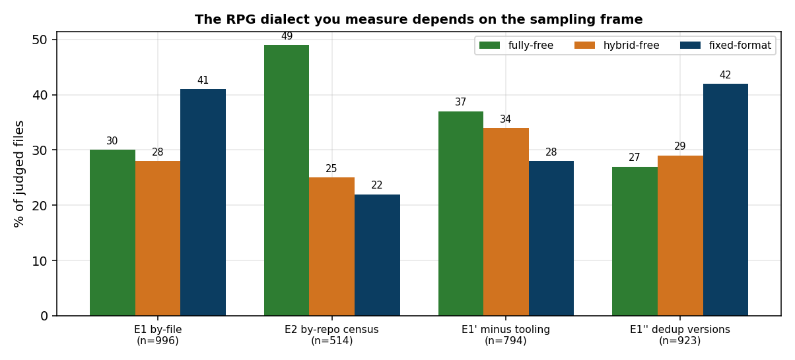
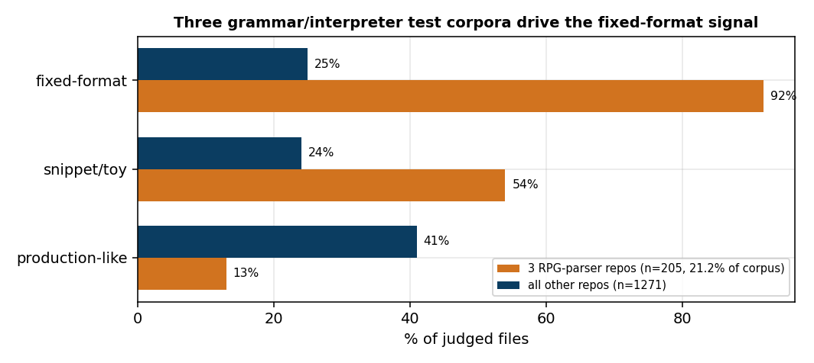
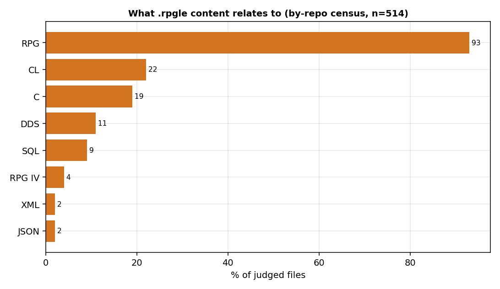
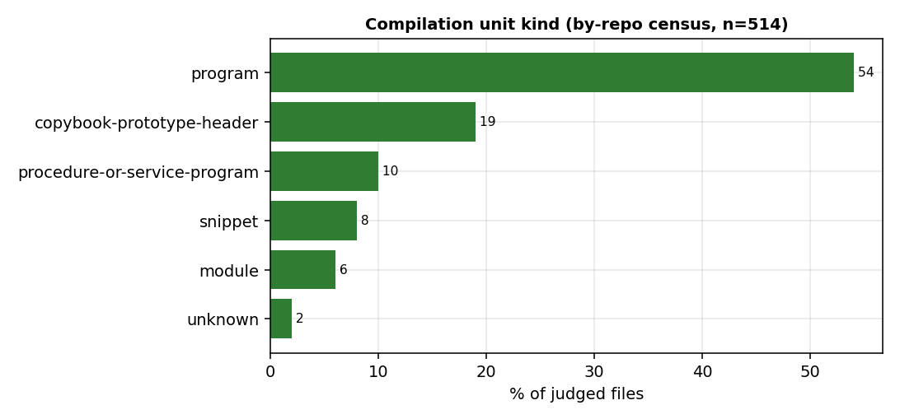
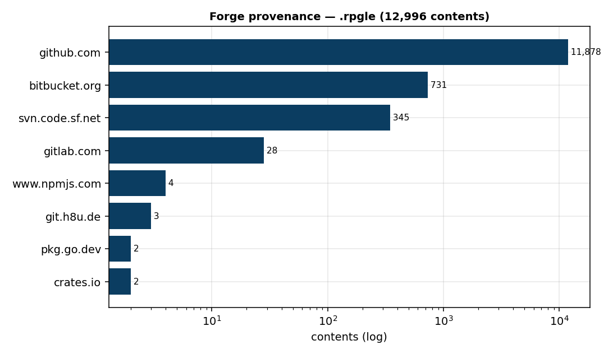
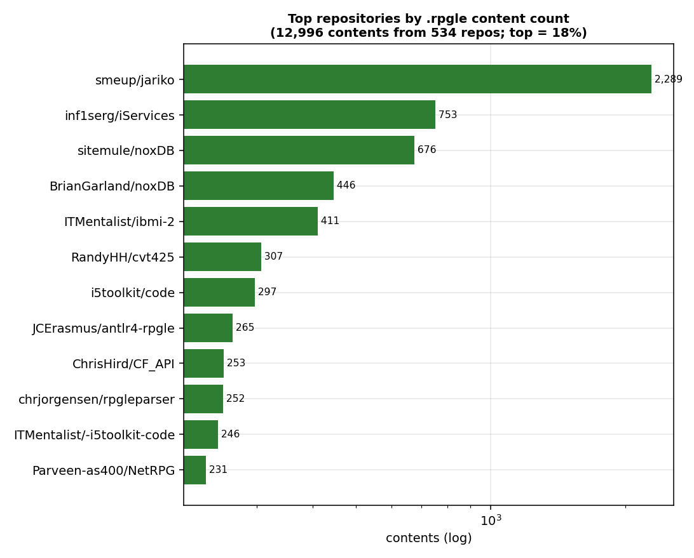
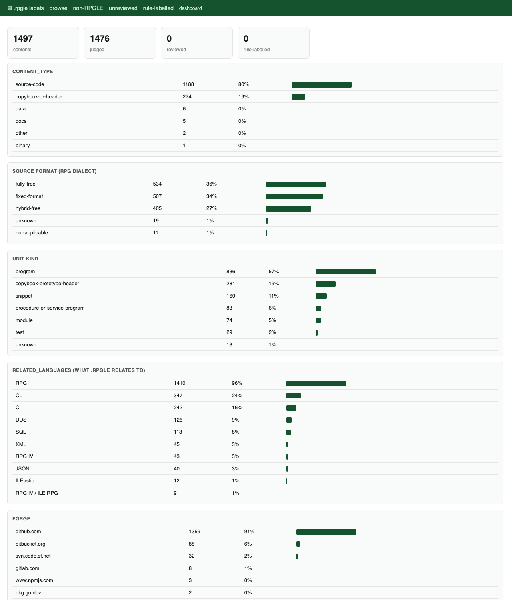
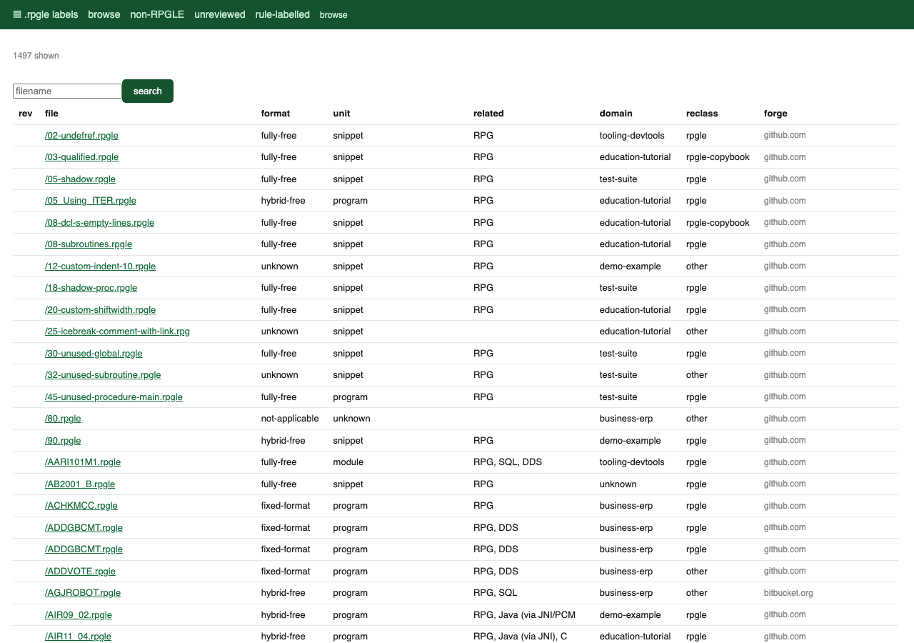

# What is *actually* in the `.rpgle` extension on Software Heritage?

*An empirical study of the `.rpgle` file extension in the Software Heritage (SWH)
archive — the world's largest source-code archive. Toolkit: `tools/rpgle/`.*

> **Bottom line.** `.rpgle` is a **clean** extension: 99.5% of files are genuine
> ILE RPG (RPG IV) source for IBM i. So "what is it?" is quickly settled — and
> the interesting question becomes **which RPG**. The answer depends entirely on
> *how you sample*. Counting **files**, fixed-format (column-oriented, 1960s-style)
> RPG looks dominant at 41%. Counting **projects**, it collapses to 22% while
> modern fully-free RPG rises to 49%. The gap is not noise: **three repositories
> — grammars and an interpreter for RPG itself — contribute 21% of all `.rpgle`
> content in the archive**, and 92% of their files are fixed-format test fixtures.
> The archive's picture of RPG is shaped by the tools built to parse RPG.

## 1. Motivation & questions

A file extension is the cheapest possible label. Software Heritage has archived
about 13,000 files ending in `.rpgle`, but the extension alone says nothing about
what they contain, who wrote them, or why. This is the third extension we study
with the same methodology (after `.cbl`/`.CBL` and `.fsf`), and the first where
the extension turns out to be *honest*. That makes it the most informative case
for the method: when contamination is not the story, what is?

- **Q1 — What is it?** What kind of content sits under `.rpgle`, and which
  languages or notations does it relate to?
- **Q2 — How pure is the extension?** Is everything really RPG?
- **Q3 — Which dialect?** RPG IV admits three very different source formats.
  What is the archive's actual mix — and is that mix a property of the language,
  or of the sample?
- **Q4 — Can machines answer this cheaply?** How far can zero-cost deterministic
  indicators go, and where is a language model genuinely required — or wrong?

### 1.1 What is `.rpgle`? (a two-minute primer)

**RPG** ("Report Program Generator") is an IBM business language from 1959, still
in production on **IBM i** (the operating system of the AS/400 midrange line).
`.rpgle` denotes its modern incarnation, **ILE RPG** / **RPG IV**. Three source
formats coexist *within the same language*, and a file can be in any of them:

| Format | How it looks | Era |
|---|---|---|
| **fixed-format** | Column-oriented. Column 6 holds a *specification letter* — `H` control, `F` file, `D` definition, `C` calculation, `P` procedure, `O` output. A `*` in column 7 marks a comment. Columns 1–5 are a sequence number. | classic |
| **hybrid-free** | A positional member that contains free-form islands, either `/free … /end-free` blocks or (since v7.1) free-form statements confined to columns 8–80. | transitional |
| **fully-free** | The literal directive `**FREE` on line 1, column 1. Columns then stop meaning anything: `ctl-opt`, `dcl-s`, `dcl-proc`, `//` comments, code from column 1. | modern |

Two more terms used throughout. A **copy member** (RPG's copybook) is a
declaration-only file pulled in with `/copy` or `/include` — prototypes (`dcl-pr`,
or fixed-format `D` specs with `PR`), constants, data structures. It declares but
never computes. **DDS** is the separate, non-RPG notation that describes display
files and database files; **CL** is IBM i's command language.

> **Why the `**FREE` line matters.** It is not a style hint. It is a compiler
> directive that switches off column semantics for the whole member. Its presence
> or absence is a *lexical fact*, decidable by looking at one line. Remember this:
> it becomes the sharpest result in §5.6.

## 2. Data

### 2.1 The population we sample from

The frame is `rpgle_files+origins.csv`, derived from the SWH **graph** by the
maintainer: each row carries a content SWHID, a file name, and an SWH *browse*
URL from which the originating repository (`origin_url`) can be parsed.

| Property | Value |
|---|---|
| Rows in CSV | 13,271 |
| **Unique contents** (`swh:1:cnt:…`) | **13,002** |
| Contents with a recoverable origin | 12,996 (99.95%) |
| **Distinct repositories** | **534** |
| Distinct file names | 6,562 |
| Contents per repo — median / mean / max | **3 / 24.3 / 2,289** |
| Repos contributing exactly 1 content | 135 |
| Largest repo's share | **17.6%** (`smeup/jariko`) |
| Top-10 repos' share | **45.8%** |
| Repos needed to cover 80% of contents | **64 (12.0% of repos)** |

Forges, by content: `github.com` 11,878 · `bitbucket.org` 731 ·
`svn.code.sf.net` 345 · `gitlab.com` 28. A curious tail: a handful of contents
are attributed to *package registries* (`npmjs.com`, `pkg.go.dev`, `crates.io`) —
`.rpgle` fixtures vendored inside RPG language-server and parser packages.

The population is extremely **top-heavy**. Any statistic computed over *files* is
therefore, to first order, a statistic about a dozen large repositories. This is
not an incidental caveat; it is the central finding of §5.3.

> **A second, subtler distortion: version inflation.** SWH archives every
> revision, so one source file yields one content per distinct byte-state.
> Grouping by `(repository, path)` shows that the 13,265 contents are really
> **8,656 distinct files plus 4,609 later revisions — 34.7% of the "corpus" is
> version history.** One path, `noxDB/JSONXML.rpgle`, appears **51 times**.
> A "file count" over SWH is a *file-version* count.

### 2.2 Sampling frames

Because the population is skewed two ways, no single sample answers the question.
We draw two, and derive two more for free by re-weighting.

| Frame | Definition | n | Fraction of population |
|---|---|---:|---|
| **E1 · by-file** | uniform random over the 13,002 contents | 1,000 | 7.7% of contents |
| **E2 · by-repo** | ≤ 1 content per repository — with 534 repos this is a **census**, not a sample | 534 | **100% of repos** |
| E1′ · by-file, adjusted | E1 minus the three language-tooling repos | 794 judged | post-stratified |
| E1″ · by-file, deduplicated | E1 with ≤ 1 content per `(repo, path)` | 923 judged | post-stratified |

E1 ∪ E2 = **1,497** contents fetched. E1′ and E1″ re-weight *already-judged* files,
so they cost nothing extra — a cheap way to test whether a population artifact
actually biases an estimate.

## 3. Experiments

All three experiments run over the same fetched bytes. Each content is fetched
once from the SWH API (`/api/1/content/sha1_git:<sha>/raw/`, authenticated,
1,200 req/h) and cached, then passed through two independent layers.

| # | Experiment | Frame | Output |
|---|---|---|---|
| **E1** | LLM-as-judge over a uniform by-file sample | by-file | content type, dialect, unit kind, related languages, domain, maturity |
| **E2** | Same judge over the by-repo **census** | by-repo | the same, one file per project |
| **E3** | Deterministic indicators vs. the judge | both | agreement, and *which layer is authoritative* |

**Layer 1 — mechanical indicators** (`tools/rpgle/indicators.py`, zero cost).
Regex/column analysis: the `**FREE` directive, `/free` blocks, fixed-format spec
lines by letter, `ctl-opt`, `dcl-s/ds/f/c/pr/proc` counts, fixed-format `D`-spec
prototypes, free-form statements (opcodes, assignments, bare calls), `EXEC SQL`,
`/copy` and `/include`, conditional directives, `WORKSTN`, `EXTPROC`, comment
ratio. From these: `source_format_guess`, `looks_rpgle`, `looks_copybook`.

**Layer 2 — LLM-as-judge** (`tools/rpgle/judge.py`). One call per file to
`anthropic/claude-sonnet-4.6` via OpenRouter, `temperature = 0`, **structured
output** against a strict JSON schema (`rpgle-judge/1`) whose enum fields pin the
taxonomy. Following a lesson from the `.fsf` study, the schema leads with *what
the content is* (`content_type`) and *what it relates to* (`related_languages[]`),
rather than asking the model to confirm "is this RPG?" — a question that invites
agreement.

**Cost & scale.** 1,497 contents fetched, 21 non-text (never judged), **1,476
judged**, 0 JSON parse failures, **$17.57** total.

## 4. Results

### 4.1 The extension is clean — and that is itself a result

Under `.rpgle`, essentially everything is RPG.

| | E1 by-file (n=996) | E2 by-repo (n=514) |
|---|---|---|
| Not a programming language | **0.5%** (95% CI 0.2–1.2) | **2.5%** (CI 1.5–4.3) |
| Not source code or a copy member | 0.3% (CI 0.1–0.9) | 2.3% (CI 1.3–4.0) |
| Platform `ibm-i-as400` | 99.9% | 98.1% |

The entire non-RPG tail across all 1,476 judged files is **14 files**: a GPLv3
`LICENSE.rpgle`, an ILEDocs metadata header, a compile-time table of data, a
token list used by a parser, an EBCDIC-encoded binary, a file containing the
single character `h`, and one containing `awdawd`.

> **Finding 1 — The method does not manufacture contamination.**
> The same pipeline found that ~46% of `.cbl`/`.CBL` files are not COBOL, and
> that 99% of `.fsf` files are not a programming language. Here it reports 99.5%
> clean. An extension audit that *always* finds rot is measuring its own
> priors; this one discriminates.

Note that contamination is *five times higher* by repo (2.5%) than by file
(0.5%). Junk files live in small repositories, so counting files hides them.
The direction is the same as in COBOL, where by-file contamination (46%) was
dominated by one synthetic fixture repo — there, weighting by repo *removed*
apparent contamination; here it *reveals* it. Neither frame is "right"; they
answer different questions.

### 4.2 The real question is *which* RPG — and the frame decides



| Frame | n judged | fully-free | hybrid-free | fixed-format | median LOC |
|---|---:|---:|---:|---:|---:|
| E1 · by-file | 996 | 30% | 28% | **41%** | 65 |
| **E2 · by-repo (census)** | 514 | **49%** | 25% | **22%** | 69 |
| E1′ · minus 3 tooling repos | 794 | 37% | 34% | 28% | 91 |
| E1″ · dedup by `(repo,path)` | 923 | 27% | 29% | 42% | 60 |

Read across the top two rows: **the dominant dialect of RPG in Software Heritage
is fixed-format if you count files and fully-free if you count projects.** The
95% CIs do not overlap (by-file 37.7–43.7%; by-repo 18.4–25.6%). A paper that
reported either number alone would be defensible and misleading.

> **Finding 2 — "Which dialect dominates?" has no frame-free answer.**
> Most IBM i *projects* on public forges have moved to modern fully-free RPG
> (49%). Most `.rpgle` *files* in the archive are still fixed-format (41%),
> because legacy-style code is concentrated in a few very large repositories.

### 4.3 Why the frames disagree: RPG's own tooling dominates the archive



Three repositories are **grammars and interpreters for RPG itself** —
`smeup/jariko` (an RPG interpreter written in Kotlin), `JCErasmus/antlr4-rpgle`
and `chrjorgensen/rpgleparser` (ANTLR grammars). Together they hold **21.2% of
all `.rpgle` content in the archive**. Their `.rpgle` files are not applications;
they are **test fixtures for parsers**, and parser fixtures deliberately exercise
the old, hard-to-parse syntax.

| | 3 tooling repos (n=205) | all other repos (n=1,271) |
|---|---:|---:|
| fixed-format | **92%** | 25% |
| snippet or toy-or-hello-world | **54%** | 24% |
| student-exercise | 32% | 9% |
| production-like | 13% | **41%** |
| median LOC | **23** | 83 |

Removing just these three repositories (frame E1′) moves fixed-format from 41% to
28% and lifts median file size from 65 to 91 lines. They are the single largest
source of the frame effect.

Now contrast with the *other* population artifact. Deduplicating version history
(E1″, removing 34.7% of the corpus) barely moves anything: fixed-format 41% → 42%.

> **Finding 3 — Not every population artifact biases an estimate.**
> Version inflation is huge (35% of contents) but **harmless** for proportions:
> the 51 archived versions of `JSONXML.rpgle` are all the same dialect, so they
> cancel out. Repository concentration is smaller in raw count but **biasing**,
> because a repo's files are homogeneous *and* unrepresentative. Diagnose which
> kind of skew you have before you correct for it — and correcting for the wrong
> one buys nothing.

The practical consequence for inference is different, though: 4,609 of 13,265
contents are revisions of another content in the sample. Treating them as
independent draws **understates confidence-interval width**, even where it does
not shift the point estimate.

### 4.4 What `.rpgle` relates to



Asked what each file relates to, the judge (by-repo census) reports: **RPG 93%**,
**CL 22%**, **C 19%**, **DDS 11%**, **SQL 9%**, plus XML/JSON tails. `.rpgle` is
monolingual in syntax but deeply *interfacial* in practice — its job is to reach
other systems.

The **C** relationship is the surprise, and it is structural rather than
incidental. IBM i ports of C libraries ship RPG prototype headers that bind to C
entry points through `EXTPROC`. Our review tool's detail view (Appendix A) shows
`/SAX2.rpgle` from **libxml2**: 248 lines of fixed-format `D` specs declaring
`extproc('xmlSAX2GetPublicId')` and friends, guarded by `/if not defined(XML_SAX2_H__)`.
It is a C header, transliterated into RPG. `libssh2`, LDAP and JDBC bindings
appear the same way.

Two further shapes appear in the tail:

- **Templated RPG.** 15 files are **IceBreak** web-service sources — RPG embedded
  in ASP-style `<%@ language="RPGLE" pgmtype="srvpgm" %>` … `<% … %>` template
  tags. Under one extension, a file that is *not* a compilable RPG member at all
  until a preprocessor runs.
- **Embedded SQL is rare, and frame-dependent**: 1.5% of files, but 5.6% of
  projects. Open-source RPG is libraries and demos; the database-heavy business
  code that defines RPG in industry is largely absent from public forges.

### 4.5 A fifth of `.rpgle` does not compile to anything



**18.8% of files (CI 16.5–21.3) and 18.5% of projects (CI 15.4–22.1)** are copy
members: declaration-only headers, `/copy`-ed into real programs.

> **Finding 4 — The extension is polysemous *inside* the language.**
> `.rpgle` names both compilation units and headers, exactly as `.cbl` names both
> COBOL programs and copybooks. Any tool that counts `.rpgle` files as "RPG
> programs", or feeds them to a compiler, is wrong about one file in five. Unlike
> the dialect mix, this ratio is **frame-invariant** — it is a property of how RPG
> is written, not of who is sampled.

### 4.6 Which layer is the oracle? (E3)

We validate the zero-cost mechanical layer against the judge on three targets.
The heuristics were frozen after inspecting errors on the **first 326 judged
files**; the remaining **1,146 were judged afterwards** and serve as a genuinely
prospective held-out set.

| Target | Layer | Precision | Recall | F1 | Majority baseline |
|---|---|---:|---:|---:|---:|
| **T1** · is it RPG at all? | v2, frozen → *prospective* | 0.999 | 0.953 | **0.976** | 0.990 (acc.) |
| **T3** · is it a copy member? | v2, frozen → *prospective* | 0.718 | 0.928 | 0.809 | 0.806 (acc.) |
| **T3** · is it a copy member? | v3, post-hoc → *in-sample* | 0.937 | 0.806 | **0.867** | 0.806 (acc.) |

*(held-out n = 1,146. T1's baseline is high because the extension is clean —
which is exactly why T1 is not the interesting target here. Only the frozen-v2
rows are held-out; v3 was refined after seeing these errors and is reported for
completeness, not as an unbiased estimate.)*

Error analysis drove two revisions, and both are worth stating because they show
what the oracle is *for*:

- **v1 → v2.** `looks_copybook` only recognised free-form `dcl-pr`. It therefore
  missed every fixed-format `D`-spec prototype header — i.e. all the C-library
  ports of §4.4 (recall 0.43). Adding fixed-format `PR`/`PI` detection and a
  "declares but never computes" rule fixed it.
- **v2 → v3.** The executable-code test recognised RPG *opcodes* but not the two
  commonest free-form statements: assignment (`count = count + 1;`) and bare
  procedure calls (`printf('hi');`). Real programs were being called headers
  (precision 0.72). Adding both lifted precision to 0.94.

Then the third target inverted the roles.

> **Finding 5 — The LLM is not the ground truth. On lexical facts, the code is.**
> Whether a member is `fully-free` is *defined* by the literal `**FREE` on line 1.
> A regex decides it exactly. The judge disagrees on **9.1% of files (134/1,446)**,
> and the error is almost entirely one-sided: **132 files it calls "fully-free"
> have no `**FREE` directive**, against 2 in the other direction. It is reading
> "this is written in free-form style" — true — and answering a different
> question from the one the schema asked.

The judge's error is not random: 46 of those 132 files *do* place code in columns
1–5, so they are free-form in every respect but the directive; the rest are
positional members full of free-form syntax. The model is tracking a real,
useful property — it is simply not the property `source_format` names.

> **Lesson — Split the schema by decidability.**
> Ask the model for **semantic** facts (what is this about? what does it relate
> to? is it production code or a fixture?), where it is excellent and no regex
> will do. Compute **lexical** facts (a directive, a column, a keyword) in code,
> where a model adds cost, latency and a 9% error rate. Where the two overlap, do
> not assume the model is right and the code is buggy: check the *direction* of
> the disagreement. Ours was one-sided, which is the signature of a definition
> mismatch, not of noise.

For this reason the shipped `source_format_guess` follows the directive, and a
separate indicator, `free_code_at_col1`, records the de-facto notion the judge
was reaching for.

### 4.7 Provenance





## 5. Lessons for the general methodology

This is the third extension processed with the playbook in
`docs/swh_extension_study_playbook.md`. Comparing the three sharpens it:

| | `.cbl` / `.CBL` | `.fsf` | `.rpgle` |
|---|---|---|---|
| Is the extension what it claims? | **No** — 46% of files not COBOL | **No** — 99% not a programming language | **Yes** — 99.5% ILE RPG |
| Dominant surprise | one synthetic fixture repo = 40.8% of files | it is a Tcl-hosted fMRI config DSL | RPG's own parsers = 21% of content |
| Frame sensitivity | contamination 46% by file → 7.3% by repo | E2 was already a census | dialect 41% → 22% fixed-format |
| Frame-invariant fact | mainframe idioms (CICS/SQL/COMP-3) 3–7% | Tcl hosting, 77% | copy members, ~19% |
| Where the LLM was essential | recognising synthetic noise | naming the domain (neuroimaging) | `related_languages`, maturity, purpose |
| Where the LLM was wrong | — | — | `source_format` (9.1%, one-sided) |

Three additions to the playbook:

> **Lesson A — Always report the sampling frame beside the number.**
> Three studies, three cases where by-file and by-repo disagree materially, and
> in *different directions*. "46% of COBOL files are not COBOL" and "only 22% of
> RPG projects are fixed-format" are both true and both incomplete.

> **Lesson B — Post-stratify before you re-sample.**
> E1′ and E1″ cost zero additional judgments and localised the frame effect to
> three repositories. Re-weighting an existing sample is the cheapest possible
> ablation, and it distinguishes a *biasing* artifact (repo concentration) from a
> merely *inflating* one (version history).

> **Lesson C — A clean extension is the most demanding test of the pipeline.**
> When 46% of files are junk, any crude classifier scores well and every finding
> looks dramatic. When 99.5% are genuine, the majority-class baseline is 0.99 and
> the pipeline has to earn its keep on a *secondary* axis — here, dialect and unit
> kind. Choose the validation target by what varies in the population, not by
> what the extension is named after.

## 6. Limitations

- **Judge as oracle.** T1/T3 treat the LLM's labels as truth. §4.6 shows this is
  unsafe for lexical properties; for `content_type` and `unit_kind` it remains
  unaudited by humans. The review tool (Appendix A) exists to close this gap;
  human review is not yet done.
- **One model, one temperature.** No inter-model agreement study, no self-consistency
  sampling. The 0 parse failures and one-sided §4.6 error suggest stability, not
  correctness.
- **Origins are one-per-content.** The frame CSV attributes each content to a
  single origin, so cross-repository duplication (e.g. the `sitemule/noxDB` and
  `BrianGarland/noxDB` forks) is invisible; 534 repositories is a lower bound.
- **The archive is not the language.** IBM i shops keep source in libraries on the
  machine, not on GitHub. The near-absence of embedded SQL (1.5%) almost certainly
  reflects what is *published*, not what is *written*.
- **v3 is retrospective.** The held-out figures in §4.6 are for v2. The v2→v3
  refinement was made after inspecting errors on all data, so T3's 0.867 F1 is
  in-sample and should be read as an upper bound.

## 7. Future work

- Run the human review pass and measure human–judge agreement per field, to
  quantify §6's first limitation on `unit_kind` and `domain`.
- Ask a second model the *same* schema and use disagreement to locate the fields
  that are genuinely ambiguous (we predict `source_format` and `maturity`).
- Extend the version-history observation into a method: sample by
  `(repo, path)` at HEAD, and compare against by-file and by-repo as a third
  standard frame.
- Apply the same pipeline to `.clle` (IBM i CL) and `.dds`, the two notations
  `.rpgle` most often relates to, to see whether the tooling-repo confound is a
  property of `.rpgle` or of niche languages generally.

---

## Appendix A — The review tool

`tools/rpgle/review_app.py` (a dependency-free `http.server` app, port 8768)
turns the study output into something a human can audit. Reviews are appended as
JSON under `reviews_rpgle/<sha1_git>/<UTC>--<reviewer>--<hash8>.json`, so git is
the sync layer and nothing is ever overwritten.

**Dashboard** — corpus-level distributions over the judged set, with a live count
of what has been human-reviewed and what a group rule already covers.



**Browse** — filterable list (non-RPGLE, unreviewed, rule-labelled), showing the
judge's dialect, unit kind and related languages beside the mechanical label.



**Detail** — source on the left; on the right the recovered origin, the judge's
verdict, every mechanical indicator, and two forms. This is `/SAX2.rpgle` from
libxml2, the C-header-as-RPG case of §4.4: `looks_copybook = True`, 175 fixed
spec lines, 0 `dcl-pr` (they are `D` specs), `extproc(...)` throughout.


**Group assertions.** Reviewing 13,000 files one at a time is not feasible, and
much of the label mass is repository-shaped. A rule states one fact about a
*set*: scope `origin` (every file from this repository) or scope `filename`
(a regex over names), plus a label and a rationale. Rules are appended to
`reviews_rpgle/_rules.jsonl` and matched at display time, so a single assertion —
*"every `.rpgle` in `smeup/jariko` is an interpreter test fixture"* — labels 2,289
contents. The COBOL study used the same mechanism to dispatch the 40.8% synthetic
`WBC_*_FOO.CBL` tail in one statement.

## Appendix B — Reproducing

```bash
# population statistics (§2.1)
python3 -m tools.rpgle.population

# sample: uniform n=1000 + by-repo census; writes worklist_all.csv
python3 -m tools.rpgle.study --sample --n 1000 --seed 5

# fetch + indicators + judge  (needs SWH_TOKEN and OPENROUTER_API_KEY)
source .swh_token && source .openrouter_key
python3 -m tools.rpgle.study --run --judge

# recompute the mechanical layer from cached bytes, without re-paying the judge
python3 -m tools.rpgle.study --refresh-indicators

# results
python3 -m tools.rpgle.study --report        # per-frame summary
python3 -m tools.rpgle.analysis              # §4.2-4.3, §4.6 frame + confound tables
python3 -m tools.rpgle.eval_reclassify       # E3: T1/T2/T3
python3 -m tools.rpgle.make_figures          # docs/assets/rpgle/*.png
python3 -m tools.rpgle.review_app            # http://127.0.0.1:8768
```

Artifacts: `data/derived/rpgle_study/` — `worklist_all.csv`, `population.json`,
`reports/<sha1_git>.json` (one per content: indicators, reclassifier label, judge
verdict, usage, cost), `summary_rpgle.json`, `analysis.json`, `eval_split.json`,
`eval_tuning_set.json` (the 326 SHAs used to tune, so the held-out split is
auditable).
